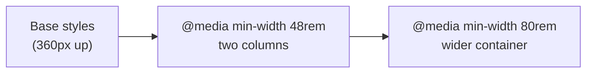

## What

**CSS** is a set of rules: `selector { property: value; }`. The browser matches rules to elements, resolves conflicts, computes final values and lays boxes out.

### The cascade and specificity

When rules conflict, the browser picks a winner by: **importance** (`!important`), then **specificity**, then **source order** (later wins).

Specificity is counted as three numbers (ids, classes/attributes/pseudo-classes, elements):

| Selector | Specificity |
|----------|-------------|
| `p` | 0,0,1 |
| `.card` | 0,1,0 |
| `.card .title` | 0,2,0 |
| `#hero` | 1,0,0 |
| `#hero p` | 1,0,1 |

Inline styles beat all of these, which is why this program bans them.

### The box model

Every element is a rectangle: content → padding → border → margin.

```css
*, *::before, *::after { box-sizing: border-box; } /* width includes padding + border */
```

### Units
`px` fixed. `rem` relative to the root font size (use for text and spacing so users' font settings are respected). `%` relative to the parent. `vw`/`vh` relative to the viewport. `fr` a share of free space in Grid.

## Why

Layout bugs (overflow on mobile, styles not applying, things not centering) are the most common frontend complaints. They stop being mysterious once you know the box model and specificity.

## How

### Flexbox: one dimension

```css
.nav { display: flex; gap: 1rem; align-items: center; justify-content: space-between; flex-wrap: wrap; }
.sidebar-layout { display: flex; gap: 2rem; }
.sidebar-layout main { flex: 1; min-width: 0; }
.sidebar-layout aside { flex: 0 0 18rem; }
```

### Grid: two dimensions

```css
.cards { display: grid; gap: 1rem; grid-template-columns: repeat(auto-fit, minmax(16rem, 1fr)); }
```

`auto-fit` + `minmax` gives a 3-card grid on desktop that stacks to 1 column on a phone, with no media query.

### Mobile-first media queries

```css
.layout { display: grid; gap: 2rem; }                /* phone: one column */
@media (min-width: 48rem) {
  .layout { grid-template-columns: 1fr 18rem; }       /* tablet+: content + sidebar */
}
```



### Interactive states

```css
.btn { background: var(--brand); color: white; padding: .6rem 1rem; border: 0; border-radius: .5rem; }
.btn:hover { filter: brightness(1.1); }
.btn:active { transform: translateY(1px); }
.btn:focus-visible { outline: 3px solid #f59e0b; outline-offset: 2px; }
```

Use `:focus-visible` so keyboard users get a ring without mouse users seeing it on every click.

### Responsive images
```css
img { max-width: 100%; height: auto; display: block; }
```

## When

- **Flexbox** for rows of items (nav bars, button groups, centering).
- **Grid** for page layouts and card grids.
- **Media queries** when the layout itself must change; **fluid** units (`clamp()`, `minmax`) when it can flex continuously.

## Where

The profile page (Day 3), the portfolio (Day 7), and every web app in Weeks 3–5 (Tailwind is just utility classes over these same ideas).

## Levels of understanding

<Levels>
<Level id="beginner">

Everything on a page is a box with space inside (padding) and outside (margin). Flexbox lines boxes up in a row or column. Grid arranges them in rows and columns. Media queries say "change the layout when the screen is wider than this".

</Level>
<Level id="intermediate">

The cascade resolves conflicts by importance, specificity and order. `box-sizing: border-box` makes sizing predictable. Margins can collapse vertically. Use `gap` instead of margins between flex/grid children. Prefer `rem` for type/spacing and `min-width` queries (mobile-first).

</Level>
<Level id="advanced">

Flex items have `min-width: auto`, which causes overflow with long content; set `min-width: 0`. Grid tracks use intrinsic sizing (`min-content`, `max-content`). Use custom properties for theming (dark mode), `clamp()` for fluid type, container queries for component-level responsiveness, and `@layer` to control the cascade without specificity wars.

</Level>
<Level id="industry">

Teams adopt a design system with tokens (colors, spacing, type), utility-first CSS (Tailwind) or CSS modules, and test at standard breakpoints plus real devices. Layout shifts (CLS) and unreadable focus styles are treated as bugs and checked in Lighthouse and visual regression tests.

</Level>
</Levels>

## Common mistakes

<Callout kind="mistake">

- Fixed pixel widths that overflow at 360px.
- Fighting specificity with `!important` instead of fixing selectors.
- Removing `outline` without a replacement.
- Using `height: 100vh` on mobile (address-bar issues); prefer `min-height: 100dvh`.
- Relying on margins for spacing inside flex/grid instead of `gap`.
- Desktop-first CSS that needs many overrides for mobile.

</Callout>

## Industry usage

<Callout kind="industry">Responsive and accessible UI is table stakes. Tailwind and design systems encode the same box model, flex/grid and breakpoint concepts you just learned. In Week 3 you will build the booking UI at 360px and 1440px.</Callout>

## Exercises

<Challenge kind="exercise" title="Cards that stack" answer={<pre>{`.cards{display:grid;gap:1rem;grid-template-columns:repeat(auto-fit,minmax(16rem,1fr))}`}</pre>}>

Make a 3-card project grid that is 3 columns on desktop and 1 column on a phone, using one CSS rule and no media query.

</Challenge>

<Challenge kind="debug" title="The stubborn colour" answer={<p>The id selector <code>#nav a</code> (1,0,1) beats <code>.link</code> (0,1,0). Reduce the first rule&apos;s specificity (<code>nav a</code>) or increase the second&apos;s.</p>}>

`#nav a { color: grey; }` and `.link { color: red; }`. The link stays grey. Why, and how do you fix it without `!important`?

</Challenge>

## Interview questions

<Challenge kind="interview" title="Flex vs Grid" answer={<p>Flexbox lays out along one axis and sizes items from their content; Grid defines rows and columns and places items into them. Use flex for components, grid for page and card layouts; they combine well.</p>}>

"When would you use Flexbox and when Grid?"

</Challenge>
