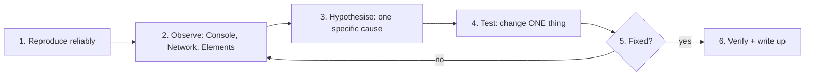

## What

Debugging is **finding the difference between what you believe the code does and what it actually does**. Saturday labs have no AI on purpose: you are building the instinct that lets you judge AI-written code later.

### The loop



### Your instruments

| Symptom | Look in | What to look for |
|---------|---------|------------------|
| Image/CSS/JS missing | Network | Red row, 404, exact URL requested |
| Style not applying | Elements → Styles | Struck-through rule, higher specificity winner |
| Layout overflows on mobile | Device toolbar + Elements | Element wider than 360px, fixed widths |
| Nothing happens on click | Console + Sources | Error, or handler never attached / attached twice |
| Data not showing | Network → Response | Status code, JSON shape, `ok` false |
| Form field unnamed | Accessibility pane | Missing accessible name |

### Console methods
```js
console.log("value:", x);          // quick look
console.table(items);              // arrays of objects as a table
console.error("bad", err);         // red, with stack trace
console.time("render"); /* work */ console.timeEnd("render");
```

### Breakpoints
In **Sources**, click a line number to pause there. Then use **Step over** (F10), **Step into** (F11), watch variables in **Scope**, add **Watch** expressions, and read the **Call stack** to see who called whom. A *conditional breakpoint* (right-click the line) pauses only when e.g. `i === 7`. *Event listener breakpoints* pause on any click. Often 60 seconds with a breakpoint beats 10 minutes of `console.log`.

## Why

Guessing and random edits create new bugs. A method keeps you calm and fast, and the write-up proves you understand the cause, not just that the symptom vanished.

## How

Write every fix as **symptom → cause → fix → how verified**:

> **Symptom:** hero image shows a broken icon; Network shows `GET /image/Hero.PNG 404`.
> **Cause:** folder is `images/` and file is `hero.png`; Linux paths are case-sensitive.
> **Fix:** `src="images/hero.png"`.
> **Verified:** reloaded with cache disabled: status 200, no red rows, console clean.

A good "how verified" is observable and repeatable (a request status, a test, a measurement), not "looks fine".

## When

Reproduce first, always. If you cannot reproduce it, you cannot know you fixed it. Reduce the problem: remove code until the bug disappears, then add back the last piece.

## Where

The Week 0 Saturday lab; the same method scales to server logs (Week 1), auth failures (Week 2), React DevTools (Week 3), `docker logs` (Week 4), and LLM traces (Week 5).

## Levels of understanding

<Levels>
<Level id="beginner">

When something breaks, don't change ten things. Find where it breaks, guess why, change one thing, and check. Then write down what you learned.

</Level>
<Level id="intermediate">

Use the right panel for the symptom, read the first error (later ones are often consequences), bisect the problem (comment out half), and use breakpoints to inspect real values instead of assumed ones.

</Level>
<Level id="advanced">

Form falsifiable hypotheses ("if the listener is attached twice, `getEventListeners(list)` will show two"). Use `debugger`, blackboxing, async call stacks, network throttling and request blocking to recreate failure conditions such as offline or slow 3G.

</Level>
<Level id="industry">

Incident postmortems use the same structure: symptom, impact, cause, fix, verification, and prevention (a test or alert). Regression tests turn every fixed bug into a permanent guard; in Week 1 you must add a test for each lab fix.

</Level>
</Levels>

## Common mistakes

<Callout kind="mistake">

- Changing several things at once, so you don't know what fixed it.
- Reading the last error instead of the first.
- Trusting cached results; disable cache while debugging.
- "Fixing" with `try/catch {}` that hides the error.
- Declaring victory without re-running the original reproduction.
- Writing "it works now" as the verification.

</Callout>

## Industry usage

<Callout kind="industry">Senior engineers are valued for debugging speed. In Week 6 you will review an AI-generated patch that looks right but reintroduces a security bug; only people who can read behaviour precisely will catch it.</Callout>

## Exercises

<Challenge kind="exercise" title="Do it for all six" answer={<p>For each of the six broken-lab bugs write four lines (symptom, cause, fix, verified). Verification examples: Network status 200; Styles pane shows the rule winning; no horizontal scroll at 360px; Accessibility name present; offline shows the error state; one click creates exactly one item.</p>}>

Open the Week 0 Debug labs tab. Before revealing any solution, write your own symptom → cause → fix → how verified for each bug.

</Challenge>

<Challenge kind="debug" title="Console shows nothing but the button is dead" answer={<p>Open Elements → Event Listeners on the button: none attached. The script ran before the element existed (no <code>defer</code>/module, <code>querySelector</code> returned null) but optional chaining hid the error. Move the script to the end, use <code>type="module"</code>, and stop swallowing nulls.</p>}>

`document.querySelector("#save")?.addEventListener("click", save)` runs, no errors appear, yet clicking does nothing. How do you prove what is wrong?

</Challenge>

## Interview questions

<Challenge kind="interview" title="Your debugging process" answer={<p>Reproduce; read the first error; narrow with logs or breakpoints; form one hypothesis and change one thing; verify with the original reproduction; add a regression test and write up cause and prevention.</p>}>

"Walk me through how you debug a bug you've never seen before."

</Challenge>
