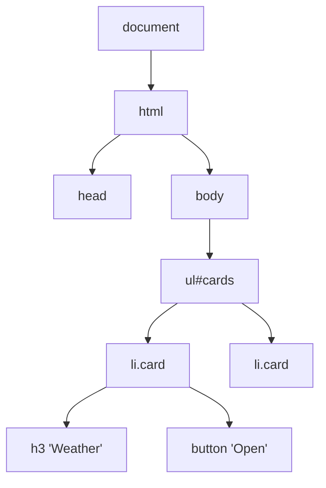
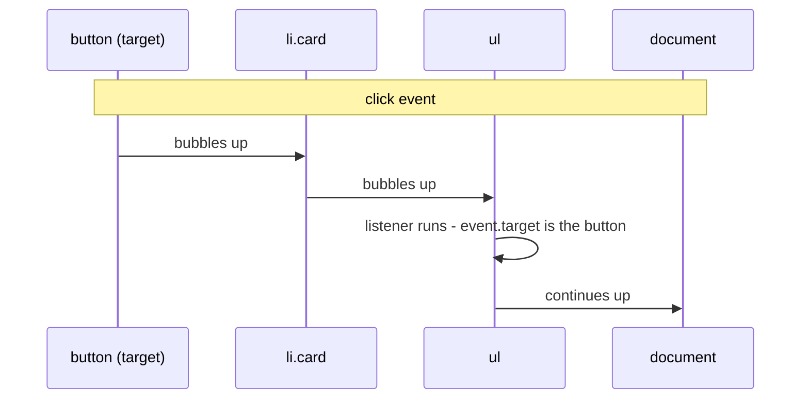

## What

The **DOM** (Document Object Model) is the live tree of objects the browser builds from your HTML. JavaScript reads and changes the page by changing this tree.



### Selecting and changing

```js
const list = document.querySelector("#cards");          // first match or null
const cards = document.querySelectorAll(".card");       // static NodeList

const li = document.createElement("li");                // create
li.className = "card";
li.textContent = "Weather app";                         // SAFE: text, not HTML
list.append(li);                                        // insert
li.classList.toggle("is-active");                       // style via classes, not inline styles
li.remove();                                            // delete
```

**`textContent` vs `innerHTML`:** `textContent` inserts plain text. `innerHTML` parses a string as HTML, so `` typed by a user would run. Never put user text into `innerHTML` (this is XSS).

<Playground title="Injection, defused" code={`
const evil = '';
const box = document.createElement("div");

box.textContent = evil;
console.log("textContent shows text:", box.innerHTML);   // escaped
console.log("child elements:", box.children.length);      // 0

const box2 = document.createElement("div");
box2.innerHTML = evil;
console.log("innerHTML created an element:", box2.children.length); // 1  (dangerous)
`} />

### Events and the event object

An **event** is something that happened (click, input, submit, keydown). A listener is a function the browser calls.

```js
button.addEventListener("click", (event) => {
  console.log(event.type, event.target);  // what happened, on which element
});
form.addEventListener("submit", (event) => {
  event.preventDefault();                 // stop the page reload
});
```

`input` fires on every keystroke; `change` fires when the control loses focus after a change; `submit` fires on the form.

### Bubbling and delegation

Most events **bubble**: after firing on the target, they travel up through its ancestors.



**Event delegation** = one listener on the parent, then identify the child:

```js
const list = document.querySelector("#filters");
list.addEventListener("click", (event) => {
  const btn = event.target.closest("button[data-tag]");
  if (!btn || !list.contains(btn)) return;
  renderCards(btn.dataset.tag);           // data-tag="web" -> dataset.tag
});
```

## Why

- **Performance and simplicity:** 200 cards need 1 listener, not 200.
- **Dynamic content:** items added later work automatically. No re-binding.
- **Fewer bugs:** attaching the same handler twice (Saturday's lab) is a common cause of duplicated actions.

## How

Render cards from data, never hard-code:

```js
const projects = [
  { name: "Portfolio", tag: "web" },
  { name: "Weather", tag: "api" },
];

function renderCards(tag = "all") {
  const list = document.querySelector("#cards");
  list.replaceChildren();                                 // clear safely
  const visible = projects.filter((p) => tag === "all" || p.tag === tag);
  if (visible.length === 0) {
    const empty = document.createElement("li");
    empty.textContent = "No projects with that tag.";
    list.append(empty);
    return;
  }
  for (const p of visible) {
    const li = document.createElement("li");
    li.className = "card";
    li.textContent = p.name;                              // user/data text via textContent
    list.append(li);
  }
}
```

Write it as a module (`<script type="module" src="app.js">`): variables stay private to the file, so there are **no globals**.

## When

Use delegation for lists, tables, menus and anything rendered dynamically. Attach a direct listener when there is a single static element (a form's `submit`). Use `closest()` when children (icons, spans) may be the click target.

## Where

The card filter (Day 4), the portfolio contact form (Day 7), and conceptually every React `onClick` in Week 3, where React uses delegation internally.

## Levels of understanding

<Levels>
<Level id="beginner">

The page is a family tree of elements. JavaScript can find an element, change its text, add or remove elements, and react when you click. A click on a small button inside a card also counts as a click on the card and the list, so one listener on the list can handle all of them.

</Level>
<Level id="intermediate">

`querySelector` returns the first match; `querySelectorAll` returns a static list. Use `classList` to change styles, `textContent` for safe text, `dataset` to attach data to elements. Events bubble from target to root; `event.target` is where it started and `event.currentTarget` is where the listener sits. `preventDefault()` cancels default behaviour such as form submission or link navigation.

</Level>
<Level id="advanced">

Events have capture, target and bubble phases; `addEventListener(type, fn, { capture, once, passive, signal })` controls them, and an `AbortController` signal removes listeners. `focus`/`blur` do not bubble (use `focusin`/`focusout`). `stopPropagation` breaks delegation higher up, so avoid it. Large DOM updates should be batched (`replaceChildren`, `DocumentFragment`) to limit layout work. XSS defences also include CSP and sanitizers like DOMPurify when HTML is unavoidable.

</Level>
<Level id="industry">

Frameworks (React, Vue) manage the DOM for you and still rely on delegation and on the textContent-style escaping you learned here. Security reviews specifically search for `innerHTML`, `dangerouslySetInnerHTML` and `eval`. Accessibility tests check that every interactive handler is reachable by keyboard.

</Level>
</Levels>

## Common mistakes

<Callout kind="mistake">

- Using `innerHTML` with user or API text.
- Attaching a listener inside the function that renders (it stacks up on every render).
- `onclick="..."` inline attributes.
- Checking `event.target === button` when the click landed on an icon inside the button; use `closest`.
- Forgetting `event.preventDefault()` on form submit.
- Using `var` or accidental globals instead of modules and `const`.
- Treating the `querySelectorAll` result as a live list.

</Callout>

## Industry usage

<Callout kind="industry">Reviewers flag one-listener-per-item loops and `innerHTML` on sight. The "one delegated listener, textContent only, no globals" acceptance criteria are exactly the habits that make Week 3's React code easy to learn.</Callout>

## Exercises

<Challenge kind="exercise" title="Filterable cards" answer={<p>Your solution should have: a <code>projects</code> array; <code>renderCards(tag)</code> that clears and rebuilds with <code>createElement</code> and <code>textContent</code>; exactly one <code>click</code> listener on the filter container using <code>closest</code>; an empty-state message; and <code>type="module"</code> with no globals.</p>}>

Render 5+ project cards from an array of objects and add tag filter buttons. Use a single delegated listener. Handle an empty array and an object with a missing `tag` field without crashing.

</Challenge>

<Challenge kind="debug" title="Two items per click" answer={<p>Each call to <code>render()</code> adds another click listener to the same list, so after N renders one click runs N handlers. Attach the listener once outside <code>render</code> (or delegate).</p>}>

After pressing &quot;Add&quot; three times, each later click adds three items. The code calls `list.addEventListener("click", onAdd)` inside `render()`. Why?

</Challenge>

## Interview questions

<Challenge kind="interview" title="Why delegation?" answer={<p>One listener on a stable ancestor handles events from many (including future) children via bubbling, reducing memory use and re-binding. Use <code>event.target.closest(selector)</code> to find the intended element.</p>}>

"What is event delegation and why use it?"

</Challenge>

<Challenge kind="interview" title="XSS" answer={<p>Cross-site scripting happens when untrusted text is interpreted as HTML/JS. Prevent it by inserting text with <code>textContent</code>, escaping on output, using a CSP, and sanitizing when HTML is required.</p>}>

"How do you stop user input from running as script on your page?"

</Challenge>
