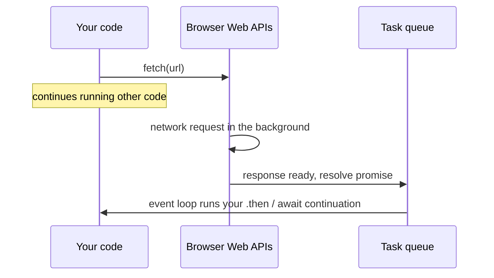
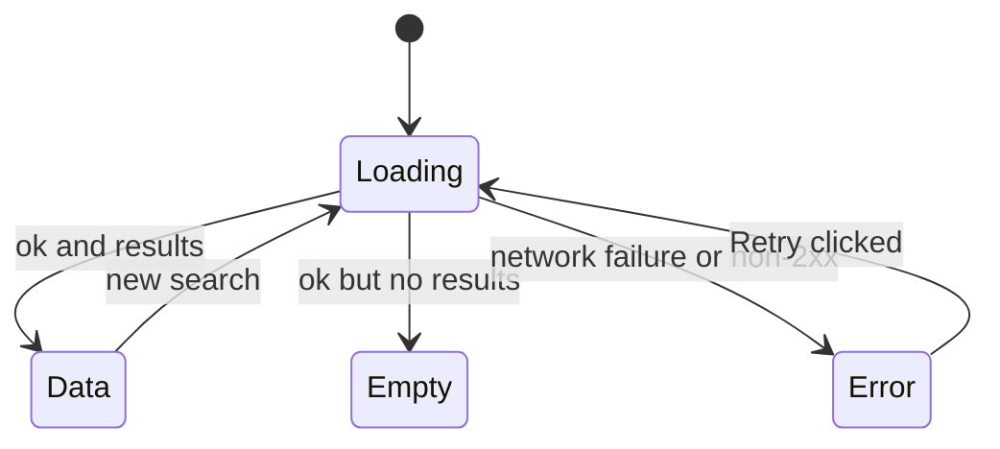

## What

An **API** (Application Programming Interface) over HTTP is a server that answers requests with *data* instead of web pages, usually **JSON**:

```json
{ "city": "Chennai", "temp": 31.2, "forecast": [{ "day": "Mon", "max": 33 }] }
```

`JSON.parse(text)` turns JSON text into a JavaScript value; `JSON.stringify(value)` does the reverse. JSON has no functions, no `undefined`, and no comments.

**Asynchronous** code starts work now and finishes later (network, timers). A **Promise** is an object representing a future result: *pending → fulfilled (value)* or *rejected (error)*.

## Why

A page that blocks while waiting for the network would freeze. JavaScript has one main thread and an **event loop**; async APIs let it keep rendering and responding while waiting.



## How

### fetch and the two ways it can fail

```js
async function getJson(url) {
  const response = await fetch(url);             // rejects ONLY on network failure
  if (!response.ok) {                            // 404, 500… resolve with ok === false
    throw new Error(`HTTP ${response.status}`);
  }
  return response.json();                        // also async
}
```

### The four UI states

Every data widget must render exactly one of these:



```js
async function search(city) {
  setState({ kind: "loading" });
  try {
    const geo = await getJson(
      `https://geocoding-api.open-meteo.com/v1/search?name=${encodeURIComponent(city)}&count=1`
    );
    if (!geo.results?.length) return setState({ kind: "empty" });
    const { latitude, longitude, name } = geo.results[0];
    const wx = await getJson(
      `https://api.open-meteo.com/v1/forecast?latitude=${latitude}&longitude=${longitude}` +
      `&current=temperature_2m&daily=temperature_2m_max,temperature_2m_min&timezone=auto&forecast_days=5`
    );
    setState({ kind: "data", name, wx });
  } catch (err) {
    setState({ kind: "error", message: err.message });
  }
}
```

Note `encodeURIComponent`: user text in a URL must be encoded. Note `?.` (optional chaining): `geo.results` is missing when nothing matches.

### Safe localStorage

```js
const KEY = "recent-cities";
function loadRecent() {
  try {
    const parsed = JSON.parse(localStorage.getItem(KEY));
    return Array.isArray(parsed) ? parsed.filter(x => typeof x === "string").slice(0, 5) : [];
  } catch {
    return [];                      // corrupted JSON falls back to an empty list
  }
}
function saveRecent(city) {
  const next = [city, ...loadRecent().filter(c => c !== city)].slice(0, 5);
  localStorage.setItem(KEY, JSON.stringify(next));
}
```

<Playground title="Handle corrupted data" code={`
function safeParse(text, fallback) {
  try { const v = JSON.parse(text); return v ?? fallback; } catch { return fallback; }
}
console.log(safeParse('["Chennai","Pune"]', []));
console.log(safeParse('{oops', []));
console.log(safeParse(null, []));
`} />

### Promise combinators
`Promise.all([a, b])` waits for all (fails fast); `Promise.allSettled` waits for all and reports each result; `Promise.race` takes the first to settle.

## When

Use `async/await` for readable sequential steps. Use `Promise.all` for independent requests that can run in parallel. In Week 1 you will add `AbortController` so a new search cancels the older one, and in Week 3 TanStack Query will manage this for you.

## Where

Weather widget (Day 5), portfolio (Day 7), and every frontend→backend call from Week 3 onward.

## Levels of understanding

<Levels>
<Level id="beginner">

`fetch` asks a server for data. Because the answer takes time, you `await` it. If something goes wrong, you must show a message and a Retry button, never a blank box.

</Level>
<Level id="intermediate">

`fetch` returns a Promise that rejects only on network errors, so check `response.ok`. `await` pauses the async function, not the page. Wrap in `try/catch`. Model UI as states (loading/error/empty/data). Always encode query values and guard against missing fields.

</Level>
<Level id="advanced">

Promise callbacks run as microtasks, before the next rendering/macrotask. Concurrent searches create races: an older, slower response can overwrite a newer one, so cancel with `AbortController` or ignore stale results by request id. CORS decides whether browser JS may read a cross-origin response; the server must send `Access-Control-Allow-Origin`.

</Level>
<Level id="industry">

Production clients add timeouts, retries with backoff for idempotent requests, caching and deduplication (TanStack Query), centralised API clients, typed responses validated with Zod, and observability of failed requests. Rate limits (429) and secrets (never in browser code) shape API design.

</Level>
</Levels>

## Common mistakes

<Callout kind="mistake">

- Assuming `fetch` rejects on 404/500.
- Forgetting `await response.json()`.
- An empty `catch {}` that hides failures (the "fails silently" bug in Saturday's lab).
- Building URLs with raw user text.
- Not handling "no results".
- `JSON.parse(localStorage.getItem(k))` with no try/catch.
- Mixing `.then` chains and `await` without understanding which returns a Promise.

</Callout>

## Industry usage

<Callout kind="industry">Every SaaS frontend is a client for JSON APIs. The same states (loading, error, empty, data) appear in design reviews, QA test plans and Playwright tests. Mentors will check yours with the network switched off.</Callout>

## Exercises

<Challenge kind="exercise" title="Find it in the Network tab" answer={<p>Request URL: the geocoding or forecast URL; Method: GET; Status: 200; Response: JSON with <code>results</code> (geocoding) or <code>current</code>/<code>daily</code> (forecast). Use the Headers tab for the first three and Response/Preview for the body.</p>}>

Run your weather search and locate the request. State its URL, method, status code and response body out loud.

</Challenge>

<Challenge kind="debug" title="Always shows 'Loading…'" answer={<p>If <code>fetch</code> throws, the code jumps to <code>catch</code> but nothing resets the state. Set an error state in <code>catch</code> (and use <code>finally</code> to clear loading flags).</p>}>

A widget sets `loading = true`, awaits `fetch`, then sets `loading = false` only on success. Offline, it spins forever. What is missing?

</Challenge>

## Interview questions

<Challenge kind="interview" title="fetch errors" answer={<p>fetch rejects only when the request cannot complete (network/CORS/abort). HTTP 4xx/5xx resolve normally, so check <code>response.ok</code> and throw.</p>}>

"What happens to a fetch promise when the server returns 500?"

</Challenge>
