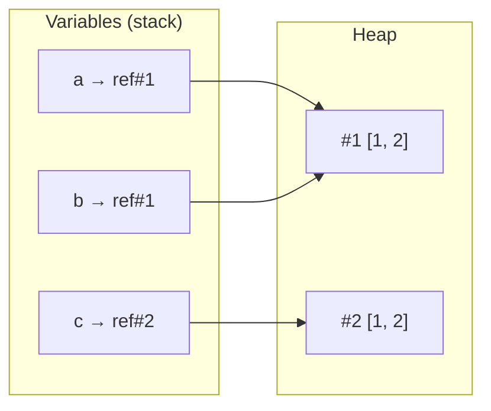

## What

An **array** is an ordered list of values. In JavaScript an array is also an **object**: indices are really property names (`"0"`, `"1"`, …) and `length` is a property that tracks the highest index + 1.

```js
const skills = ["HTML", "CSS", "JS"];
console.log(skills[0]);       // "HTML"
console.log(skills.length);   // 3
console.log(typeof skills);   // "object"  (use Array.isArray to check)
console.log(Array.isArray(skills)); // true
```

### The memory model: values vs references

JavaScript has two kinds of values:

- **Primitives** (`number`, `string`, `boolean`, `null`, `undefined`, `bigint`, `symbol`) are stored *by value*. Copying copies the value.
- **Objects** (arrays, objects, functions) live in memory on the **heap**. A variable holds a **reference** (an address) to it. Copying the variable copies the *address*, not the data.



<Playground title="Two names, one array" code={`
const a = [1, 2];
const b = a;          // copies the reference, not the array
b.push(3);
console.log("a:", a); // [1,2,3]  <- changed through b!

const c = [...a];     // a real (shallow) copy
c.push(4);
console.log("a:", a, "c:", c);

console.log([1, 2] === [1, 2]); // false: different references
console.log(a === b);           // true: same reference
`} />

## Why

Almost every real bug involving arrays and objects in the frontend is a reference bug: state that "changes by itself", a list that shows stale data, an equality check that is never true. React (Week 3) relies on **new reference = changed** to know when to re-render, so you must understand this now.

## How

### Mutating vs non-mutating methods

| Mutates the original | Returns a new array (safe) |
|----|----|
| `push`, `pop`, `shift`, `unshift` | `slice`, `concat`, spread `[...a]` |
| `splice`, `sort`, `reverse`, `fill` | `map`, `filter`, `flat`, `flatMap` |
| `a[i] = x`, `a.length = 0` | `toSorted`, `toReversed`, `toSpliced`, `with` (modern) |

```js
const nums = [3, 1, 2];
const sortedCopy = [...nums].sort((x, y) => x - y); // nums unchanged
// Without a comparator, sort() converts to strings: [10, 9, 1].sort() -> [1, 10, 9]
```

### The methods you will use every day

<Playground title="Method tour" code={`
const projects = [
  { name: "Portfolio", tag: "web", stars: 12 },
  { name: "Weather", tag: "api", stars: 30 },
  { name: "Quiz", tag: "web", stars: 5 },
];

console.log(projects.map(p => p.name));                 // transform each
console.log(projects.filter(p => p.tag === "web"));     // keep matches
console.log(projects.find(p => p.stars > 20));          // first match or undefined
console.log(projects.some(p => p.stars === 0));         // any?
console.log(projects.every(p => p.stars > 0));          // all?
console.log(projects.reduce((sum, p) => sum + p.stars, 0)); // fold to one value
console.log(projects.map(p => p.tag).includes("api"));  // membership
console.log(projects.map(p => p.tag).indexOf("web"));   // position or -1
`} />

- `slice(start, end)` copies a range without changing the original. `splice(start, deleteCount, ...items)` **changes** the original: it is the one that trips people up.
- `indexOf` returns `-1` when not found. `if (arr.indexOf(x))` is a bug (0 is falsy, -1 is truthy). Use `includes`.

### Immutable updates (what you will do in React)

```js
const list = [{ id: 1, done: false }, { id: 2, done: false }];

const added   = [...list, { id: 3, done: false }];                       // add
const removed = list.filter(item => item.id !== 2);                      // remove
const toggled = list.map(item => item.id === 1 ? { ...item, done: true } : item); // update
```

Spread is a **shallow** copy: nested objects are still shared. For deep copies use `structuredClone(value)`.

<Playground title="Shallow vs deep" code={`
const a = [{ n: 1 }];
const shallow = [...a];
shallow[0].n = 99;
console.log(a[0].n);        // 99 (shared inner object)

const deep = structuredClone(a);
deep[0].n = 1;
console.log(a[0].n);        // still 99
`} />

## When

- Use an **array** for ordered collections you iterate over (cards, bookings, search history).
- Use an **object / Map** when you look things up by key (`usersById[id]`): array `find` is O(n), object lookup is O(1) on average.
- Use a **Set** to deduplicate: `[...new Set(arr)]`.
- Prefer non-mutating methods whenever the array might be shared (props, state, function arguments).

## Where

- Rendering lists of cards from data (Day 4 task).
- Saving the last 5 searched cities in `localStorage` (Day 5).
- API responses are usually JSON arrays of objects.
- In Week 1, you will write pure functions over a contact list without mutating inputs.

## Performance notes

- `push`/`pop` are O(1). `shift`/`unshift`/`splice` in the middle are O(n) because elements must move (engines optimize but don't rely on it).
- `includes`/`indexOf`/`find` are O(n). Inside a loop that is O(n²): build a `Set` or object first.
- Chaining `.filter().map()` creates intermediate arrays. Fine for hundreds of items; for hot paths with large data use one `for...of` or `reduce`.

## Levels of understanding

<Levels>
<Level id="beginner">

An array is a numbered list. The first item is number 0. You can add things to it with `push` and ask how long it is with `length`. Careful: if you write `const b = a`, you did not make a second list; you gave the same list a second name.

</Level>
<Level id="intermediate">

Arrays are objects, so variables hold references. Methods like `push`, `splice` and `sort` mutate in place; `map`, `filter` and `slice` return new arrays. To update immutably, use spread, `map` and `filter`. Always give `sort` a comparator for numbers.

</Level>
<Level id="advanced">

Engines store arrays in specialised "elements kinds" (packed SMI, doubles, generic) and deopt when you mix types or create holes (`arr[1000] = x` on an empty array makes a sparse, slower array). `Array.from({length:n}, fn)` avoids holes. `sort` is stable since ES2019. Equality is by reference, so `includes` of an object literal never matches a different literal; use `some` with a predicate.

</Level>
<Level id="industry">

Teams enforce immutability by convention and lint rules (no param mutation), and rely on it for React rendering, Redux/Zustand updates and memoization. Code reviews flag `.sort()` on props, `.splice()` in state, and O(n²) `find` in loops. Large lists are paginated server-side and virtualized in the UI rather than rendered as thousands of DOM nodes.

</Level>
</Levels>

## Common mistakes

<Callout kind="mistake">

- `const b = a` then mutating `b` and being surprised `a` changed.
- Calling `.sort()` without a comparator on numbers, or on an array you did not mean to change.
- `if (arr.indexOf(x))` instead of `arr.includes(x)`.
- Using `splice` when you meant `slice`.
- Modifying an array while looping over it with `forEach` (skipped items).
- `typeof arr === "array"` (it is `"object"`); use `Array.isArray`.
- Assuming spread makes a deep copy.

</Callout>

## Industry usage

<Callout kind="industry">

Data from APIs arrives as arrays of objects. Senior reviewers expect you to normalise them (arrays → lookup maps) when you need repeated access by id, to treat inputs as read-only, and to write small pure functions that are trivially testable, exactly the contact-list exercise in Week 1.

</Callout>

## Exercises

<Challenge kind="exercise" title="Predict, then run" answer={<p>Output: <code>false</code>, <code>true</code>, <code>[1,2,3]</code>, <code>[1,2]</code>. <code>[1,2] === [1,2]</code> compares two references; <code>b</code> shares <code>a</code>&apos;s reference; <code>c</code> is a copy.</p>}>

Without running it, predict what each line logs:

```js
const a = [1, 2];
const b = a;
const c = [...a];
b.push(3);
console.log([1, 2] === [1, 2], a === b, a, c);
```

</Challenge>

<Challenge kind="exercise" title="Immutable toggle" answer={<pre>{`const toggle = (items, id) =>
  items.map(i => i.id === id ? { ...i, done: !i.done } : i);`}</pre>}>

Write `toggle(items, id)` that flips `done` for one item and returns a new array without mutating `items` or the other objects. Prove it by checking `items[0] === result[0]` is `true` for untouched items.

</Challenge>

<Challenge kind="debug" title="The disappearing items" answer={<p><code>splice</code> mutates the array while <code>forEach</code> is walking it, so after removing index 1 the next element shifts into index 1 and is skipped. Use <code>filter</code>: <code>const kept = items.filter(i =&gt; !i.done)</code>.</p>}>

```js
items.forEach((item, i) => { if (item.done) items.splice(i, 1); });
```

Some completed items remain. Why?

</Challenge>

## Interview questions

<Challenge kind="interview" title="Reference traps" answer={<p>Variables hold references to heap objects. Assignment copies the reference, so both names see mutations. Copy with spread/slice (shallow) or structuredClone (deep). Mention that React compares references to detect changes.</p>}>

&quot;Why did changing array b change array a, and how do you avoid it?&quot;

</Challenge>

<Challenge kind="interview" title="sort pitfalls" answer={<p>Default sort converts elements to strings and compares UTF-16 code units, so <code>[10, 9, 1].sort()</code> gives <code>[1, 10, 9]</code>. Pass <code>(a, b) =&gt; a - b</code>. It also mutates; copy first or use <code>toSorted</code>.</p>}>

&quot;What does [10, 9, 1].sort() return and why?&quot;

</Challenge>
