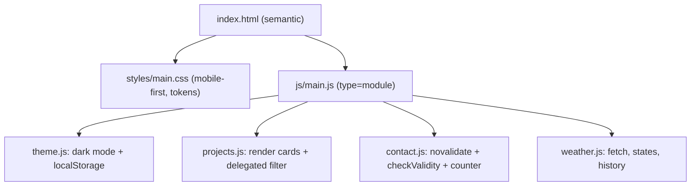

## What

Sunday is a **build day**: afternoon rules apply all day (AI coding tools are allowed) and explain-back still applies to the last commit. Week 0 has no PRs, so write "How I verified this" in the README.



## Why

The portfolio is the first artefact a recruiter or client sees, and it proves the week's skills together: semantics, responsive CSS, DOM, fetch with all states, and deployment.

## How

### Build order (about 6 hours)
1. **Structure (45 min):** header/nav, About, Projects, Contact, footer; one `h1`; landmarks; skip link.
2. **Styles (60 min):** CSS custom properties for colors (`--bg`, `--fg`, `--brand`), mobile-first layout, card grid with `auto-fit`, visible focus states.
3. **Projects (45 min):** array of 3+ project objects rendered with `createElement` and `textContent`; one delegated filter listener.
4. **Dark mode (30 min):** toggle sets `data-theme` on `html`; save to `localStorage` in try/catch; a corrupted or unexpected value falls back to the default (or `prefers-color-scheme`).
5. **Contact form (60 min):** `novalidate`; on submit `preventDefault()`; for each field use `checkValidity()` and show **your own** message in an element linked by `aria-describedby`; focus the first invalid field; on success show a message and reset; character counter updates on `input` (e.g. "123 / 500").
6. **API widget (75 min):** the Day 5 weather widget with loading, error + Retry, empty and data states, and last-5 cities in `localStorage`.
7. **QA and deploy (45 min):** validator, console, Network, 360px to 1440px, keyboard pass, screenshots, GitHub Pages.

### Contact form skeleton

```js
form.addEventListener("submit", (event) => {
  event.preventDefault();
  let firstInvalid = null;
  for (const field of form.elements) {
    if (!(field instanceof HTMLInputElement || field instanceof HTMLTextAreaElement)) continue;
    const msgEl = document.getElementById(`${field.id}-error`);
    if (field.checkValidity()) { msgEl.textContent = ""; field.removeAttribute("aria-invalid"); continue; }
    msgEl.textContent = messageFor(field);               // your own wording per validity state
    field.setAttribute("aria-invalid", "true");
    firstInvalid ??= field;
  }
  if (firstInvalid) return firstInvalid.focus();
  status.textContent = "Thanks! Your message was validated locally (no server in Week 0).";
  form.reset(); counter.textContent = "0 / 500";
});
```

### Deploying to GitHub Pages
Push to GitHub → Settings → Pages → deploy from the `main` branch root. Use **relative paths** (`images/me.jpg`), not root-relative (`/images/me.jpg`), because Pages serves from `/repo-name/`. Test the live URL, not just Live Server.

### Verification checklist (copy into the README)
- [ ] Passes validator.w3.org (link to the result)
- [ ] 360px, 768px, 1440px screenshots; no horizontal scroll
- [ ] Keyboard-only: nav, filter buttons, theme toggle, form, retry
- [ ] Console and Network clean on the live URL
- [ ] Offline mode shows the error state; wrong city shows empty state
- [ ] `localStorage.setItem("theme", "{oops")` then reload: still works
- [ ] Empty form submit shows your messages and sends nothing

## When

Do the checklist continuously, not at the end. Commit after each numbered step so the history shows your process.

## Where

GitHub repository + GitHub Pages URL + README with screenshots. Optional stretch: list your public repos from the GitHub API.

## Levels of understanding

<Levels>
<Level id="beginner">

Build the page piece by piece, saving a commit each time something works. Test it on a phone-sized screen and with only the keyboard, then put it online.

</Level>
<Level id="intermediate">

Separate data, rendering and event code into modules; use CSS variables for theming; validate with `checkValidity()` and accessible messages; model widget states explicitly; verify against a written checklist.

</Level>
<Level id="advanced">

Respect `prefers-color-scheme` and `prefers-reduced-motion`, debounce input where useful, avoid layout shift with image dimensions, add a CSP meta tag where possible, and measure with Lighthouse.

</Level>
<Level id="industry">

Static sites ship through CI with link checks and Lighthouse budgets; the README documents decisions and verification so another developer can maintain it.

</Level>
</Levels>

## Common mistakes

<Callout kind="mistake">

- Root-relative asset paths that break on Pages.
- Saving the theme without a try/catch fallback.
- Relying on browser-default validation messages when the brief asks for your own.
- Rendering API or user text with `innerHTML`.
- Leaving the final polish and README to the last 10 minutes.

</Callout>

## Industry usage

<Callout kind="industry">A live portfolio with a clear README is evidence you can ship. Interviewers click it, resize it and tab through it.</Callout>

## Exercises

<Challenge kind="exercise" title="Score yourself against the rubric" answer={<p>Use the Week 0 assessment tab: tick only items you can demonstrate live. Typical deductions: missing alt text or labels (20), horizontal scroll or unclear focus (20), missing retry/empty state (25), console errors (15), no screenshots or Pages link (20).</p>}>

Before submitting, score the project with the 100-point rubric and fix the lowest category.

</Challenge>

## Interview questions

<Challenge kind="interview" title="Walk me through it" answer={<p>Present the structure, one tricky bug you fixed with symptom → cause → fix → verification, how you handled failure states, and what you would improve next.</p>}>

"Walk me through your portfolio's code and one problem you solved."

</Challenge>
