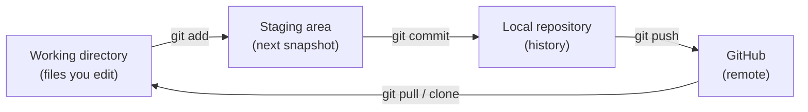

## What

Four tools you will use every working day:

1. **Terminal (shell):** type commands instead of clicking.
2. **File system and paths:** where things live and how to refer to them.
3. **Git + GitHub:** a time machine for your code, and a place to share it.
4. **DevTools:** the browser's built-in microscope (Elements, Console, Network, Sources).

### Terminal essentials

```bash
pwd                # print working directory: where am I?
ls -la             # list files (including hidden), with details
cd projects        # change directory into "projects"
cd ..              # go up one level
cd ~               # go home
mkdir portfolio    # make a folder
touch index.html   # create an empty file
cat index.html     # print a file
rm file.txt        # delete a file (NO recycle bin!)
```

### Paths: absolute vs relative

```text
/home/asha/portfolio/index.html      <- absolute: from the root of the disk
./styles/main.css                    <- relative: from the current file's folder
../images/me.jpg                     <- relative: go up one folder first
/styles/main.css                     <- root-relative: from the site root (works on a server, not on file://)
```

A **broken asset path** is the number one Day 1 bug. The Network tab shows it as a red 404 with the exact URL the browser tried.

### Git in one picture



```bash
git init                          # start tracking this folder
git status                        # what changed?
git add index.html styles/        # stage specific files
git commit -m "Add profile page skeleton"
git branch -M main
git remote add origin https://github.com/YOU/portfolio.git
git push -u origin main
git log --oneline                 # history
git diff                          # what exactly changed?
```

A **commit** is a snapshot plus a message. Small commits with clear one-line messages ("Add contact form", not "stuff") are a Week 1 acceptance criterion.

### DevTools map

| Panel | Use it to… |
|-------|------------|
| Elements | See the live DOM and the CSS applied to each element; edit styles live |
| Console | Read errors and run JavaScript (`console.log`, `console.table`) |
| Network | See every request: URL, method, status, size, timing, response |
| Sources | Set breakpoints and step through code line by line |
| Device toolbar | Emulate phone widths (try 360px) |

## Why

You cannot debug what you cannot see. Professionals do not guess; they look at the Network tab, read the Console, and check `git diff`. Git also protects you: you can always return to the last working commit.

## How

**Task: label a real site's requests.** Open DevTools → Network, tick *Disable cache*, reload. In the *Type* column you will see `document` (HTML), `stylesheet`, `script`, `img`, `font`, and `fetch/xhr` (API calls). Click one: *Headers* shows request/response headers, *Preview/Response* shows the body, *Timing* shows where time went.

**Task: Live Server vs `file://`.** Right-click `index.html` → *Open with Live Server* gives `http://127.0.0.1:5500/` (a real HTTP server). Double-click gives `file:///C:/...`. Differences you will observe: `fetch` to local files fails on `file://`, `type="module"` scripts are blocked, root-relative paths (`/styles/main.css`) break, and Live Server reloads on save.

## When

- Use the terminal for repeatable actions (installing packages, running servers, Git). In Week 4 you will do everything on a remote server through a terminal only.
- Commit whenever one small thing works. Push at least at the end of each session.
- Open DevTools the moment something looks wrong, before changing code.

## Where

Everywhere: your laptop, CI servers (GitHub Actions runs shell commands), the production VPS (SSH into a terminal), and every browser.

## Levels of understanding

<Levels>
<Level id="beginner">

The terminal is a text box where you tell the computer what to do. Git saves snapshots of your work so you can go back. GitHub keeps a copy online. DevTools lets you look inside any web page and see what loaded and what broke.

</Level>
<Level id="intermediate">

Git tracks content by hashing snapshots; `add` chooses what goes into the next commit; `push` uploads commits. `.gitignore` keeps files such as `node_modules/` and `.env` out of history. DevTools Network shows status codes and timing; Console shows runtime errors with line numbers.

</Level>
<Level id="advanced">

A commit is an immutable object pointing at a tree and parent commit(s); branches are movable pointers. Rewriting history changes hashes, which is why you never force-push shared branches. Secrets committed once live in history forever, so deleting the file is not enough (Week 2 lab). Shell commands compose with pipes: `ls | wc -l`, and exit codes drive CI success or failure.

</Level>
<Level id="industry">

Every change goes through a branch and pull request with review and CI checks. Teams use conventional, small commits so history can be bisected (`git bisect`) to find the commit that introduced a bug. Engineers live in the terminal and DevTools; "it works on my machine" is answered with logs and reproducible commands.

</Level>
</Levels>

## Common mistakes

<Callout kind="mistake">

- Running commands in the wrong folder (always `pwd` first).
- `rm` without checking the path; there is no undo.
- `git add .` that accidentally stages secrets or `node_modules`.
- Vague commit messages ("fix", "update").
- Committing a `.env` file or API key.
- Judging layout with cached assets; tick *Disable cache* while debugging.
- Opening the file with `file://` and then debugging "CORS errors" that vanish on Live Server.

</Callout>

## Industry usage

<Callout kind="industry">Interviewers often screen with a Git question ("how do you undo the last commit?") and a DevTools question ("how do you find why this request failed?"). From Week 1 your mentor reviews your commits and PR descriptions as carefully as your code.</Callout>

## Exercises

<Challenge kind="exercise" title="First repo, no broken paths" answer={<p>Checklist: folder has <code>index.html</code>, <code>styles/</code>, <code>images/</code>; page opened through Live Server shows zero red rows in Network; <code>git log --oneline</code> shows at least one commit; the repo is visible on GitHub; you can explain each command you typed.</p>}>

Create the project folder, a page that links one stylesheet and one image, open it through Live Server and `file://`, fix any 404, then commit and push. Write down the differences you saw.

</Challenge>

<Challenge kind="debug" title="Image 404 on GitHub Pages only" answer={<p>The path starts with <code>/images/…</code> (root-relative). On GitHub Pages the site lives under <code>/repo-name/</code>, so <code>/images</code> points at the domain root. Use a relative path (<code>images/hero.png</code>).</p>}>

Your page works locally but images vanish after deploying to `https://you.github.io/portfolio/`. The `img` src is `/images/hero.png`. Why?

</Challenge>

## Interview questions

<Challenge kind="interview" title="git add vs commit vs push" answer={<p><code>add</code> stages changes for the next snapshot; <code>commit</code> records the staged snapshot locally; <code>push</code> uploads local commits to the remote. Nothing is on GitHub until you push.</p>}>

"What is the difference between git add, git commit and git push?"

</Challenge>
