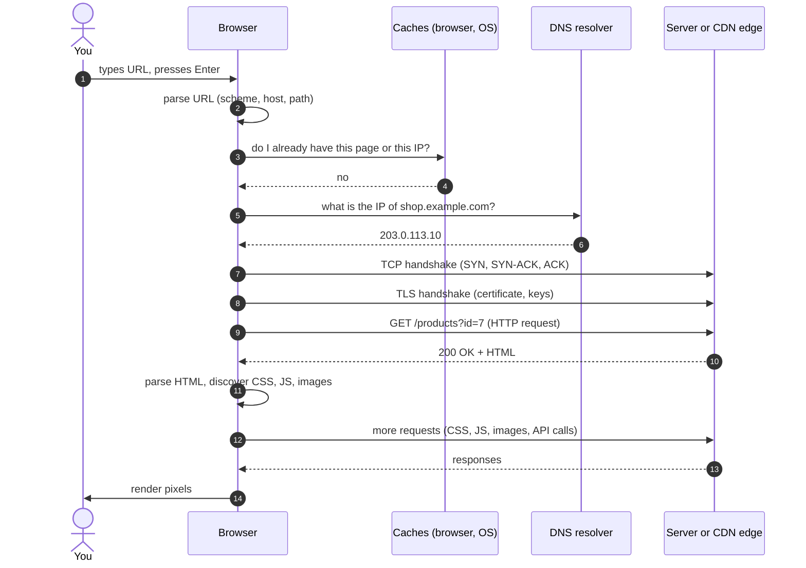
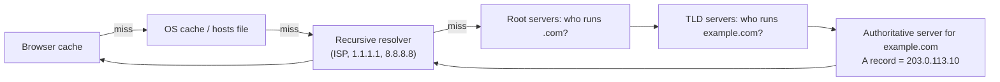
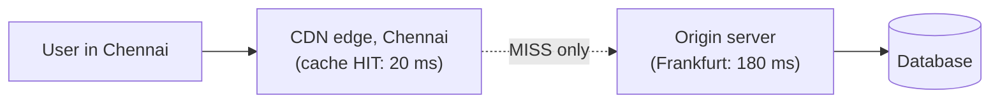
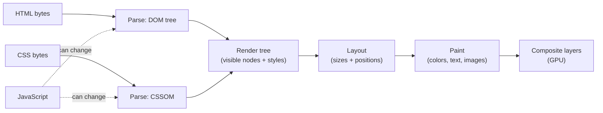

You type `https://shop.example.com/products?id=7` into the address bar and press Enter. About 300 milliseconds later you see a page. In between, **at least eight separate systems** cooperated. This lesson takes them apart one by one. If you can explain this flow out loud in two minutes, you have the mental model that every later week builds on.

## What

A URL (Uniform Resource Locator) is an *address*. The act of "visiting" it is a chain of conversations between your browser and several computers around the world.

Anatomy of a URL:

```text
https://shop.example.com:443/products?id=7#reviews
\___/   \_______________/\__/\_______/\___/ \_____/
scheme        host        port  path  query  fragment
```

| Part | Meaning | Who uses it |
|------|---------|-------------|
| scheme | Which protocol to speak (`https` = HTTP over TLS) | Browser |
| host | Which machine (resolved by DNS) | Browser + DNS |
| port | Which program on that machine (443 is the HTTPS default) | Browser / OS |
| path | Which resource | Server |
| query | Extra parameters, `key=value` pairs joined by `&` | Server |
| fragment | A spot inside the page; **never sent to the server** | Browser only |

## Why

Almost every bug you will ever debug on the web lives in one of these steps. "Site can't be reached" is DNS or networking. "Your connection is not private" is TLS. A `404` is the server saying it understood you but has nothing at that path. A white page with a console error is rendering. Knowing the steps tells you **where to look first**.

## How

### The full journey



### Step 1. Parse and check caches

The browser splits the URL into parts. If you typed `example.com` it assumes `https://`. Before touching the network it checks, in order: the **browser cache** (do I already have a fresh copy of this page?), the **service worker** (if one is installed), and the **HSTS list** (must this site always use HTTPS?).

### Step 2. DNS: turning a name into an address

Computers route traffic by **IP address** (`203.0.113.10` for IPv4, or an IPv6 address). Humans prefer names. **DNS** (Domain Name System) is the global phone book that maps names to addresses.



Key DNS record types you will use in Week 4:

- **A** — name → IPv4 address. **AAAA** — name → IPv6.
- **CNAME** — name → another name (an alias). `www.example.com → example.com`.
- **TXT** — free text, used to prove you own a domain.
- **TTL** (time to live) — how long resolvers may cache the answer. A low TTL means changes spread faster but cost more lookups.

### Step 3. TCP: opening a reliable pipe

Now the browser knows *where* the server is. It opens a **TCP connection** with a three-way handshake: SYN → SYN-ACK → ACK. TCP guarantees that bytes arrive complete and in order, retransmitting what gets lost. (HTTP/3 uses QUIC over UDP instead, but the idea of a reliable channel is the same.)

### Step 4. TLS: making the pipe private

For `https`, the browser and server then run a **TLS handshake**:

1. The server sends its **certificate**, a document signed by a Certificate Authority your browser trusts, saying "this public key belongs to `shop.example.com`".
2. The browser checks the signature, the expiry date, and that the name matches.
3. Both sides agree on a shared secret key. Everything after this is encrypted.

This is why a wrong or expired certificate gives a scary full-page warning. TLS provides **confidentiality** (nobody can read it), **integrity** (nobody can change it) and **authenticity** (you are talking to the real server).

### Step 5. HTTP: the actual conversation

HTTP is a text-based request/response protocol. The browser sends:

```http
GET /products?id=7 HTTP/1.1
Host: shop.example.com
Accept: text/html
Cookie: session=abc123
User-Agent: Mozilla/5.0 ...
```

The server answers:

```http
HTTP/1.1 200 OK
Content-Type: text/html; charset=utf-8
Cache-Control: max-age=60
Set-Cookie: theme=dark

<!doctype html>
<html>...
```

Anatomy: a **request line** (method + path + version), **headers** (metadata), a blank line, then an optional **body**. The response has a **status line** (code + reason), headers, a blank line, and a body.

Status code families:

| Range | Meaning | Examples |
|-------|---------|----------|
| 1xx | Informational | 101 Switching Protocols |
| 2xx | Success | 200 OK, 201 Created, 204 No Content |
| 3xx | Redirect | 301 Moved Permanently, 302 Found, 304 Not Modified |
| 4xx | **Your** mistake | 400 Bad Request, 401 Unauthorized, 403 Forbidden, 404 Not Found, 409 Conflict, 429 Too Many Requests |
| 5xx | **Server** mistake | 500 Internal Server Error, 502 Bad Gateway, 503 Service Unavailable |

### Step 6. The server (and the CDN in front of it)

What does "the server" do with `GET /products?id=7`? Typically: a web server or app (Node, Python, Ruby…) matches the path to a handler, which may query a **database**, build HTML (or JSON) and send it back.

Large sites put a **CDN** (Content Delivery Network, e.g. Cloudflare, Fastly, CloudFront) in front. A CDN is a fleet of servers near users around the world that **cache** copies of static files (images, CSS, JS, sometimes whole pages). The DNS answer points at the nearest CDN edge. On a cache hit the edge replies in a few milliseconds without ever contacting the "origin" server.



### Step 7. Rendering: HTML in, pixels out

The browser does not just paste the HTML. It runs a pipeline:



Important consequences:

- The parser stops at a plain `<script>` tag and runs it first, because JS might change the page. That is why scripts go at the end of `body` or use `defer` / `type="module"`.
- CSS **blocks rendering** (the browser refuses to paint unstyled content). Keep CSS small.
- Each `<link>`, `<script>` and `` triggers **another** request, back through steps 2–5 (usually reusing the same connection). A typical page makes dozens to hundreds of requests. You will list them yourself in the Network tab today.

## When

Use this mental model whenever something is slow, broken or confusing:

- *Nothing loads, "server not found"* → DNS (step 2).
- *Loads forever, then times out* → TCP / firewall / server down (step 3).
- *"Not secure" warning* → TLS certificate (step 4).
- *Page loads but a button does nothing* → JavaScript or an API call (step 7).
- *Page is fast the second time* → caching (steps 1 and 6).

## Where

Every step happens in a concrete place:

| Step | Runs on |
|------|---------|
| URL parse, cache, render, JS | Your browser, on your machine |
| DNS resolver | Your ISP or a public resolver |
| TCP / TLS / HTTP | Between your machine and the CDN edge or server |
| App logic, database | The origin server (a VPS, a cloud VM, a container) |

## Levels of understanding

<Levels>
<Level id="beginner">

You type a name. The internet looks up the number (IP address) that goes with the name, connects to the computer at that number, asks it for the page, and the computer sends back instructions (HTML, CSS, JavaScript) that your browser uses to draw the page. Pictures and styles are separate requests.

</Level>
<Level id="intermediate">

DNS resolves the host. The browser opens TCP and TLS connections, then sends an HTTP request whose method, path, headers and cookies the server uses to decide a response. The HTML response is parsed into a DOM; linked CSS, JS and images are fetched in parallel. JS can fetch JSON from APIs after load and update the DOM. Caching (browser, CDN, DNS TTLs) skips steps on repeat visits.

</Level>
<Level id="advanced">

Modern browsers use HTTP/2 or HTTP/3 to multiplex many requests over one connection, avoiding head-of-line blocking at the HTTP layer. TLS 1.3 completes in one round trip (and zero on resumption). The critical rendering path is parse HTML, build the CSSOM, build the render tree, layout, paint, composite. `preload`, `preconnect`, `defer`, and `fetchpriority` tune it. `Cache-Control`, `ETag` and `304 Not Modified` allow cheap revalidation. DNS can use anycast and geo-aware answers so one name maps to the nearest data center.

</Level>
<Level id="industry">

Engineers talk in **latency budgets**: DNS ~20 ms, TCP+TLS ~2 round trips, TTFB (time to first byte) under 200 ms, LCP (Largest Contentful Paint) under 2.5 s. Teams put static assets behind a CDN with long `max-age` and hashed filenames, use a reverse proxy (Caddy / Nginx) or load balancer in front of stateless app servers, and watch **Core Web Vitals** and p95/p99 latency in monitoring. In Week 4 you will personally configure DNS records, TLS via Caddy, and a reverse proxy.

</Level>
</Levels>

## Common mistakes

<Callout kind="mistake" title="Mixing up the layers">

- "DNS is the server." No: DNS only returns an address. The server is a different machine.
- "HTTPS makes the site safe." It makes the *connection* private; the site itself can still be malicious or buggy.
- "A 404 means the server is down." The server is up. It answered! It just has no such path.
- "The fragment (`#reviews`) goes to the server." It never leaves the browser.
- Testing with `file://` and wondering why `fetch` and modules fail. There is no server involved, so there is no HTTP. Use Live Server (`http://127.0.0.1:5500`).

</Callout>

## Industry usage

<Callout kind="industry">

Production incidents are often diagnosed with exactly this chain: `dig` (DNS), `curl -v` (TCP, TLS, HTTP in one command), the browser Network tab (waterfall of every request), and server logs. You will use all four in Weeks 4 and 6. Forward-deployed engineers use this model when a client says "your site is down" and it is actually their office DNS cache.

</Callout>

## Try it yourself

<Playground title="Parse a URL like a browser" code={`
const url = new URL("https://shop.example.com:443/products?id=7&sort=price#reviews");
console.log("scheme:", url.protocol);
console.log("host:", url.hostname);
console.log("path:", url.pathname);
console.log("query id:", url.searchParams.get("id"));
console.log("fragment:", url.hash);
`} />

## Exercises

<Challenge kind="exercise" title="Label a real page load" answer={<p>Typical result for a news site: 1 document request (HTML), 5-15 CSS/JS files, 30-100 images, plus several third-party calls (analytics, ads, fonts). XHR/Fetch rows are API calls returning JSON. Check the <b>Status</b> column for anything not 200/304, and the <b>Waterfall</b> to see what blocked what.</p>}>

Open any site you like. Open DevTools → **Network**, tick *Disable cache*, reload. Count the requests. Pick five and label each as HTML, CSS, JS, image, font or API call. Which request started first? Which was slowest, and why?

</Challenge>

<Challenge kind="exercise" title="Draw it without looking" answer={<p>Your drawing should contain, in order: URL parsing, cache check, DNS lookup, TCP handshake, TLS handshake, HTTP request, server work, HTTP response, HTML parse, subresource requests, render. Missing the TCP/TLS steps is the most common omission.</p>}>

Close this page. On paper or in Excalidraw, draw the whole URL-to-page flow from memory, then compare with the diagram above. Then explain it out loud in under two minutes while a friend (or a voice recorder) listens.

</Challenge>

<Challenge kind="debug" title="Why does this fail?" answer={<p>The page was opened with <code>file://</code>, so there is no web server and the request is blocked by the browser&apos;s same-origin rules for modules. Serve it with Live Server (<code>http://127.0.0.1:5500</code>) and it works.</p>}>

Your `index.html` uses `<script type="module" src="app.js">`. Double-clicking the file shows a blank page and the Console says *"Access to script at 'file:///…/app.js' from origin 'null' has been blocked by CORS policy"*. What is going on?

</Challenge>

## Interview questions

<Challenge kind="interview" title="Classic" answer={<p>Walk the chain: parse URL → check caches → DNS → TCP → TLS → HTTP request → server/CDN → response → parse HTML into DOM → fetch CSS/JS/images → CSSOM → render tree → layout → paint → composite. Then add one depth point of your own (for example, why CSS blocks rendering or how CDNs reduce latency). Interviewers grade structure and the depth of 1-2 steps, not recall of all.</p>}>

"What happens when you type a URL into the browser and press Enter?"

</Challenge>

<Challenge kind="interview" title="Follow-up" answer={<p>The browser (or OS) has the IP cached for the duration of the record&apos;s TTL. Within that window, no DNS lookup happens. Lowering a TTL <i>before</i> a planned server migration makes the switch propagate faster.</p>}>

"You changed the A record but some users still see the old site. Why?"

</Challenge>
