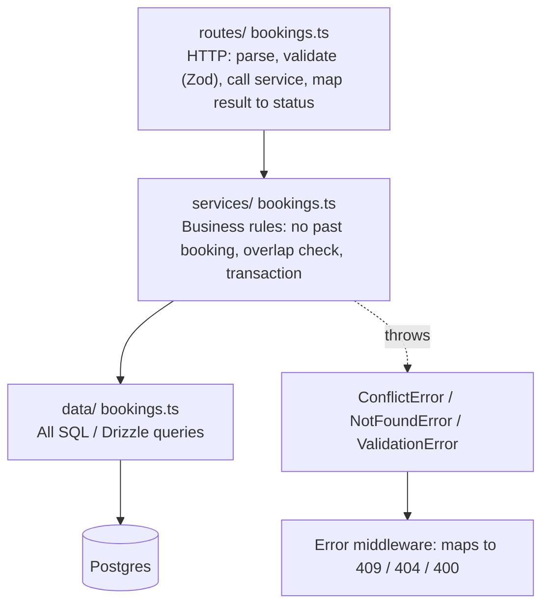

## What

### Layers



- **Routes never touch the database.** They translate HTTP to a function call and back.
- **Services** hold rules and transactions; they are reused later by AI tools (Week 5).
- **Data access** is the only place with SQL/ORM calls.

### Drizzle ORM

Drizzle is a thin, typed query builder over SQL: you can read the SQL it generates. Define tables in TypeScript, generate migration files, and run them.

```ts
import { pgTable, bigint, text, integer, timestamp } from "drizzle-orm/pg-core";

export const services = pgTable("services", {
  id: bigint("id", { mode: "number" }).primaryKey().generatedAlwaysAsIdentity(),
  name: text("name").notNull(),
  durationMin: integer("duration_min").notNull(),
  priceCents: integer("price_cents").notNull(),
});
```

```ts
// data/customers.ts
import { ilike, desc } from "drizzle-orm";
export async function search(db: Db, q: string | undefined, limit: number, offset: number) {
  return db.select().from(customers)
    .where(q ? ilike(customers.name, `%${q}%`) : undefined)       // parameterised by the library
    .orderBy(desc(customers.id)).limit(limit).offset(offset);     // pagination in SQL
}
```

Check the Drizzle docs for the current API of the version you install; function names evolve. Log the generated SQL in development (`logger: true`) so you always know what runs.

### Migrations as versioned files

`drizzle-kit generate` produces SQL files (`0001_init.sql`, `0002_trgm.sql`); a migrate script applies them in order and records which ran. **Never edit the database by hand** and never edit a migration that has been applied elsewhere; add a new one.

```sql
-- 0002_trgm.sql
CREATE EXTENSION IF NOT EXISTS pg_trgm;
CREATE INDEX customers_name_trgm_idx ON customers USING gin (name gin_trgm_ops);
```

### Seeds
A seed script creates realistic volume (10,000 bookings across 5,000+ customers) so query plans mean something. Use set-based SQL (`INSERT ... SELECT generate_series(...)`) or batch inserts, and make it idempotent or runnable only on empty DBs. One command to rebuild: `npm run db:reset` (drop → migrate → seed).

### The booking transaction

```ts
// services/bookings.ts
export async function createBooking(db: Db, input: NewBooking, now = new Date()) {
  const start = new Date(input.startsAt);
  if (start <= now) throw new ValidationError("Cannot book in the past");
  return db.transaction(async (tx) => {
    const service = await servicesData.get(tx, input.serviceId);
    if (!service) throw new NotFoundError("Service not found");
    const end = new Date(start.getTime() + service.durationMin * 60_000);

    await staffData.lockForUpdate(tx, input.staffId);                      // SELECT ... FOR UPDATE on the staff row
    const clash = await bookingsData.findOverlap(tx, input.staffId, start, end);
    if (clash) throw new ConflictError("That time overlaps another booking");

    try {
      return await bookingsData.insert(tx, { ...input, startsAt: start, endsAt: end });
    } catch (e) {
      if (isUniqueViolation(e)) throw new ConflictError("That time was just taken");   // SQLSTATE 23505
      throw e;
    }
  });
}
```

Acceptance example: a 60-minute booking at 10:00 followed by one at 10:30 → the second returns **409**.

### Handling database errors
Map Postgres error codes: `23505` unique violation → 409; `23503` FK violation → 400/409; connection errors → 500 with a generic message and **no stack trace**. With Postgres stopped, the API must return a 500 JSON body, log the real error, and recover when Postgres returns (the pool reconnects).

### Search and EXPLAIN

```sql
EXPLAIN ANALYZE SELECT * FROM customers WHERE name ILIKE '%asha%';
-- Expect: Bitmap Index Scan on customers_name_trgm_idx for 3+ character terms
```
For terms shorter than 3 characters trigram indexes can't help; require `q.length >= 3` or accept a seq scan.

## Why

Layering keeps rules testable and reusable; migrations make schema changes reviewable and repeatable; transactions plus locks make concurrent bookings correct; SQL-side pagination keeps memory and latency flat as data grows.

## How

1. Introduce `db` (pool + Drizzle), env `DATABASE_URL`.
2. Schema → generated migrations → `npm run db:migrate`; add the trgm migration.
3. Seed script; `db:reset`.
4. Move logic into `services/` and `data/`; make routes thin.
5. Implement `POST /bookings` (transaction) and `GET /bookings?date=&q=&page=`.
6. Stop Postgres and observe; fix leaks of stack traces.
7. Use an AI agent to add inline documentation for the data layer; **verify every comment against the code** and fix mismatches.

## When

Use a transaction for any multi-step business operation. Use `FOR UPDATE` when a decision depends on rows you just read. Use keyset pagination when OFFSET gets slow on deep pages.

## Where

`src/routes`, `src/services`, `src/data`, `drizzle/`, `scripts/seed.ts`, `docker-compose.yml`.

## Levels of understanding

<Levels>
<Level id="beginner">

The API now remembers things in a real database. Routes only talk to services, services decide the rules, and a data layer talks to the database. If two people try the same time, the database makes them take turns.

</Level>
<Level id="intermediate">

Use migrations and a seed script, parameterised queries via Drizzle, a pool, error mapping (23505 → 409), transactions with row locks, and SQL pagination and search with a trigram GIN index verified by EXPLAIN ANALYZE.

</Level>
<Level id="advanced">

Pool sizing vs Postgres `max_connections`; always release clients; statement and lock timeouts; keyset pagination; avoiding N+1 queries; expand/contract migrations; testing migrations against a copy of production-like data; using advisory locks or exclusion constraints as alternatives.

</Level>
<Level id="industry">

Schema changes go through review and CI that applies all migrations to an empty DB; slow queries are tracked; the data layer is the only owner of SQL so refactors are safe; error mapping is centralised and observable.

</Level>
</Levels>

## Common mistakes

<Callout kind="mistake">

- SQL or ORM calls inside route handlers.
- Check-then-insert without a lock or constraint.
- Leaking `error.stack` or SQL text to clients.
- Fetching all rows then filtering in JavaScript.
- Editing an applied migration, or changing the DB by hand.
- Not releasing pooled clients.
- Seeding 20 rows and thinking the query plan is representative.

</Callout>

## Industry usage

<Callout kind="industry">Interviewers often ask you to talk through exactly this endpoint: validation, transaction, lock, overlap check, error mapping, and the test that proves exactly one of two concurrent requests wins.</Callout>

## Exercises

<Challenge kind="exercise" title="Prove the plan" answer={<p>Run <code>EXPLAIN ANALYZE</code> for an ILIKE search of 3+ characters before and after the GIN index. Record the node type (Seq Scan vs Bitmap Index Scan), actual time and rows. Include the output in the PR description.</p>}>

Show that the trigram index is used for name search on the seeded 5,000+ customers.

</Challenge>

<Challenge kind="debug" title="500 with a stack trace" answer={<p>The error middleware sends <code>err.stack</code> (or <code>err.message</code> with SQL). Log the real error server-side and return a generic JSON 500; map known Postgres codes to specific 4xx.</p>}>

With Postgres stopped, `GET /bookings` returns the Node stack trace. Fix?

</Challenge>

## Interview questions

<Challenge kind="interview" title="Why layers?" answer={<p>Separation lets you test rules without HTTP, reuse them from other callers (CLI import, AI tools), swap persistence, and keep SQL in one reviewable place, while routes stay thin and consistent.</p>}>

"Why not put the SQL directly in the route handler?"

</Challenge>
