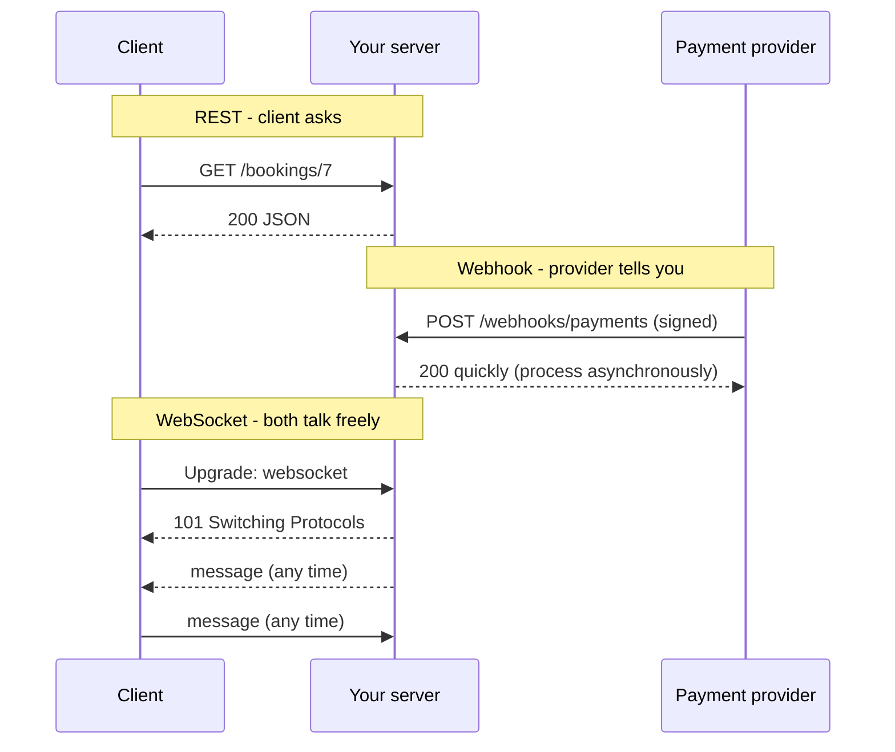

## What

| Style | Who starts it | Shape | Good for | Watch out for |
|-------|--------------|-------|----------|---------------|
| **REST / HTTP request-response** | Client asks | One request, one response | CRUD, queries, most apps | Polling is wasteful for "tell me when" |
| **Webhook** | Server calls **your** URL when something happens | HTTP POST from another system | Payment succeeded, form submitted, booking created elsewhere | Spoofing, replays, duplicates, retries |
| **WebSocket** | Either side, after an upgrade | One long-lived two-way connection | Live chat, presence, collaborative editing, games | State per connection, scaling, reconnects |
| **Server-sent events (SSE)** | Server pushes over one HTTP response | One-way text stream | Live progress, notifications, **streaming LLM tokens** | One direction only, proxies that buffer |



## Why

Choosing by communication pattern, not fashion, avoids both polling storms and over-engineering. A booking site rarely needs WebSockets; "email me when it's paid" needs a webhook.

## How

### Receiving a webhook safely

Anyone on the internet can POST to your URL. Defences:

1. **Verify a signature** computed with a shared secret over the **raw body** (do not parse and re-serialise first).
2. **Check a timestamp** and reject old deliveries (replay protection).
3. **Compare in constant time.**
4. **Be idempotent:** providers retry, so the same event id may arrive twice. Record processed ids (unique constraint) and ignore repeats.
5. **Answer fast** (2xx), then do slow work in a job queue; non-2xx or timeouts trigger retries.

```js
import crypto from "node:crypto";

const sign = (secret, body, ts) => crypto.createHmac("sha256", secret).update(`${ts}.${body}`).digest("hex");

export function verifyWebhook(secret, rawBody, headers, nowSec = Math.floor(Date.now() / 1000)) {
  const ts = Number(headers["x-timestamp"]);
  if (!Number.isFinite(ts) || Math.abs(nowSec - ts) > 300) return false;       // replay window: 5 minutes
  const expected = Buffer.from(sign(secret, rawBody, ts), "hex");
  const given = Buffer.from(String(headers["x-signature"] ?? ""), "hex");
  return given.length === expected.length && crypto.timingSafeEqual(given, expected);
}
```

Tested behaviours: a valid signature passes; a tampered body fails; a delivery 10 minutes old fails; a wrong or missing signature fails. In Express, capture the raw body (`express.raw({ type: "application/json" })` on that route) *before* JSON parsing. Each provider documents its own header names and signing scheme; follow theirs exactly.

```sql
-- Idempotency: the second insert of the same event id fails, so you skip the work
CREATE TABLE processed_events (event_id text PRIMARY KEY, received_at timestamptz NOT NULL DEFAULT now());
INSERT INTO processed_events (event_id) VALUES ($1) ON CONFLICT DO NOTHING RETURNING event_id;   -- no row returned = duplicate
```

### Server-sent events for streaming

```ts
app.get("/events", (req, res) => {
  res.writeHead(200, { "content-type": "text/event-stream", "cache-control": "no-cache", connection: "keep-alive" });
  const timer = setInterval(() => res.write(`data: ${JSON.stringify({ t: Date.now() })}\n\n`), 1000);
  req.on("close", () => clearInterval(timer));          // stop work when the client leaves
});
```
Browsers consume it with `new EventSource("/events")`. LLM "streaming" in Week 5 is this pattern or a chunked text response. Make sure your reverse proxy does not buffer it.

### WebSockets in brief
Start as an HTTP request with `Upgrade: websocket`; afterwards both sides send frames. You must handle authentication at connect time, heartbeats (ping/pong), reconnection with backoff, and horizontal scaling (a message for user X must reach whichever server holds X's connection; usually via Redis pub/sub or a managed service).

## When

Default to REST. Add a webhook when another system must notify you. Use SSE for one-way live updates and token streaming. Use WebSockets only when the client must also send frequent real-time messages.

## Where

Payment and calendar integrations, the Week 5 streaming summary, a live "bookings today" dashboard, WhatsApp-style channels (the Week 5 stretch task receives webhooks from the messaging provider).

## Levels of understanding

<Levels>
<Level id="beginner">

Normally your app asks a server a question and gets an answer. A webhook flips it: another service rings your doorbell when something happens. A live connection (WebSocket) is like an open phone line where both sides can speak any time.

</Level>
<Level id="intermediate">

Pick the style from the communication pattern. Verify webhook signatures over the raw body with a timestamp window, answer quickly, and make handlers idempotent with a unique event id. Use SSE for one-way streams.

</Level>
<Level id="advanced">

Design retry-safe consumers (at-least-once delivery), dead-letter failed events, rotate signing secrets with overlap, scale WebSockets with sticky sessions or pub/sub, and handle backpressure on streams.

</Level>
<Level id="industry">

Integrations are monitored by delivery success rate and lag; event schemas are versioned; teams use managed real-time services when connection scaling is not their core business.

</Level>
</Levels>

## Common mistakes

<Callout kind="mistake">

- Trusting a webhook because the URL is "secret".
- Verifying the signature of the re-serialised JSON instead of the raw body.
- Doing slow work before replying, causing timeouts and duplicate deliveries.
- Not de-duplicating events.
- Polling every second for something a webhook would deliver.
- Using WebSockets for plain request/response.

</Callout>

## Industry usage

<Callout kind="industry">Payment, messaging and calendar providers all use signed webhooks with retries. "How do you make your webhook handler safe and idempotent?" is a standard backend interview question.</Callout>

## Exercises

<Challenge kind="exercise" title="Test the verifier" answer={<p>Write five tests: valid signature accepted; body changed by one character rejected; timestamp 10 minutes old rejected; wrong signature rejected; missing signature header rejected. Then add a duplicate-event test showing the work runs once.</p>}>

Write tests for `verifyWebhook` and a duplicate-delivery test for the handler.

</Challenge>

<Challenge kind="debug" title="Signature never matches" answer={<p>The handler parsed JSON with <code>express.json()</code> and verified <code>JSON.stringify(req.body)</code>, which differs from the exact bytes the provider signed (whitespace, key order). Use the raw body for verification.</p>}>

Every genuine webhook fails verification in your Express app, but your unit test with a hand-made body passes. Why?

</Challenge>

## Interview questions

<Challenge kind="interview" title="Idempotent webhook" answer={<p>Providers deliver at least once, so store each event id with a unique constraint and skip repeats; reply 2xx quickly and process asynchronously; verify the signature and timestamp first.</p>}>

"A provider sometimes sends the same webhook twice. How do you make sure you act once?"

</Challenge>
