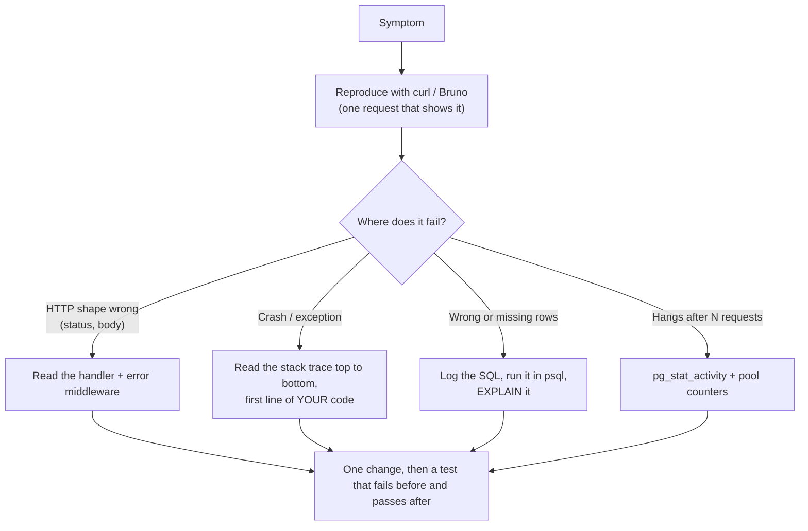

## What

Saturday is **no AI**: you are training the instinct that lets you judge AI-written code on Monday. The backend version of the debugging loop (reproduce, observe, hypothesise, change one thing, verify, write up) has its own instruments.



### Instruments

| Symptom | Tool | Command or action |
|---------|------|-------------------|
| Exception | Stack trace | Find the first frame in `src/`, not `node_modules` |
| Wrong value mid-function | VS Code debugger | Breakpoint, step over (F10), watch variables |
| Wrong rows | psql | `\d bookings` (schema), run the generated SQL by hand |
| Slow or full-scan query | EXPLAIN | `EXPLAIN (ANALYZE, BUFFERS) SELECT ...` |
| Hang after ~10 requests | Postgres | `SELECT state, count(*) FROM pg_stat_activity GROUP BY 1;` |
| Server-side errors | Postgres log | `docker compose logs db` |

## Why

Backends fail quietly: a missing `await` returns `{}` with status 200 and nothing crashes. Only structured investigation finds these.

## How

Work through the seven bugs. For each, here is the *signal* to look for:

1. **SQL injection (string concatenation).** Signal: input like `' OR '1'='1` changes the result set. Fix: placeholders (`$1`) and Zod validation; never interpolate. Test: the payload returns zero rows.
2. **Missing `await`.** Signal: body is `{}` or `[object Promise]`; no error. A promise serialises as an empty object. Fix: `await`, and an async wrapper so rejections reach the error middleware. Test asserts `body.id`.
3. **Errors returned with 200.** Signal: the frontend shows success on failure; the body has an `error` key. Fix: central error handler mapping errors to 400/404/409/500. Test asserts status codes.
4. **Missing foreign key.** Signal: a report total is lower than the sum of rows; `LEFT JOIN ... WHERE c.id IS NULL` finds orphans. Fix as a **new migration**: quarantine or repair the orphans first, then `ADD CONSTRAINT ... FOREIGN KEY ... ON DELETE RESTRICT`. Never edit the database by hand and never edit an applied migration.
5. **Pool client never released.** Signal: the API works for ~10 requests then hangs; `pg_stat_activity` shows connections stuck `idle in transaction` or the pool's `waitingCount` grows. Every `pool.connect()` needs `client.release()` in `finally`, or use `pool.query()` for single statements.

   ```ts
   const client = await pool.connect();
   try { /* queries */ } finally { client.release(); }
   ```
6. **Price stored as text.** Signal: `ORDER BY price` gives `100, 20, 9`. Fix: migration `ALTER COLUMN ... TYPE integer USING price::integer` plus a `CHECK (price >= 0)`. Existing data must convert cleanly, so look for bad values first (`WHERE price !~ '^[0-9]+$'`).
7. **GROUP BY report with duplicate rows.** Signal: each service appears several times. A join to a one-to-many table (here `staff_hours`) multiplies rows; extra `GROUP BY` columns split groups. Fix: remove the unnecessary join, group by the entity key, check totals against a hand-written query.

### Write-up format (required)

```text
Symptom:    GET /bookings hangs on the 11th request (curl timeout)
Cause:      pool.connect() in the list handler never calls release(); the pool (max 10) is exhausted
Fix:        use pool.query(); added a test that makes 25 sequential requests
Verified:   25/25 return 200 in under 50 ms; pg_stat_activity shows 1 idle connection
```

## When

Reproduce first. If you cannot reproduce it with a single request, make that your first task. Prefer fixing the *class* of bug (a lint rule, a test, a helper) over the single instance.

## Where

The runnable lab is in the repository: `labs/week-1/broken` with a checker (`node labs/week-1/check.mjs broken`, Postgres required; see `labs/README.md`). Schema fixes must be a new migration that repairs the existing data.

## Levels of understanding

<Levels>
<Level id="beginner">

When the server acts strangely, don't guess. Make the problem happen with one request, look at what the server and database say, change one thing, and run the request again. Then write down what was wrong.

</Level>
<Level id="intermediate">

Use the debugger and stack traces to locate the failing line, psql and EXPLAIN to check queries, and `pg_stat_activity` for pool problems. Fix schema issues with migrations that handle existing data, and add one test per fix.

</Level>
<Level id="advanced">

Instrument the pool (`totalCount`, `idleCount`, `waitingCount`), set `statement_timeout` and `idle_in_transaction_session_timeout` so leaks fail loudly, log slow queries (`log_min_duration_statement`), and write tests that would have caught the class of bug (a load test for leaks, a schema test for FKs).

</Level>
<Level id="industry">

Incident reviews record symptom, cause, fix, verification and prevention; prevention is a guard (lint rule, constraint, alert on pool saturation), not a promise to be careful.

</Level>
</Levels>

## Common mistakes

<Callout kind="mistake">

- Fixing the symptom (raising the pool size) instead of the leak.
- Editing the production schema by hand, or editing an applied migration.
- Converting a column type without checking existing values.
- "Fixing" 200-with-error by changing the frontend.
- Adding `try/catch` that swallows the error.
- Declaring it fixed without the original reproduction passing.

</Callout>

## Industry usage

<Callout kind="industry">Connection leaks and missing constraints are among the most common real production backend defects; both are invisible in a demo and obvious under load or after a year of data.</Callout>

## Exercises

<Challenge kind="exercise" title="Reproduce before fixing" answer={<p>For each of the seven bugs write the single command that shows it (curl, psql or a failing assertion) before changing any code. Your reproduction doubles as the regression test.</p>}>

Write the one-line reproduction for every bug before touching the code.

</Challenge>

<Challenge kind="debug" title="Orphans and the migration" answer={<p>The migration failed because existing rows violate the new constraint. Find them with a LEFT JOIN ... IS NULL, quarantine them into a separate table (not silent deletion), then add the constraint in the same migration.</p>}>

Your new migration adding the foreign key fails with &quot;violates foreign key constraint&quot;. Why, and how do you proceed safely?

</Challenge>

## Interview questions

<Challenge kind="interview" title="Hang after N requests" answer={<p>Suspect a resource leak: pool clients not released, open transactions, or unclosed streams. Verify with pg_stat_activity and pool counters, fix with try/finally or pool.query, add a load test, and consider timeouts so leaks surface quickly.</p>}>

"An API works for a while and then every request hangs. What do you check?"

</Challenge>
