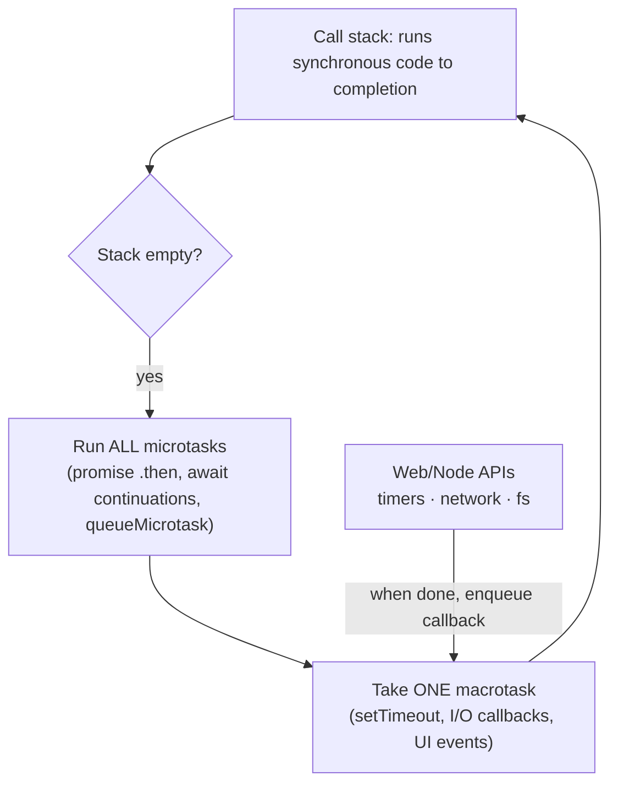

## What

JavaScript runs your code on **one thread**: one function at a time on the **call stack**. Anything that waits (timers, network, files) is handed to the runtime, and when it finishes a callback is placed on a **queue**. The **event loop** is the rule that decides what runs next: when the stack is empty, run **all microtasks**, then take **one macrotask** and repeat.



Predict the output before running it (then check):

<Playground title="Order of execution" code={`
console.log("1 sync start");
setTimeout(() => console.log("5 timeout 0 (macrotask)"), 0);
Promise.resolve().then(() => console.log("3 promise (microtask)"));
queueMicrotask(() => console.log("4 queueMicrotask"));
(async () => {
  console.log("2 async fn runs synchronously until its first await");
  await null;
  console.log("4b after await (microtask)");
})();
console.log("2b sync end");
`} />

The order is: all synchronous code first (`1`, `2`, `2b`), then every microtask in the order queued (`3`, `4`, `4b`), then the timer (`5`) even though its delay is `0`.

### async/await in one sentence
`await` pauses the *async function* (not the thread) and schedules the rest of it as a microtask when the promise settles. Code after the call to an async function keeps running immediately.

### Closures
A **closure** is a function together with the variables it was created next to. The variables stay alive as long as the function does.

```js
function makeCounter() {
  let n = 0;                 // private to this call
  return () => ++n;          // remembers n
}
const a = makeCounter(), b = makeCounter();
a(); a();                    // 2
b();                         // 1: separate closure, separate n
```

## Why

Most "mysterious" async bugs are ordering bugs: a value read before it was set, a state update that has not happened yet, two requests finishing in the wrong order (the AbortController lesson), a long synchronous loop freezing every request on a Node server.

## How

### Blocking the loop
A synchronous `while` or heavy `JSON.parse` blocks *everything*: timers, other requests, UI. On a Node API, one slow synchronous task delays all users. Break work into chunks, stream, or move it to a worker/queue.

### Classic loop trap

```js
for (var i = 0; i < 3; i++) setTimeout(() => console.log(i), 0);   // 3 3 3   (one shared var)
for (let i = 0; i < 3; i++) setTimeout(() => console.log(i), 0);   // 0 1 2   (a new binding per iteration)
```

### Running promises
`await a(); await b();` runs one after the other. `await Promise.all([a(), b()])` starts both then waits for both (use when independent). `Promise.allSettled` never rejects; it reports each result.

### Unhandled rejections
A rejected promise nobody handles can crash a Node process or vanish silently. Always `await` inside `try/catch` or attach `.catch`, and funnel route errors to the error middleware.

## When

Reach for this model whenever output order surprises you, when a handler "returns too early", and whenever you write code that mixes callbacks, promises and timers.

## Where

Express handlers (missing `await` returns `{}`), React effects and state updates, the Week 0 fetch widget, the Week 5 streaming responses.

## Levels of understanding

<Levels>
<Level id="beginner">

JavaScript does one thing at a time. When something slow happens, like asking a server for data, it leaves a note ("call me when it's done") and keeps going. The notes are handled when the current work finishes.

</Level>
<Level id="intermediate">

Synchronous code runs first, then microtasks (promise callbacks) in order, then the next macrotask (timers, I/O). `await` splits a function at that point. Closures keep variables alive; `let` in loops gives each iteration its own variable.

</Level>
<Level id="advanced">

Node adds phases (timers, pending, poll, check for `setImmediate`, close) and `process.nextTick` (runs before promise microtasks). Browsers also schedule rendering between macrotasks, so long microtask chains can starve paint. Use `AbortController` for cancellation and `structuredClone`/workers for heavy work.

</Level>
<Level id="industry">

Latency problems in Node services are often event-loop blocking; teams monitor event-loop lag, avoid sync APIs on hot paths, and offload CPU work. Reviewers flag floating promises (not awaited) and async functions passed to APIs that ignore their result.

</Level>
</Levels>

## Common mistakes

<Callout kind="mistake">

- Expecting `setTimeout(fn, 0)` to run before pending promise callbacks.
- Forgetting `await`, then using a Promise as if it were the value.
- `forEach` with an `async` callback (it does not wait for the callbacks).
- Using `var` in loops with callbacks.
- Blocking the loop with a big synchronous computation in a request handler.

</Callout>

## Industry usage

<Callout kind="industry">"Predict the output order" is a staple interview question precisely because the answer shows whether you have a correct mental model rather than memorised patterns.</Callout>

## Exercises

<Challenge kind="exercise" title="Predict, then run" answer={<p>Output order: A, D, C, B. Synchronous logs A and D first; the promise microtask C runs before the timer B even though the timer delay is 0.</p>}>

Without running it, give the output order:

```js
console.log("A");
setTimeout(() => console.log("B"), 0);
Promise.resolve().then(() => console.log("C"));
console.log("D");
```

</Challenge>

<Challenge kind="debug" title="forEach and await" answer={<p><code>forEach</code> ignores the promises returned by an async callback, so the code after it runs before the work finishes. Use <code>for...of</code> with <code>await</code> (sequential) or <code>await Promise.all(items.map(async ...))</code> (parallel).</p>}>

`items.forEach(async (i) => await save(i)); console.log("all saved");` prints before any save finishes. Why, and how do you fix it?

</Challenge>

## Interview questions

<Challenge kind="interview" title="Microtask vs macrotask" answer={<p>After the current synchronous code, the engine drains the microtask queue (promise reactions, await continuations) completely, then runs one macrotask (timer, I/O) and repeats. That is why a resolved promise callback runs before a zero-delay timeout.</p>}>

"Why does a promise callback run before setTimeout(fn, 0)?"

</Challenge>
