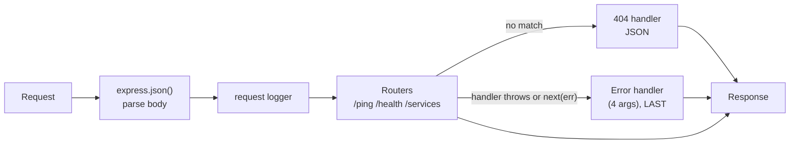

## What

### REST in practice

REST models your system as **resources** (nouns) addressed by URLs, manipulated with HTTP **methods** (verbs):

| Operation | Request | Success | Typical errors |
|-----------|---------|---------|----------------|
| List | `GET /services` | 200 + array | |
| Read one | `GET /services/7` | 200 | 404 |
| Create | `POST /services` + JSON | 201 + created resource (+ `Location`) | 400, 409 |
| Replace | `PUT /services/7` | 200 | 400, 404 |
| Partial update | `PATCH /services/7` | 200 | 400, 404 |
| Delete | `DELETE /services/7` | 204 (no body) | 404 |

Headers that matter: `Content-Type: application/json` (what you send), `Accept`, `Authorization`/`Cookie` (identity), `Cache-Control`. Safe methods (GET) must not change data; idempotent methods (PUT, DELETE) give the same result when repeated.

**Other API styles:** *REST* for request/response CRUD (this program); *webhooks* when another system must notify you (payment succeeded); *WebSockets* for continuous two-way streams (live chat, presence). Choose by communication pattern, not fashion.

### Express request flow and middleware order



Order matters: body parsing before routes; 404 after all routes; error handler last.

```ts
import express from "express";
import "dotenv/config";

const app = express();
app.use(express.json({ limit: "100kb" }));

app.get("/ping", (_req, res) => res.json({ msg: "pong" }));
app.get("/health", (_req, res) => res.json({ uptime: process.uptime(), timestamp: new Date().toISOString() }));

const router = express.Router();
let nextId = 1;
const services: { id: number; name: string; durationMin: number; priceCents: number }[] = [];

router.get("/", (_req, res) => res.json(services));
router.post("/", (req, res) => {
  const { name, durationMin, priceCents } = req.body ?? {};
  if (typeof name !== "string" || !Number.isInteger(durationMin) || !Number.isInteger(priceCents))
    return res.status(400).json({ error: { code: "VALIDATION", message: "name, durationMin, priceCents required" } });
  const s = { id: nextId++, name, durationMin, priceCents };
  services.push(s);
  res.status(201).json(s);
});
router.delete("/:id", (req, res) => {
  const i = services.findIndex((s) => s.id === Number(req.params.id));
  if (i === -1) return res.status(404).json({ error: { code: "NOT_FOUND", message: "Service not found" } });
  services.splice(i, 1);
  res.status(204).end();
});
app.use("/services", router);

// 404 for unknown paths (JSON, not Express's HTML page)
app.use((_req, res) => res.status(404).json({ error: { code: "NOT_FOUND", message: "Route not found" } }));

// Error handler: must have 4 parameters. Malformed JSON arrives here as a SyntaxError.
app.use((err: unknown, _req: express.Request, res: express.Response, _next: express.NextFunction) => {
  if (err instanceof SyntaxError && "body" in err) return res.status(400).json({ error: { code: "BAD_JSON", message: "Request body is not valid JSON" } });
  console.error(err);                                                    // log server-side only
  res.status(500).json({ error: { code: "INTERNAL", message: "Something went wrong" } });
});

app.listen(Number(process.env.PORT ?? 4000), () => console.log("API up"));
```

Configuration: `PORT` from `.env` (gitignored), with `.env.example` committed listing every variable (no secrets). Auto-restart in dev: `node --watch` (or `tsx watch`, `nodemon`).

### Testing the API with Bruno
Bruno stores requests as plain files in your repo (`bruno/`), so the collection is reviewed and versioned. Add assertions (`res.status eq 201`) and run in CI/terminal with `bru run`. Use `curl -i` for quick checks.

### Vite port and AbortController (frontend practice)
Port the Week 0 weather widget to Vite + TypeScript. When the user searches again, **cancel the previous request** so an older, slower response can't overwrite the newer one:

```ts
let controller: AbortController | undefined;
async function search(city: string) {
  controller?.abort();                           // cancel the in-flight request
  controller = new AbortController();
  try {
    const res = await fetch(url(city), { signal: controller.signal });
    if (!res.ok) throw new Error(`HTTP ${res.status}`);
    render(await res.json());
  } catch (e) {
    if ((e as DOMException).name === "AbortError") return;   // expected, not an error state
    showError((e as Error).message);
  }
}
```

## Why

A consistent, predictable API is the contract every client depends on. Correct status codes let clients react properly, and JSON errors everywhere mean frontends never have to parse HTML error pages.

## How

1. `/ping`, `/health`; CRUD for `/services` in memory.
2. Make every non-204 response JSON; handle bad JSON; add the JSON 404.
3. Bruno collection covering every route and failure; `bru run` passes.
4. Branch, port the widget with AbortController, build with zero type errors, open a PR.
5. Create a deliberate merge conflict between two branches editing the same line; resolve and explain it in the PR.

## When

Use `PUT/PATCH/DELETE` semantics honestly; use `POST` for actions that aren't CRUD (`POST /bookings/:id/cancel`). Use webhooks and WebSockets only when REST polling doesn't fit.

## Where

`src/routes/*.ts`, `src/app.ts`, `bruno/`, `.env.example`.

## Levels of understanding

<Levels>
<Level id="beginner">

An API is a menu of web addresses. You GET to read, POST to create, PUT/PATCH to change, DELETE to remove. The server answers with a number that says how it went (200 fine, 404 not found) and a JSON message.

</Level>
<Level id="intermediate">

Use Router per resource, middleware in the right order, JSON error shapes, correct codes (201 create, 204 delete, 400 invalid, 404 missing, 409 conflict), env config, and Bruno tests. Cancel stale browser requests with AbortController.

</Level>
<Level id="advanced">

Design for idempotency (idempotency keys on POST), pagination, versioning, ETags/conditional requests, consistent error envelopes (RFC 9457 problem details), request ids, timeouts and graceful shutdown. Understand that `express.json` limits and content-type checks protect against abuse.

</Level>
<Level id="industry">

APIs are specified (OpenAPI), contract-tested, versioned and documented; consumers are notified of changes; observability (request ids, structured logs, metrics) is built in from the start.

</Level>
</Levels>

## Common mistakes

<Callout kind="mistake">

- 200 for everything, including errors.
- HTML error pages leaking from the default Express handler.
- Registering the 404/error handlers before routes.
- Crashing on malformed JSON.
- Verbs in URLs (`/getServices`).
- Committing `.env`.
- Treating `AbortError` as a failure to display.

</Callout>

## Industry usage

<Callout kind="industry">Front-end and mobile teams build against your status codes and error shapes. A stable contract plus a committed Bruno/Postman/OpenAPI collection is how teams work in parallel.</Callout>

## Exercises

<Challenge kind="exercise" title="Status code table" answer={<p>For each route list a happy case and at least one failure with the code: create 201 / invalid body 400; get 200 / unknown id 404; delete 204 / unknown id 404; bad JSON 400; unknown path 404. Your Bruno assertions should check them all.</p>}>

Write the status-code table for `/services` and encode it as Bruno assertions.

</Challenge>

<Challenge kind="debug" title="HTML 404 page" answer={<p>Unknown paths fall through to Express&apos;s default handler. Add a catch-all JSON 404 after all routes and an error handler last.</p>}>

`GET /nope` returns an HTML page &quot;Cannot GET /nope&quot;. How do you return JSON instead?

</Challenge>

## Interview questions

<Challenge kind="interview" title="PUT vs POST idempotency" answer={<p>PUT replaces a resource at a known URL, so repeating it yields the same state (idempotent). POST creates or triggers actions and usually isn&apos;t idempotent; use idempotency keys to make retries safe.</p>}>

"Which HTTP methods are idempotent and why does it matter?"

</Challenge>
