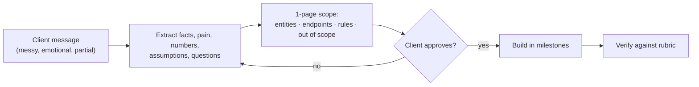

## What

You receive a messy WhatsApp message from a salon owner about double bookings and phone cancellations. Your first deliverable is **not code**: it is a one-page scope the "client" can approve.



### Scope document template

```text
# Booking API v1 - Scope
Problem (client's words): "<quote>"  Impact: <numbers if given>
Entities: customers, services, staff, staff_hours, bookings
Endpoints: (list with method, path, success + error codes)
Business rules:
 1. No overlapping bookings for a staff member (409)
 2. No bookings in the past (400)
 3. Cancelling sets status = 'cancelled' (row kept)
 4. Customer email unique
Out of scope (v1): payments, reminders, login, multi-branch, frontend
Assumptions / questions for the client: ...
```

## Why

Most failed projects fail on misunderstanding, not typing. A scope makes disagreement cheap, and it is what you test against.

## How

### Milestones (about 7 hours)
1. **Scope (45 min)** - written, committed as `docs/SCOPE.md`.
2. **Schema + migrations + seed (75 min)** - constraints from Day 3; seed 10k bookings.
3. **Services + customers CRUD (60 min)** - routes → services → data.
4. **Bookings: create / list / cancel (90 min)** - transaction + lock; pagination; search; 409.
5. **Availability (45 min)** - staff hours minus bookings, ISO with offsets.
6. **CSV import (45 min)** - see below.
7. **Tests + Bruno + README (60 min)**.

### CSV import script

```text
name,email,phone
Asha Rao,asha@example.com,+91 98765 43210
Bad Row,not-an-email,
Asha R.,ASHA@example.com,+91 98765 43210
```

Rules: parse with a CSV library; validate each row with Zod; **insert good rows with `ON CONFLICT (lower(email)) DO NOTHING`** (or update); collect bad rows as `{ line, reason }`; print a summary:

```text
Imported 1, skipped 1 duplicate (line 4), rejected 1 (line 3: invalid email)
```

A **second run creates no duplicates**. Do not abort the whole file for one bad row. Process in batches inside transactions for speed.

### Verification checklist
- [ ] Fresh clone: `npm i`, `docker compose up -d`, `npm run db:reset`, `npm test`, `npm run dev` works exactly as the README says
- [ ] Every route has a happy-path and a failure test
- [ ] Two simultaneous overlapping bookings: exactly one succeeds
- [ ] 10:00 (60 min) then 10:30 → 409 with a readable message
- [ ] Past booking → 400; cancel keeps the row
- [ ] Search uses SQL (EXPLAIN shows trigram index for 3+ characters)
- [ ] CSV re-run creates no duplicates; bad rows listed with line numbers
- [ ] Bruno collection passes with `bru run`
- [ ] No secrets committed; `.env.example` complete

## When

Re-read the scope at each milestone. If you discover a missing rule, update the scope and tell the client, rather than silently changing behaviour.

## Where

`docs/SCOPE.md`, the API repo, Bruno collection, README. Stretch: exclusion constraint with `btree_gist`, or availability in FastAPI/Go/Rails.

## Levels of understanding

<Levels>
<Level id="beginner">

Write down what you will build before building it, in a page the owner can read. Then build one small piece at a time and check each piece with tests.

</Level>
<Level id="intermediate">

Turn messy requirements into entities, endpoints, rules and non-goals; implement in vertical slices; use constraints and transactions for rules; make imports idempotent and report errors by line.

</Level>
<Level id="advanced">

Identify ambiguous requirements and ask targeted questions; record decisions; consider time zones and DST for availability; design import for large files (streaming, batching); add idempotency keys for booking creation.

</Level>
<Level id="industry">

Scope documents are contractual artefacts; changes go through change control; imports are rehearsed on a copy of client data with a rollback plan.

</Level>
</Levels>

## Common mistakes

<Callout kind="mistake">

- Starting with the schema before agreeing on rules.
- Aborting the entire CSV import on the first bad row.
- Import that duplicates customers on re-run.
- Availability returning times without a UTC offset.
- No out-of-scope list, so everything creeps in.

</Callout>

## Industry usage

<Callout kind="industry">Importing a client's messy spreadsheet is the first real task in many deployments. Reporting bad rows precisely is what makes the client trust the system with the rest of their data.</Callout>

## Exercises

<Challenge kind="exercise" title="Write the scope" answer={<p>A good scope states each business rule as a testable sentence (&quot;two active bookings for one staff member may not overlap&quot;), lists endpoints with status codes, names what is excluded, and lists assumptions as questions for the client.</p>}>

From the WhatsApp message your mentor provides, produce `docs/SCOPE.md` and get it approved before writing code.

</Challenge>

## Interview questions

<Challenge kind="interview" title="Idempotent import" answer={<p>Use a natural unique key (case-insensitive email) with upsert or DO NOTHING so repeats don&apos;t duplicate, validate per row, continue on errors, and report line numbers and reasons.</p>}>

"How do you make a data import safe to re-run?"

</Challenge>
