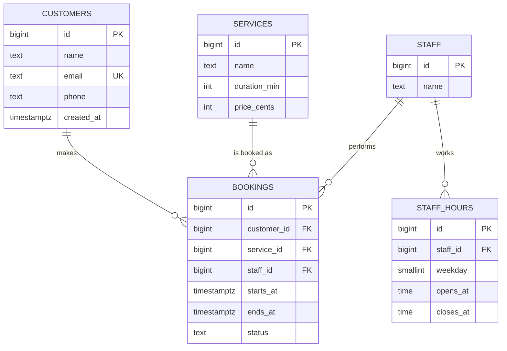

## What

### Module 1 · Database fundamentals
A **database** is software that stores data durably, lets many clients read and write at once, and keeps it consistent. A file or an in-memory array (your Week 1 Day 2 `/services`) loses data on restart, has no concurrency control, and gets slow without indexes.

### Module 2 · Relational databases
Postgres is a **relational** database: data lives in **tables** (rows = records, columns = attributes), and tables relate through keys.

- **Primary key (PK):** uniquely identifies a row.
- **Foreign key (FK):** a column that must match a PK in another table.



### Module 3 · Normalization
**Normalization** means storing each fact once. Bad design:

| booking_id | customer_name | customer_email | service_name | service_price |
|---|---|---|---|---|
| 1 | Asha | asha@x.com | Haircut | 500 |
| 2 | Asha | asha@x.co | Haircut | 450 |

Problems: the customer is typed twice (and the email now disagrees), the price changed in one row only. Fix: split into `customers`, `services`, `bookings` and reference by id. Rules of thumb: 1NF (atomic values, no lists in a cell), 2NF/3NF (every column depends on the key, the whole key, and nothing but the key).

> **Exception worth knowing:** a booking should snapshot the price paid (`price_cents_at_booking`) because the service price will change later. That is deliberate denormalization of *history*, not laziness.

### Module 5 · Constraints
Constraints are rules the database enforces **no matter which code writes to it**: your API, a script, a mistaken manual UPDATE.

## Why

Application code has bugs and races. Constraints are the last line of defence, and they are the only defence against two simultaneous requests. "No double booking" must be true *in the database*.

## How

```sql
CREATE TABLE customers (
  id          bigint GENERATED ALWAYS AS IDENTITY PRIMARY KEY,
  name        text        NOT NULL CHECK (length(trim(name)) > 0),
  email       text        NOT NULL UNIQUE,
  phone       text,
  created_at  timestamptz NOT NULL DEFAULT now()
);

CREATE TABLE services (
  id            bigint GENERATED ALWAYS AS IDENTITY PRIMARY KEY,
  name          text    NOT NULL,
  duration_min  integer NOT NULL CHECK (duration_min > 0),
  price_cents   integer NOT NULL CHECK (price_cents >= 0)   -- money as integer minor units, never float or text
);

CREATE TABLE staff (
  id   bigint GENERATED ALWAYS AS IDENTITY PRIMARY KEY,
  name text NOT NULL
);

CREATE TABLE staff_hours (
  id        bigint GENERATED ALWAYS AS IDENTITY PRIMARY KEY,
  staff_id  bigint   NOT NULL REFERENCES staff(id) ON DELETE CASCADE,
  weekday   smallint NOT NULL CHECK (weekday BETWEEN 0 AND 6),
  opens_at  time     NOT NULL,
  closes_at time     NOT NULL,
  CHECK (closes_at > opens_at),
  UNIQUE (staff_id, weekday)
);

CREATE TABLE bookings (
  id          bigint GENERATED ALWAYS AS IDENTITY PRIMARY KEY,
  customer_id bigint NOT NULL REFERENCES customers(id) ON DELETE RESTRICT,
  service_id  bigint NOT NULL REFERENCES services(id)  ON DELETE RESTRICT,
  staff_id    bigint NOT NULL REFERENCES staff(id)     ON DELETE RESTRICT,
  starts_at   timestamptz NOT NULL,
  ends_at     timestamptz NOT NULL,
  status      text NOT NULL DEFAULT 'booked' CHECK (status IN ('booked','cancelled')),
  CHECK (ends_at > starts_at)
);

-- Two ACTIVE bookings may not share a staff member and start time; cancelled ones don't count.
CREATE UNIQUE INDEX bookings_no_double_start
  ON bookings (staff_id, starts_at) WHERE status <> 'cancelled';
```

### Choosing ON DELETE

| FK | Choice | One-line justification |
|----|--------|------------------------|
| `staff_hours.staff_id` | CASCADE | Hours are meaningless without the staff member. |
| `bookings.customer_id` | RESTRICT | Never lose booking history or revenue by deleting a customer; anonymize instead. |
| `bookings.service_id` | RESTRICT | Past bookings must still point at a service. Retire services with an `active` flag. |
| `bookings.staff_id` | RESTRICT | Same: history must survive. |

### Data types worth remembering
`timestamptz` (always, stores an instant in UTC; plain `timestamp` is a trap), `text` (no need for `varchar(n)`), `integer` cents for money, `boolean`, `uuid`, `jsonb`.

### See constraints fail

```sql
INSERT INTO customers (name, email) VALUES ('Asha', 'asha@x.com');
INSERT INTO customers (name, email) VALUES ('Other', 'asha@x.com');
-- ERROR: duplicate key value violates unique constraint "customers_email_key"
```

## When

Put a rule in the database when it must **always** hold (uniqueness, valid ranges, referential integrity, no overlapping resources). Put it in application code when it needs context (who is allowed, friendly messages). Do both: the app gives friendly errors, the DB guarantees correctness.

## Where

Every backend with persistent state. In Week 1 Day 4 you will map these errors (`23505` unique violation, `23503` FK violation) to HTTP `409`/`400` responses.

## Levels of understanding

<Levels>
<Level id="beginner">

A database is a set of spreadsheets that follow strict rules and can link to each other with ids. A rule like "email must be unique" is enforced by the database itself, so no program can break it.

</Level>
<Level id="intermediate">

Design tables by entities and relationships (1-to-many via a FK on the "many" side). Normalize to avoid contradictory duplicates. Use PK, FK, UNIQUE, NOT NULL, CHECK and DEFAULT to encode business rules; choose CASCADE vs RESTRICT per relationship; store money in integer minor units and time as `timestamptz`.

</Level>
<Level id="advanced">

Partial unique indexes express "unique among active rows". Exclusion constraints (`EXCLUDE USING gist` with `btree_gist`) can forbid overlapping ranges outright (Week 1 stretch). Deferrable constraints, generated columns and domains tighten the model. Foreign keys need indexes on the referencing column for fast deletes/joins (Postgres doesn't create them automatically).

</Level>
<Level id="industry">

Schema changes ship as versioned, reviewed **migrations** applied by CI/CD; destructive changes use expand/contract steps to avoid downtime. Teams soft-delete or anonymize for compliance (GDPR/DPDP), keep audit columns (`created_at`, `updated_at`, `created_by`) and review schemas the way they review API contracts.

</Level>
</Levels>

## Common mistakes

<Callout kind="mistake">

- Storing price as `text` or `float` (wrong sorting, rounding errors). It is the Saturday lab bug.
- `timestamp` without time zone.
- Forgetting the FK so rows point at deleted parents.
- `ON DELETE CASCADE` on bookings → deleting a customer silently deletes revenue history.
- Relying on app code to prevent duplicates.
- Comma-separated lists in a single column.

</Callout>

## Industry usage

<Callout kind="industry">Constraint violations are first-class signals: logs and metrics count them, and APIs translate them to precise HTTP errors. Interviewers love "how do you prevent double booking?" because the right answer is a database constraint plus a transaction, not an `if` statement.</Callout>

## Exercises

<Challenge kind="exercise" title="Prove each constraint" answer={<p>You should be able to show, with one query each: duplicate email fails (23505); inserting a booking with a non-existent customer fails (23503); deleting a customer with bookings fails (RESTRICT); deleting a staff member removes their staff_hours (CASCADE); two active bookings at the same start fail but a cancelled one can be re-booked.</p>}>

Write one SQL statement for each: duplicate email, orphan booking, deleting a customer with bookings, deleting a staff member with hours, and a double booking followed by a re-booking of a cancelled slot.

</Challenge>

## Interview questions

<Challenge kind="interview" title="Money" answer={<p>Floats cannot represent decimals exactly (0.1 + 0.2 ≠ 0.3) and text sorts lexicographically ("9" &gt; "10"). Store integer minor units (cents/paise) or <code>numeric(12,2)</code>; format at the edge.</p>}>

"How would you store prices and why not float?"

</Challenge>
