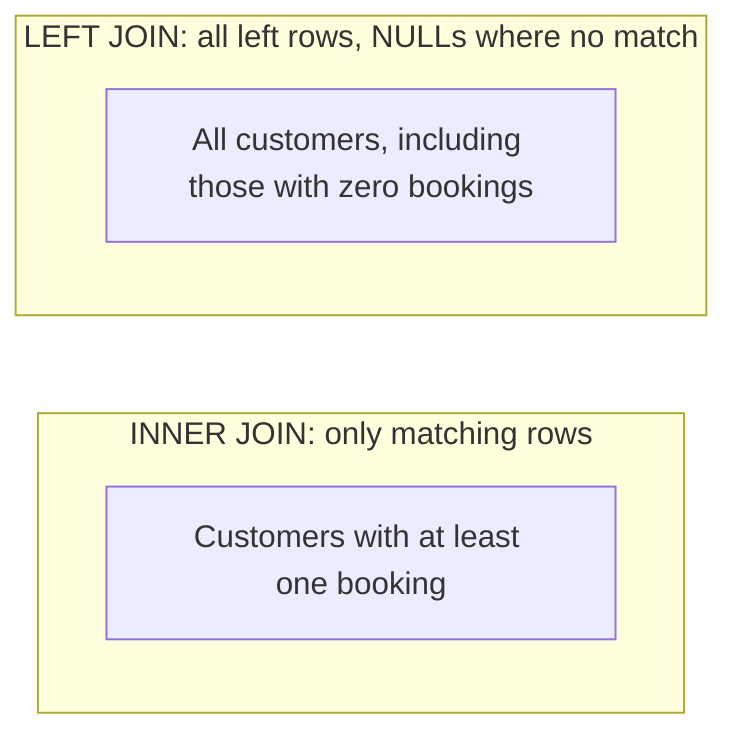
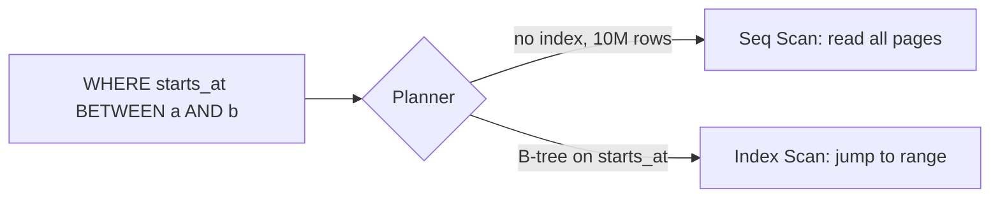

## What

### Module 6 · Joins
A **join** combines rows from two tables using a condition (usually `FK = PK`).



Example data: customers `Asha(1)`, `Ben(2)`, `Chitra(3)`; bookings for customers 1 and 2 only.

```sql
-- INNER: Chitra disappears
SELECT c.name, b.starts_at
FROM customers c
JOIN bookings b ON b.customer_id = c.id;

-- LEFT: Chitra appears with NULL starts_at
SELECT c.name, b.starts_at
FROM customers c
LEFT JOIN bookings b ON b.customer_id = c.id;

-- Customers with ZERO bookings: LEFT JOIN + IS NULL ("anti-join")
SELECT c.name
FROM customers c
LEFT JOIN bookings b ON b.customer_id = c.id
WHERE b.id IS NULL;
```

> **This is the Saturday bug:** if bookings pointed at deleted customers, an INNER JOIN in the revenue report would silently drop them. A foreign key prevents the orphans.

### Module 7 · Aggregation

```sql
-- Revenue per service (completed or booked, not cancelled)
SELECT s.name, count(*) AS bookings, sum(s.price_cents) / 100.0 AS revenue
FROM bookings b
JOIN services s ON s.id = b.service_id
WHERE b.status <> 'cancelled'
GROUP BY s.id, s.name
ORDER BY revenue DESC;

-- Customers with more than 3 bookings (HAVING filters AFTER grouping)
SELECT c.id, c.name, count(*) AS n
FROM customers c JOIN bookings b ON b.customer_id = c.id
GROUP BY c.id
HAVING count(*) > 3;
```

`WHERE` filters rows *before* grouping; `HAVING` filters groups *after*. Every non-aggregated column in `SELECT` must appear in `GROUP BY` (or be functionally dependent on a grouped primary key). A report that "returns duplicate rows" usually joined a one-to-many table without grouping.

### Core statements you must know by heart

```sql
SELECT id, name FROM customers WHERE email ILIKE '%@gmail.com' ORDER BY name LIMIT 20 OFFSET 40;
INSERT INTO customers (name, email) VALUES ('Dev', 'dev@x.com') RETURNING id;
UPDATE bookings SET status = 'cancelled' WHERE id = 7 RETURNING *;
DELETE FROM staff_hours WHERE staff_id = 2;

-- Upsert: re-running a CSV import creates no duplicates
INSERT INTO customers (name, email) VALUES ('Dev', 'dev@x.com')
ON CONFLICT (email) DO UPDATE SET name = EXCLUDED.name;

-- Bookings for a given day in the business time zone
SELECT * FROM bookings
WHERE starts_at >= TIMESTAMPTZ '2026-03-02 00:00 Asia/Kolkata'
  AND starts_at <  TIMESTAMPTZ '2026-03-03 00:00 Asia/Kolkata';
```

### Module 4 · Indexes

Without an index Postgres must scan every row (**sequential scan**). An index is a separate sorted structure (usually a **B-tree**) that finds rows in O(log n).



```sql
CREATE INDEX bookings_starts_at_idx ON bookings (starts_at);        -- range queries by day
CREATE INDEX bookings_customer_idx  ON bookings (customer_id);       -- FK joins/deletes
CREATE EXTENSION IF NOT EXISTS pg_trgm;
CREATE INDEX customers_name_trgm ON customers USING gin (name gin_trgm_ops); -- ILIKE '%asha%'
```

Trade-offs: indexes speed reads but slow writes and use disk; a multi-column index `(a, b)` helps filters on `a` or `a AND b`, not on `b` alone; a leading wildcard (`'%x'`) can't use a B-tree (that's why trigram GIN exists); low-selectivity columns (a boolean) rarely benefit.

## Why

The difference between 2 ms and 20 s on 10,000+ rows is usually one index and one query that expresses what you mean. Seeding 10,000 bookings on Thursday is how you *see* that.

## How

Always measure:

```sql
EXPLAIN ANALYZE
SELECT * FROM customers WHERE name ILIKE '%asha%';
-- Look for: Bitmap Index Scan on customers_name_trgm  (good)
--           Seq Scan on customers                       (needs an index or the table is tiny)
```

Read plans from the innermost node outward; compare **estimated vs actual rows** and the **actual time**.

## When

- **INNER JOIN** when a match is required; **LEFT JOIN** when the left side must survive.
- Add an index when `EXPLAIN ANALYZE` shows a slow seq scan on a big table for a frequent query, not preemptively on every column.

## Where

Booking list, availability, revenue reports, customer search (Week 1), dashboards (Week 3), and RAG keyword search (Week 5).

## Levels of understanding

<Levels>
<Level id="beginner">

A join lines up rows from two tables by id. INNER JOIN keeps only pairs that match; LEFT JOIN keeps everyone from the first table. An index is like a book's index: you look up the page instead of reading every page.

</Level>
<Level id="intermediate">

Group rows with GROUP BY to compute counts and sums; filter groups with HAVING. Use RETURNING and ON CONFLICT to write idempotent code. Index columns used in WHERE, JOIN and ORDER BY of frequent queries, and verify with EXPLAIN ANALYZE.

</Level>
<Level id="advanced">

The planner chooses between seq, index, index-only and bitmap scans using table statistics (`ANALYZE`). Join algorithms: nested loop, hash, merge. Composite index column order matters; partial and covering (`INCLUDE`) indexes reduce size and heap fetches. Pagination with OFFSET degrades on deep pages; keyset pagination (`WHERE (starts_at,id) > ($1,$2)`) stays fast.

</Level>
<Level id="industry">

Teams track slow queries (`pg_stat_statements`), review plans in PRs for hot paths, create indexes with `CREATE INDEX CONCURRENTLY` in production to avoid locking, and drop unused ones. ORMs generate SQL: you must be able to read it (Drizzle logging) and spot N+1 query patterns.

</Level>
</Levels>

## Common mistakes

<Callout kind="mistake">

- `WHERE` on a left-joined table's column, which turns LEFT JOIN into INNER JOIN. Put the condition in `ON`.
- Selecting non-grouped columns, or double counting after joining two one-to-many tables.
- `OFFSET 100000` pagination.
- Indexing everything, or functions on indexed columns (`WHERE lower(email) = ...` needs an index on `lower(email)`).
- Building SQL by string concatenation (SQL injection, Saturday lab). Always use parameters (`$1`).

</Callout>

## Industry usage

<Callout kind="industry">Analytics-style questions ("revenue per service this month", "customers who haven't returned in 60 days") are daily work for forward-deployed engineers; fluent joins and aggregation let you answer a client in minutes.</Callout>

## Exercises

<Challenge kind="exercise" title="10 queries by hand" answer={<p>Check each against seed data: (1) bookings for a day, (2) bookings per customer, (3) customers with zero bookings (LEFT JOIN … IS NULL), (4) revenue per service, (5) busiest weekday, (6) staff utilisation, (7) cancelled rate per month, (8) top 5 customers by spend, (9) next free slot per staff, (10) repeat customers (HAVING count &gt; 1).</p>}>

Write the 10 queries from the Day 3 tasks without AI. For each, say whether it needs an index and prove it with `EXPLAIN ANALYZE`.

</Challenge>

<Challenge kind="debug" title="Duplicate rows in the report" answer={<p>Joining <code>bookings</code> to <code>staff_hours</code> (one staff → many rows) multiplies each booking by the number of hour rows. Remove the unneeded join, or aggregate before joining.</p>}>

A "bookings per staff" report returns each booking 5 times. The query joins bookings → staff → staff_hours. Why?

</Challenge>

## Interview questions

<Challenge kind="interview" title="INNER vs LEFT" answer={<p>INNER returns only rows that match on both sides; LEFT returns all left rows with NULLs where no match. Example: customers INNER JOIN bookings omits customers with no bookings; LEFT JOIN … WHERE b.id IS NULL finds exactly those.</p>}>

"Explain INNER vs LEFT JOIN using this schema."

</Challenge>
