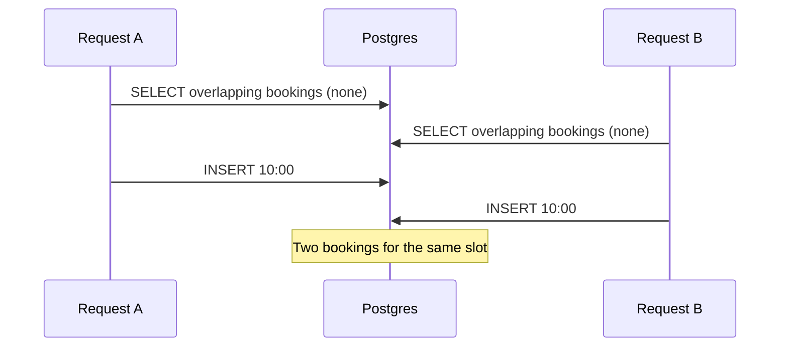
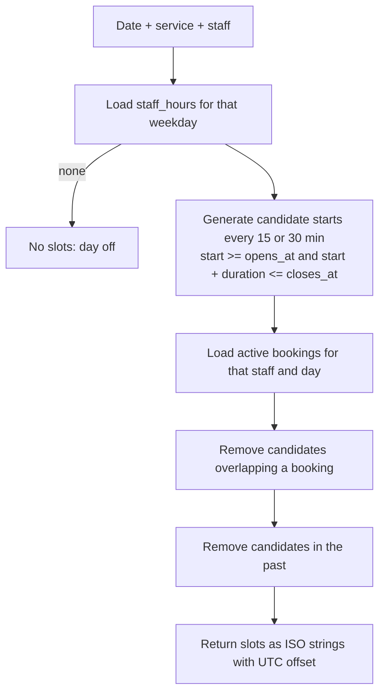

## What

### Module 8 · Transactions
A **transaction** groups statements so they succeed or fail together.

```sql
BEGIN;
  INSERT INTO bookings (...) VALUES (...);
  UPDATE ... ;
COMMIT;     -- or ROLLBACK;
```

**ACID:** Atomic (all or nothing), Consistent (constraints always hold), Isolated (concurrent transactions don't see each other's half-finished work), Durable (committed data survives a crash).

### The double-booking race

Two customers click "10:00" at the same moment. Each request checks "is the slot free?" (yes), then inserts. Both succeed.



Two layers of defence:

1. **Exact same start time** → the partial unique index from Module 5 rejects the second insert (`23505`).
2. **Overlapping but different start (10:00 for 60 min vs 10:30)** → a unique index can't see overlap. Lock the staff row so requests for that staff run one at a time:

```sql
BEGIN;
SELECT id FROM staff WHERE id = $1 FOR UPDATE;        -- second transaction waits here

SELECT 1 FROM bookings
WHERE staff_id = $1 AND status <> 'cancelled'
  AND starts_at < $3 AND ends_at > $2                 -- overlap test: start < otherEnd AND end > otherStart
LIMIT 1;

-- if a row came back: ROLLBACK and return 409 Conflict
INSERT INTO bookings (...) VALUES (...);
COMMIT;
```

```mermaid
sequenceDiagram
    participant A as Request A
    participant DB as Postgres
    participant B as Request B
    A->>DB: BEGIN; SELECT staff FOR UPDATE (lock)
    B->>DB: BEGIN; SELECT staff FOR UPDATE (waits…)
    A->>DB: overlap check: none → INSERT → COMMIT (lock released)
    DB-->>B: lock acquired
    B->>DB: overlap check: finds A's booking
    B-->>B: ROLLBACK → API returns 409
```

**Isolation levels:** Postgres defaults to `READ COMMITTED`. `SERIALIZABLE` can also prevent this class of bug but requires retry logic. Row locks (`FOR UPDATE`) are the simple, explicit tool here. The stretch goal is an **exclusion constraint** that makes the database refuse overlaps itself:

```sql
CREATE EXTENSION IF NOT EXISTS btree_gist;
ALTER TABLE bookings ADD CONSTRAINT no_overlap
  EXCLUDE USING gist (staff_id WITH =, tstzrange(starts_at, ends_at) WITH &&)
  WHERE (status <> 'cancelled');
```

### Module 9 · Query optimization

A repeatable loop:

1. Find the slow query (logs, `pg_stat_statements`).
2. `EXPLAIN (ANALYZE, BUFFERS)` it.
3. Look for seq scans on big tables, large row-estimate errors, sorts spilling to disk.
4. Change one thing: add an index, rewrite the query, fix pagination.
5. Re-measure.

Example: `ILIKE '%asha%'` on 5,000+ customers → seq scan. After the `gin_trgm_ops` index, the plan shows `Bitmap Index Scan`. Note pg_trgm needs a search term of 3+ characters to use trigrams effectively, which is why the acceptance criteria say so.

### Module 10 · Real-world booking system schema

Everything together, as a migration-ready design:

```sql
-- 0001_init.sql (excerpt)
CREATE EXTENSION IF NOT EXISTS pg_trgm;

-- tables from the foundations lesson ...

CREATE INDEX bookings_starts_at_idx   ON bookings (starts_at);
CREATE INDEX bookings_customer_idx    ON bookings (customer_id);
CREATE INDEX customers_name_trgm_idx  ON customers USING gin (name gin_trgm_ops);
CREATE UNIQUE INDEX bookings_no_double_start ON bookings (staff_id, starts_at) WHERE status <> 'cancelled';
```

Availability for a date (algorithm, implemented in the service layer):



## Why

Correctness under concurrency is what separates a demo from a system a salon can trust on a Saturday morning.

## How

In the Drizzle service layer (Day 4), wrap the sequence above in `db.transaction(async (tx) => { ... })` and translate your `ConflictError` into HTTP 409. Test it with two parallel requests (`Promise.all`) in Vitest and assert that exactly one succeeds.

## When

Use a transaction whenever a business operation touches more than one statement or depends on a read that must still be true at write time. Keep transactions short: never call external APIs (email, an LLM) while holding locks.

## Where

Booking creation, cancellation with refunds, AI tool calls in Week 5 (they call the same service layer, so they inherit this safety).

## Levels of understanding

<Levels>
<Level id="beginner">

A transaction is "do all of this, or none of it". When two people grab the same slot, we make them take turns, and the second person is told it's already taken.

</Level>
<Level id="intermediate">

Wrap check-then-insert in a transaction and lock the staff row with `SELECT … FOR UPDATE` so concurrent bookings for that staff serialize. Back it with a partial unique index and surface violations as 409. Use `EXPLAIN ANALYZE` to verify performance.

</Level>
<Level id="advanced">

Under READ COMMITTED each statement sees a fresh snapshot, so check-then-insert races; options are explicit locks, SERIALIZABLE with retries (SQLSTATE 40001), advisory locks, or exclusion constraints (strongest, no application logic). Deadlocks are avoided by locking in a consistent order. Long transactions bloat tables via blocked vacuum.

</Level>
<Level id="industry">

Teams load-test the booking endpoint with concurrent requests, alert on lock waits and deadlocks, and prefer constraints over locks when possible because they hold for every writer (ORM, scripts, future services). Idempotency keys protect against retried requests creating duplicate bookings.

</Level>
</Levels>

## Common mistakes

<Callout kind="mistake">

- Check-then-insert without a lock or constraint.
- Holding a transaction open while calling an external service.
- Forgetting `ROLLBACK` on error / never releasing a pool client (the "API hangs after 10 requests" bug).
- Overlap test written as `starts_at = $1` instead of the interval test.
- Locking the whole bookings table when one staff row is enough.

</Callout>

## Industry usage

<Callout kind="industry">Concurrency bugs only appear in production under load. Writing the concurrent test now is the habit that distinguishes senior engineers. In Week 5 the AI agent will call this same function, and the database still refuses to double book.</Callout>

## Exercises

<Challenge kind="exercise" title="Race it" answer={<p>Fire two <code>createBooking</code> calls with <code>Promise.all</code> for overlapping times. Exactly one fulfils and one throws <code>ConflictError</code> (HTTP 409). Remove the FOR UPDATE and observe both sometimes succeed for 10:00 vs 10:30.</p>}>

Write a Vitest test that creates two overlapping bookings simultaneously. Assert exactly one succeeds. Then remove the lock and see the test go red.

</Challenge>

## Interview questions

<Challenge kind="interview" title="Prevent double booking" answer={<p>Constraint for exact duplicates (partial unique index) + transaction with row lock or exclusion constraint for overlaps; return 409; test concurrency. Mention idempotency keys for client retries.</p>}>

"How do you guarantee two users can't book overlapping slots?"

</Challenge>
