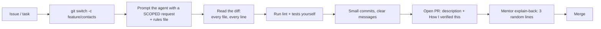

## What

### TypeScript in one page

TypeScript adds **static types** to JavaScript. Types are erased at runtime; they catch mistakes while you type.

```ts
interface Contact { id: number; name: string; email?: string }          // optional field
type Status = "booked" | "cancelled";                                   // union of literals
function greet(c: Contact): string { return `Hi ${c.name}`; }          // template string

const first = contacts[0]?.name ?? "unknown";                          // optional chaining + nullish coalescing
const { id, ...rest } = contact;                                        // destructuring, rest
const updated = { ...contact, name: "Asha" };                           // spread: copy + override
```

Types describe what *should* be; they do **not** validate data arriving at runtime (JSON from a client). That is why Day 5 adds Zod.

### Pure functions and immutability

A **pure function** returns the same output for the same input and changes nothing outside itself. They are easy to test and safe to share.

```ts
export const searchByName = (cs: readonly Contact[], q: string) =>
  cs.filter((c) => c.name.toLowerCase().includes(q.toLowerCase()));

export const countByFirstLetter = (cs: readonly Contact[]) =>
  cs.reduce<Record<string, number>>((acc, c) => {
    const k = c.name.charAt(0).toUpperCase();
    return { ...acc, [k]: (acc[k] ?? 0) + 1 };
  }, {});

export const sortByName = (cs: readonly Contact[]) =>
  [...cs].sort((a, b) => a.name.localeCompare(b.name));                // copy first: sort mutates

export const updateContact = (c: Contact, changes: Partial<Contact>): Contact => ({ ...c, ...changes });
```

### Closures and the event loop (why this matters)

A **closure** is a function that remembers variables from where it was created. The **event loop** runs one piece of JS at a time and picks the next task from queues when the call stack is empty; `await` yields so other work can run.

```ts
const counter = () => { let n = 0; return () => ++n; };    // n lives on inside the returned function
```

### Tests with Vitest

```ts
import { describe, it, expect } from "vitest";
describe("sortByName", () => {
  it("sorts without mutating the input", () => {
    const input = [{ id: 1, name: "Zed" }, { id: 2, name: "Amy" }];
    const snapshot = structuredClone(input);
    const out = sortByName(input);
    expect(out.map((c) => c.name)).toEqual(["Amy", "Zed"]);
    expect(input).toEqual(snapshot);                                    // original untouched
    expect(out).not.toBe(input);
  });
});
```

### Project setup checklist
`npm init -y` → add `typescript`, `tsx`, `vitest`, `eslint`, `prettier` → scripts: `dev`, `build`, `lint`, `format`, `test` → `tsconfig.json` with `strict: true` → `.gitignore` (node_modules, .env, dist) → `AGENTS.md`.

## Why

Typed, tested, pure code is what lets you (and an AI agent) change things without breaking them. Reading and reviewing diffs is the main skill for the rest of the program.

## How

### The AI + Git workflow



**Rules file (`AGENTS.md` / `CLAUDE.md`)** is the standing instructions an agent reads. Keep it short and concrete:

```text
# Project rules
Stack: Node 22, TypeScript strict, Express, Postgres (Drizzle), Vitest.
Structure: src/routes (HTTP only), src/services (rules), src/data (SQL), src/schemas (Zod), tests/.
Rules:
- Never commit secrets or .env. Use process.env + .env.example.
- Run `npm run lint && npm test` before saying a task is done.
- Do not change tests to make them pass without telling me why.
- Keep diffs small; no unrelated refactors; no new dependencies without asking.
```

**A scoped request** names the goal, files, constraints and the done condition: *"In src/contacts.ts add searchByName (case-insensitive, partial). Don't touch other files. Add Vitest tests for empty list and no match. Don't mutate inputs."* Vague requests ("make a contacts module") produce sprawling diffs.

**Reading a diff:** Which files changed? Anything you did not ask for? Tests edited? New dependencies? Deleted checks? Can you explain each line? If not, ask the agent to explain *and verify the explanation against the code* (agents sometimes explain what code *should* do).

**Comparing agents:** give the same scoped request to two tools; compare diffs for size, correctness, tests and surprises. Note which one you trust for what, with evidence.

### Git commands you need this week
```bash
git switch -c feature/contacts          # branch
git add -p                              # stage chunks deliberately
git commit -m "Add searchByName with tests"
git push -u origin feature/contacts     # then open a PR on GitHub
git switch main && git pull --ff-only   # update main
git merge main                          # bring main into your branch; resolve conflicts
```

Merge conflict markers:

```text
<<<<<<< HEAD
your version
=======
their version
>>>>>>> main
```
Edit to the correct final content, remove the markers, run tests, `git add`, `git commit`.

## When

Always branch for a task; always read the diff before committing agent work; always run the tests yourself.

## Where

Every repository from today onward. The rules file lives at the repo root.

## Levels of understanding

<Levels>
<Level id="beginner">

TypeScript warns you about mistakes before you run the code. Write small functions that don't change their inputs and test them. When an AI helps, give it a small job, read everything it changed, and be able to explain it.

</Level>
<Level id="intermediate">

Use strict TS, unions and interfaces; prefer `map/filter/reduce` and spread for immutable updates; write Vitest tests that assert both results and non-mutation. Use branches and PRs; give the agent a rules file and scoped tasks; review diffs and run checks locally.

</Level>
<Level id="advanced">

Use `readonly`, `as const`, discriminated unions and generics for safety; avoid `any`; understand structural typing and narrowing. Treat agent output as untrusted code: check for test edits, dependency changes, and behaviour beyond the request. Use `git rebase -i` only on your own branches; resolve conflicts by understanding both intents.

</Level>
<Level id="industry">

Teams enforce lint, format and type checks in CI, require PR descriptions with verification, and use CODEOWNERS for sensitive paths. AI usage has policies: no secrets in prompts, human review mandatory, AI-generated tests reviewed for meaning.

</Level>
</Levels>

## Common mistakes

<Callout kind="mistake">

- Using `any` to silence the compiler.
- Believing types validate runtime data.
- `Array.prototype.sort` on an input array.
- Accepting AI output without reading the diff, or letting it edit tests to pass.
- Huge commits with vague messages.
- Resolving conflicts by picking one side blindly.
- Committing `.env`.

</Callout>

## Industry usage

<Callout kind="industry">Reviewers ask "why does this test assertion exist?" and "what does this line do?" The explain-back rule in this program rehearses that scrutiny.</Callout>

## Exercises

<Challenge kind="exercise" title="Four pure functions, tested" answer={<p>Tests to include: empty list, no match, mixed-case search, multiple names with the same first letter, sorting stability, and that inputs are unchanged (<code>structuredClone</code> snapshot). Show the PR description with &quot;How I verified this&quot;.</p>}>

Implement `searchByName`, `countByFirstLetter`, `sortByName`, `updateContact` with Vitest tests including non-mutation checks, on a feature branch with a PR.

</Challenge>

<Challenge kind="debug" title="Why did the original array change?" answer={<p><code>sort</code> mutates in place. Copy first (<code>[...cs].sort(...)</code>) or use <code>toSorted</code>.</p>}>

`const sorted = contacts.sort(byName)` and later `contacts` is reordered everywhere. Why?

</Challenge>

## Interview questions

<Challenge kind="interview" title="Types vs validation" answer={<p>TypeScript types exist only at compile time and don&apos;t check data from the network. Runtime validation (Zod) is needed at trust boundaries; infer TS types from the schema to keep them in sync.</p>}>

"If my API is written in TypeScript, why do I still need runtime validation?"

</Challenge>
