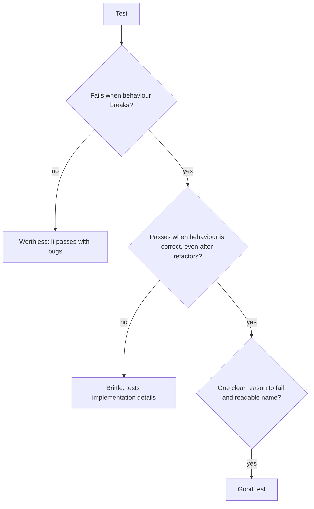

## What

### Zod at the boundary

```ts
import { z } from "zod";

export const createBookingSchema = z.object({
  customerId: z.number().int().positive(),
  serviceId: z.number().int().positive(),
  staffId: z.number().int().positive(),
  startsAt: z.string().datetime({ offset: true }),         // ISO 8601 WITH a UTC offset
}).strict();                                                // unknown keys are an error (no mass assignment)

export const listBookingsQuery = z.object({
  date: z.string().regex(/^\d{4}-\d{2}-\d{2}$/).optional(),
  q: z.string().trim().min(3).optional(),
  page: z.coerce.number().int().min(1).default(1),
  pageSize: z.coerce.number().int().min(1).max(100).default(20),
});
```

A small middleware validates and replaces the raw input with the parsed (typed, coerced) value:

```ts
export const validate = <T extends z.ZodTypeAny>(schema: T, source: "body" | "query" | "params" = "body") =>
  (req: Request, res: Response, next: NextFunction) => {
    const parsed = schema.safeParse(req[source]);
    if (!parsed.success) {
      return res.status(400).json({
        error: { code: "VALIDATION", message: "Invalid input",
          fields: Object.fromEntries(parsed.error.issues.map((i) => [i.path.join("."), i.message])) },
      });
    }
    (req as any)[source] = parsed.data;                    // note: some Express versions make req.query read-only; store as res.locals.query if needed
    next();
  };
```

### One error format everywhere
`{ "error": { "code": "VALIDATION" | "NOT_FOUND" | "CONFLICT" | "INTERNAL", "message": "...", "fields"?: { "startsAt": "Invalid datetime" } } }`. Clients (and, later, AI tools) rely on it.

### What makes a good test



Test behaviour (inputs → outputs, status codes, database state), not internal calls. Each test is independent: reset the database per test or per file; use a separate **test database**.

### Supertest against the app

```ts
import request from "supertest";
import { app } from "../src/app";

describe("POST /bookings", () => {
  beforeEach(async () => { await resetDb(); await seedMinimal(); });

  it("creates a booking (201)", async () => {
    const res = await request(app).post("/bookings").send(valid());
    expect(res.status).toBe(201);
    expect(res.body).toMatchObject({ staffId: 1, status: "booked" });
  });

  it("rejects an invalid date (400 with field error)", async () => {
    const res = await request(app).post("/bookings").send({ ...valid(), startsAt: "tomorrow" });
    expect(res.status).toBe(400);
    expect(res.body.error.fields.startsAt).toBeDefined();
  });

  it("returns 409 for an overlapping booking", async () => {
    await request(app).post("/bookings").send(valid("2030-01-07T10:00:00+05:30"));
    const res = await request(app).post("/bookings").send(valid("2030-01-07T10:30:00+05:30"));
    expect(res.status).toBe(409);
  });

  it("lets exactly one of two simultaneous requests win", async () => {
    const [a, b] = await Promise.all([post(valid()), post(valid())]);
    expect([a.status, b.status].sort()).toEqual([201, 409]);
  });
});
```

Use dates far in the future (or inject a clock) so tests don't expire. Keep fixtures small and explicit.

### Reviewing tests an AI wrote
Ask: Does each test *fail* if I delete the behaviour? (Mutate the code and watch.) Does it assert meaningful things (status **and** body **and** database state) or just "does not throw"? Are expected values hard-coded independently or copied from the implementation? Are failure cases covered? Did it mock away the thing being tested? Fix weak tests, and say so in the PR.

## Why

Validation is the trust boundary: nothing unvalidated enters the service layer. Tests are the safety net that lets you change code (and let an AI change code) with confidence. Mutation checks prove the tests can actually catch bugs.

## How

1. Add schemas for every route (body, query, params) and the validate middleware.
2. Write one happy-path and at least one failure test per route; add the 409 and concurrency tests.
3. Ask the agent to write tests for one route; review them using the questions above; correct them.
4. Break the code on purpose (remove the overlap check, change a status code, drop a validation) and confirm tests go red: the mentor will pick 3 lines.

## When

Validate at every boundary (HTTP, queue messages, env vars, AI output). Write tests as you build; add a regression test for every bug.

## Where

`src/schemas`, `src/middleware/validate.ts`, `tests/*.test.ts`, CI (next week).

## Levels of understanding

<Levels>
<Level id="beginner">

Check every request before using it, and say exactly which field is wrong. Write tests that try both good and bad requests, then break your code on purpose to see the tests catch it.

</Level>
<Level id="intermediate">

Use Zod schemas with `.strict()`, coercion for query params, a validate middleware, a consistent error envelope, a test database, Supertest for routes, and a concurrency test for bookings. Review AI-written tests by mutation.

</Level>
<Level id="advanced">

Infer TS types from schemas (`z.infer`), share schemas with the frontend, add custom refinements, use transaction-per-test or template databases for speed, property-based tests for tricky rules (overlaps), and mutation testing tools to measure test strength.

</Level>
<Level id="industry">

Test pyramids, coverage gates on critical modules, flaky-test quarantine policies (never skip tests to get green), contract tests between services, and CI parallelisation. AI-generated tests are reviewed like any other code.

</Level>
</Levels>

## Common mistakes

<Callout kind="mistake">

- Validating only some routes or only on the client.
- Using `req.body` fields directly after a failed parse.
- Tests that share state or depend on order.
- Hard-coded dates that expire.
- Tests that only assert `status 200` and not the body or state.
- Asserting on mocks of the very thing you want to test.
- Skipping or deleting a failing test to get green.

</Callout>

## Industry usage

<Callout kind="industry">Mentors will ask you to break three lines of your own code. Passing means your suite goes red for each: that is the practical definition of a trustworthy test suite.</Callout>

## Exercises

<Challenge kind="exercise" title="Mutation drill" answer={<p>Make three mutations: delete the overlap check; return 200 instead of 201; remove <code>.strict()</code> from the body schema. For each, name the test that went red. If none did, write the missing test, then repeat.</p>}>

Perform three deliberate breaks and record which tests fail.

</Challenge>

<Challenge kind="debug" title="Tests pass but production fails" answer={<p>Tests mock the data layer, so they never exercise real constraints, locking or SQL. Add integration tests against a real Postgres test database for the booking flow.</p>}>

All route tests pass, but double bookings still happen in production. What is missing?

</Challenge>

## Interview questions

<Challenge kind="interview" title="Unit vs integration" answer={<p>Unit tests check small pure pieces quickly; integration tests exercise real collaborators (HTTP, DB) and catch wiring, SQL and concurrency problems. A healthy suite has both, weighted toward fast tests plus key integration paths.</p>}>

"When do you need an integration test rather than a unit test?"

</Challenge>
