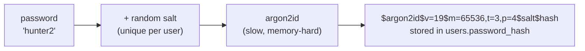
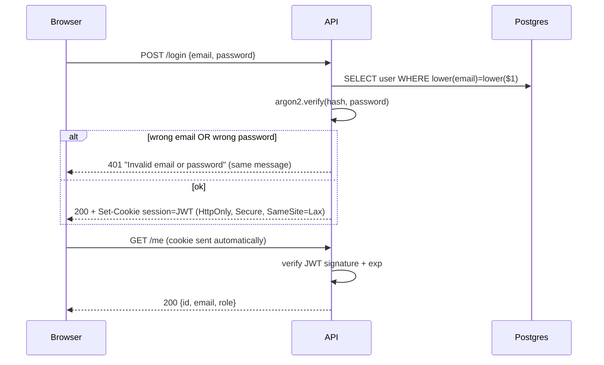

## What

**Authentication (authN)** answers "who are you?". **Authorization (authZ)** answers "what may you do?" (next lesson).

### Passwords: hash, never store

A **hash** is a one-way function: easy to compute, practically impossible to reverse. For passwords you need a *slow, salted* hash (argon2id, bcrypt, scrypt), not SHA-256.



- **Salt** makes identical passwords produce different hashes, defeating precomputed (rainbow) tables.
- **Slowness** makes brute-force guessing expensive after a database leak.
- On login you hash the attempt with the stored salt and compare, using a constant-time verify function.

```ts
import argon2 from "argon2";

export const hashPassword = (plain: string) => argon2.hash(plain, { type: argon2.argon2id });
export const verifyPassword = (hash: string, plain: string) => argon2.verify(hash, plain);
```

### Sessions vs JWT

| Aspect | Server session | JWT (stateless token) |
|--|----------------|-----------------------|
| What the client holds | Random session id | Signed token containing claims (`sub`, `role`, `exp`) |
| Where state lives | Server store (DB/Redis) | In the token |
| Revoke immediately | Yes (delete the session) | Hard (wait for expiry, or keep a denylist) |
| Scales horizontally | Needs shared store | Easy: any server can verify |

A **JWT** is `header.payload.signature` (base64url). The signature proves the server issued it and nobody edited the payload. The payload is *readable by anyone*, so never put secrets in it.

```ts
import jwt from "jsonwebtoken";

const token = jwt.sign({ sub: String(user.id), role: user.role }, process.env.JWT_SECRET!, {
  expiresIn: "1h",
  algorithm: "HS256",
});
const claims = jwt.verify(token, process.env.JWT_SECRET!, { algorithms: ["HS256"] }); // throws if expired/tampered
```

### Where to store the token: httpOnly cookies

```ts
res.cookie("session", token, {
  httpOnly: true,          // JavaScript cannot read it -> XSS cannot steal it
  secure: isProd,          // HTTPS only in production
  sameSite: "lax",         // not sent on cross-site POSTs -> CSRF mitigation
  maxAge: 60 * 60 * 1000,  // 1 hour
  path: "/",
});
```



### Access and refresh tokens
Short-lived **access** token (minutes to 1 hour) + long-lived **refresh** token (days, stored server-side, rotated on use) limits the damage of a stolen token and lets you revoke sessions. This week's minimum is a 1-hour access token; the refresh flow is the next step in real products.

## Why

Database leaks happen. If passwords are plain text, every user's password (reused on other sites) is exposed. If tokens never expire, a stolen cookie works forever. Same error for "no such user" and "wrong password" prevents **user enumeration** (attackers learning which emails are registered).

## How

Schema (migration):

```sql
CREATE TABLE users (
  id            bigint GENERATED ALWAYS AS IDENTITY PRIMARY KEY,
  email         text NOT NULL,
  password_hash text,                       -- NULL for Google-only accounts
  role          text NOT NULL DEFAULT 'customer' CHECK (role IN ('owner','staff','customer')),
  created_at    timestamptz NOT NULL DEFAULT now()
);
CREATE UNIQUE INDEX users_email_lower_idx ON users (lower(email));
```

Signup rules: validate with Zod; hash; insert; **ignore any `role` in the request body** (mass assignment): always create `customer`. Login: look up by `lower(email)`; if missing, still run a dummy hash verify to keep response time similar; return identical 401 text. Logout: clear the cookie (`res.clearCookie`).

## When

Use sessions when you need instant revocation and have a shared store; use short-lived JWT in an httpOnly cookie for simple stateless APIs (this program). Use refresh tokens as soon as sessions need to last days.

## Where

`POST /signup`, `POST /login`, `POST /logout`, `GET /me`, and the `authenticate` middleware that every protected route uses.

## Levels of understanding

<Levels>
<Level id="beginner">

You never save the real password. You save a scrambled version that can't be unscrambled. When someone logs in, you scramble what they typed the same way and see if it matches. After login, the server gives the browser a stamp (cookie) that proves who they are, and the stamp expires.

</Level>
<Level id="intermediate">

Hash with argon2id or bcrypt. Issue a signed JWT containing the user id and role with a short `exp`, set it as an httpOnly, Secure, SameSite cookie. Return the same 401 for unknown email and wrong password. Keep `JWT_SECRET` in `.env`. Emails are unique case-insensitively via an index on `lower(email)`.

</Level>
<Level id="advanced">

Pin the JWT algorithm on verify (reject `alg: none` and HS/RS confusion). Use key rotation (`kid`), rotating refresh tokens with reuse detection, and per-user token versions for forced logout. Tune argon2 parameters to ~100-500 ms on production hardware. Compare secrets in constant time; add dummy hashing to blunt timing-based enumeration.

</Level>
<Level id="industry">

Many teams buy rather than build auth (Auth0, Clerk, Cognito, Supabase Auth) because of MFA, breach detection and compliance. When building, they still implement rate limiting, breached-password checks, audit logs, and MFA for privileged accounts (owner TOTP is this week's stretch).

</Level>
</Levels>

## Common mistakes

<Callout kind="mistake">

- Storing or logging plain-text passwords (or the full request body).
- Using fast hashes (MD5, SHA-256) or no salt.
- JWTs without `exp`, or secrets hard-coded in the repo.
- Saving the JWT in `localStorage` (readable by any XSS).
- Different error messages for unknown user vs wrong password.
- Trusting `role` from the signup body.
- Case-sensitive email uniqueness: `A@x.com` and `a@x.com` become two accounts.

</Callout>

## Industry usage

<Callout kind="industry">Credential stuffing (bots replaying leaked passwords) is the most common attack on login endpoints. That is why production systems add rate limiting, lockouts/backoff, MFA and breached-password checks on top of hashing.</Callout>

## Exercises

<Challenge kind="exercise" title="Prove the five acceptance criteria" answer={<p>Show: (1) the DB column contains an argon2 string, and grep of logs finds no passwords; (2) wrong password and unknown email return identical 401 bodies; (3) a token minted with <code>expiresIn: "1s"</code> is rejected after 2 s; (4) the secret is read from <code>process.env</code> and <code>.env</code> is gitignored; (5) signing up as <code>A@x.com</code> then <code>a@x.com</code> fails with 409.</p>}>

Write a Vitest/Supertest test for each Day 1 acceptance criterion.

</Challenge>

<Challenge kind="debug" title="Everyone is an owner" answer={<p>Mass assignment: the handler spreads <code>req.body</code> into the insert, so a client sending <code>{'{"role":"owner"}'}</code> sets their own role. Pick fields explicitly (Zod <code>.strict()</code> or parse to a known shape) and force <code>role = 'customer'</code>.</p>}>

After signup with `{"email":"a@x.com","password":"...","role":"owner"}` the new user can edit services. Why?

</Challenge>

## Interview questions

<Challenge kind="interview" title="Hashing vs encryption" answer={<p>Encryption is reversible with a key; hashing is one-way. Passwords are hashed with a slow salted algorithm (argon2id/bcrypt) so even the server cannot recover them and brute force is costly.</p>}>

"Why hash passwords instead of encrypting them?"

</Challenge>

<Challenge kind="interview" title="JWT downsides" answer={<p>Stateless tokens can't be revoked before expiry without extra state, payloads are readable, and storing them in JS-accessible storage exposes them to XSS. Mitigate with short expiry, refresh rotation, httpOnly cookies, and a denylist or token version for forced logout.</p>}>

"What are the drawbacks of JWTs compared to server sessions?"

</Challenge>
