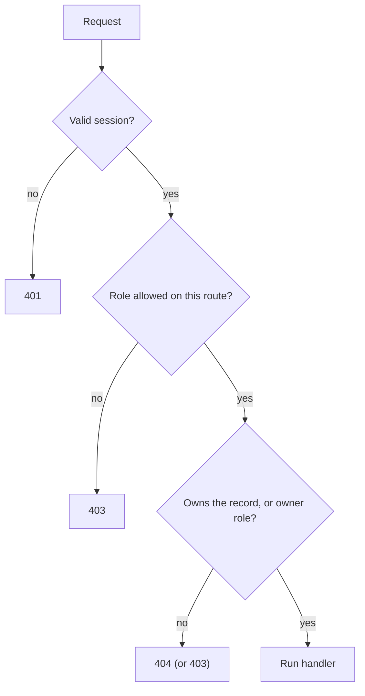

## What

**Authorization** decides whether an *authenticated* user may perform an action on a *specific* resource. Two layers:

1. **Role check (RBAC):** is this kind of user allowed to call this endpoint at all? (`owner` can create services.)
2. **Ownership check:** is this user allowed to touch *this record*? (A customer may cancel *their own* booking only.)

Missing layer 2 is **IDOR** (Insecure Direct Object Reference): change `/bookings/17` to `/bookings/18` and see or cancel someone else's data. It is consistently among the top real-world API flaws.

### 401 vs 403 vs 404

| Code | Meaning | Example |
|------|---------|---------|
| 401 Unauthorized | Not authenticated (no/invalid/expired session) | Cookie missing |
| 403 Forbidden | Authenticated but not allowed | Customer calls `POST /services` |
| 404 Not Found | Used deliberately to avoid leaking existence | Customer requests another customer's booking id |

### Permission matrix (write it before coding)

| Route | owner | staff | customer | anonymous |
|-------|:----:|:----:|:----:|:----:|
| `POST /signup`, `POST /login` | ✓ | ✓ | ✓ | ✓ |
| `GET /services` | ✓ | ✓ | ✓ | ✓ |
| `POST/PUT/DELETE /services` | ✓ | ✗ | ✗ | ✗ |
| `GET /bookings` (all) | ✓ | own schedule | own only | ✗ |
| `POST /bookings` | ✓ | ✓ | own | ✗ |
| `POST /bookings/:id/cancel` | ✓ | ✗ (v2 scope) | own only | ✗ |



## Why

Hiding a button in the UI is not security. Anyone can send the HTTP request directly with curl. The server is the only place a rule is enforced.

## How

Permission middleware as a single place for rules:

```ts
type Role = "owner" | "staff" | "customer";

export const requireAuth: RequestHandler = (req, res, next) => {
  if (!req.user) return res.status(401).json({ error: { code: "UNAUTHENTICATED", message: "Please log in." } });
  next();
};

export const permit = (...roles: Role[]): RequestHandler => (req, res, next) => {
  if (!req.user) return res.status(401).json({ error: { code: "UNAUTHENTICATED", message: "Please log in." } });
  if (!roles.includes(req.user.role)) return res.status(403).json({ error: { code: "FORBIDDEN", message: "You don't have access." } });
  next();
};

// routes
router.post("/services", permit("owner"), createService);
router.post("/bookings/:id/cancel", permit("owner", "customer"), cancelBooking);
```

Ownership belongs in the **service layer**, so every caller (REST route, AI tool in Week 5) gets it:

```ts
export async function cancelBooking(actor: AuthUser, bookingId: number) {
  const booking = await bookings.findById(bookingId);
  if (!booking) throw new NotFoundError("Booking not found");
  const isOwner = actor.role === "owner";
  const isMine = booking.customerUserId === actor.id;
  if (!isOwner && !isMine) throw new NotFoundError("Booking not found");   // don't reveal it exists
  return bookings.setStatus(bookingId, "cancelled");
}
```

Better still, push the ownership filter into the query (`WHERE id = $1 AND customer_user_id = $2`), so a forgotten `if` can't leak data. Test the matrix: for each route and role assert the expected status.

## When

Add `permit(...)` to *every* route (even public ones: `permit.public()`), so "no rule" can't be mistaken for "allowed". Add ownership logic wherever a resource belongs to a user.

## Where

All booking and customer routes; staff schedule views; later, AI tools and admin screens.

## Levels of understanding

<Levels>
<Level id="beginner">

Logging in proves who you are. Then the server still checks what you're allowed to do. A customer can see their own bookings but not someone else's. "Not logged in" is 401; "logged in but not allowed" is 403.

</Level>
<Level id="intermediate">

Implement role middleware per route and ownership checks in services or SQL `WHERE` clauses. Write a permission matrix and test it. Avoid trusting IDs from the client: scope queries by the authenticated user.

</Level>
<Level id="advanced">

Move beyond roles to attribute- and relationship-based access (ABAC/ReBAC): "staff may view bookings assigned to them". Centralize policy (CASL, OPA, Cerbos) so rules are auditable. Row-level security in Postgres can enforce tenancy at the database. Prefer default-deny.

</Level>
<Level id="industry">

Authorization bugs are the headline of most API security audits; reviewers ask "where is the ownership check?" for every endpoint. Multi-tenant SaaS adds a tenant id to every query. Policy changes are code-reviewed and covered by matrix tests.

</Level>
</Levels>

## Common mistakes

<Callout kind="mistake">

- Authenticating but never checking ownership (IDOR).
- Doing checks only in the frontend.
- Using `GET /bookings/:id` that returns data before checking the owner.
- Returning 200 with an error message.
- Forgetting a new route, so it ships unprotected. Default-deny fixes this.
- Confusing 401 and 403.

</Callout>

## Industry usage

<Callout kind="industry">This week's client message is literally an authorization bug report: "staff keep seeing each other's customers, and someone cancelled a booking that wasn't theirs." Matrix tests are how teams prove the fix and prevent regressions.</Callout>

## Exercises

<Challenge kind="exercise" title="Matrix test" answer={<p>Create users of each role, loop over a table of <code>[method, path, role, expectedStatus]</code>, and assert. Include customer A cancelling customer B&apos;s booking (expect 404/403 and the booking still booked).</p>}>

Turn the permission matrix above into a table-driven Supertest test.

</Challenge>

<Challenge kind="debug" title="The curious customer" answer={<p>The handler loads the booking by id only. Scope the query by owner (<code>WHERE id=$1 AND customer_user_id=$2</code>) or compare ownership before returning.</p>}>

Logged in as customer 5, requesting `/bookings/101` (owned by customer 9) returns the booking. What is missing?

</Challenge>

## Interview questions

<Challenge kind="interview" title="IDOR" answer={<p>IDOR is accessing another user&apos;s object by changing an identifier because the server doesn&apos;t verify ownership. Prevent it with server-side ownership checks or queries scoped to the authenticated user, plus tests for cross-user access.</p>}>

"What is an IDOR and how do you prevent it?"

</Challenge>
