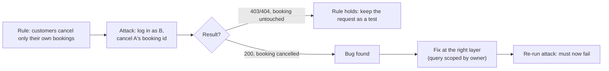

## What

Security bugs rarely crash anything. The code works; it just works for the wrong people. So the debugging method is **adversarial**: for each rule, write the request an attacker would send and check it fails.



### The five bugs and how each shows itself

| Bug | Tell | Probe |
|-----|------|-------|
| Plain-text passwords | The `password` column is readable | `SELECT email, password FROM users;` |
| JWT never expires | Payload has no `exp`; old tokens still work | Decode the middle segment (base64url); send an old or hand-made token |
| SQL injection in login | Input changes behaviour | `email = x' OR '1'='1' --`, and `alice@example.com' --` with alice's real password |
| Any user cancels any booking (IDOR) | Booking ids are guessable integers | Log in as B, cancel A's id |
| Secret in git history | A key was committed once | `git log -p -S'SECRET'`, `gitleaks detect` |

Decode a JWT without any library (it is just base64url JSON):

```bash
echo "$TOKEN" | cut -d. -f2 | tr '_-' '/+' | base64 -d 2>/dev/null; echo
```

## Why

An attacker needs only one hole; your tests need to check every rule. And a secret that lived in git history for one commit must be treated as public forever.

## How

### Fix at the right layer

- **Passwords:** hash on write (argon2id/bcrypt/scrypt), verify with a constant-time compare; existing users need a migration plan (re-hash at next login or force reset).
- **Expiry:** add `exp` when signing **and** reject tokens without it when verifying; test with a 1-second token.
- **Injection:** parameterised queries, never string interpolation; test *both* a tautology and a comment-injection probe (a concatenated query can look safe if the password is checked separately).
- **Ownership:** put the owner condition **in the query** (`WHERE id = $1 AND user_id = $2`) so a forgotten `if` can't leak; return 404 so ids don't reveal existence.
- **Secret:** the order matters.

  1. **Rotate** the secret at the provider (the old value is now compromised).
  2. Move the new value to `.env` / the secret store; add `.env` to `.gitignore`; commit `.env.example`.
  3. Optionally purge history (`git filter-repo`), knowing clones and forks may already have it.
  4. Add `gitleaks` to CI and a pre-commit hook.

  **Why deleting the file is not enough:** git stores every commit. `git log -p -S'GOOGLE_CLIENT_SECRET' --all` finds it in the old commit.

```bash
git log --all -p -S'supersecret' -- .       # which commit introduced it?
gitleaks detect --source . --redact         # scan the whole history
```

### Write-up

```text
Symptom:   user B received 200 cancelling user A's booking 14
Cause:     UPDATE ... WHERE id = $1 had no owner condition (authN present, ownership missing)
Fix:       WHERE id = $1 AND user_id = $2; 404 when 0 rows changed
Verified:  new test: B cancels A's booking -> 404 and status stays 'booked'; A cancelling own -> 200
```

## When

After every security change, re-run **all** attacks, since fixing one layer can break another. Keep the attacks as automated tests so they run in CI.

## Where

The runnable lab is `labs/week-2/broken` with its checker (`node --no-warnings labs/week-2/check.mjs broken`; Node 22+, no installs). The git-history part is part of your written fix: reproduce it in a scratch repository by committing a fake key, deleting it, and finding it again with `git log -S`.

## Levels of understanding

<Levels>
<Level id="beginner">

To check that a lock works, try to pick it. For every rule ("only the owner can cancel"), send the sneaky request and make sure it is refused. If a password or key was ever saved in the project's history, replace it, because removing the file doesn't erase the past.

</Level>
<Level id="intermediate">

Probe each rule with curl or automated tests, fix at the correct layer (hash, expiry, parameters, scoped queries), rotate leaked secrets before anything else, and add scanning to CI.

</Level>
<Level id="advanced">

Use multiple probes per vulnerability class (a single payload can miss a variant), check timing differences for user enumeration, test token algorithm confusion, and verify cookie flags in the browser. Treat history rewrites as damage control, not remediation.

</Level>
<Level id="industry">

Findings are triaged by severity, assigned owners and deadlines; secrets rotation has a runbook; secret scanning runs on every push and blocks merges.

</Level>
</Levels>

## Common mistakes

<Callout kind="mistake">

- Deleting the leaked file and calling it fixed.
- Rotating the key but leaving the old one valid at the provider.
- Testing only one injection payload.
- Checking the role but not the owner (IDOR).
- Logging passwords or tokens while debugging.
- Pasting a real secret into an AI tool to ask what is wrong with it.

</Callout>

## Industry usage

<Callout kind="industry">A short, evidence-based list of "attacks we tried and what happened" is exactly what client security questionnaires and penetration testers expect to see.</Callout>

## Exercises

<Challenge kind="exercise" title="Find it in history" answer={<p>In a scratch repo: commit a file with a fake key, delete it in the next commit, then run <code>git log --all -p -S&apos;fake-key&apos;</code> and <code>gitleaks detect</code>. Both find it. Write down the rotation steps you would take for a real one.</p>}>

Reproduce a secret leak in a scratch repository and find it with two different tools.

</Challenge>

<Challenge kind="debug" title="Injection fixed, but is it?" answer={<p>Probing only a tautology can pass when the query is still concatenated (for example when the password is verified in code). Also try a comment injection with a valid password; a concatenated query logs in, a parameterised one does not.</p>}>

Your login rejects `' OR '1'='1' --` but the query is still built with template strings. How do you prove it is still vulnerable?

</Challenge>

## Interview questions

<Challenge kind="interview" title="Leaked key" answer={<p>Rotate/revoke first, then replace and store properly, check logs for misuse, consider purging history knowing copies may exist, and add scanning to prevent recurrence.</p>}>

"You discover an API key in git history. What do you do, in order?"

</Challenge>
