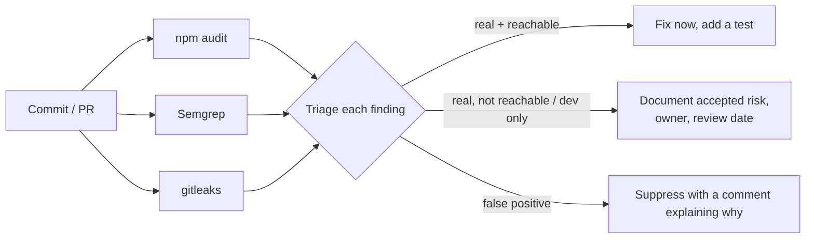

## What

Your app is mostly other people's code. Three scanners cover three different risks:

| Scanner | Looks at | Finds | Typical command |
|---------|----------|-------|-----------------|
| **npm audit** | Your dependency tree vs a vulnerability database | Known CVEs in packages | `npm audit --omit=dev` |
| **Semgrep** | Your source code | Insecure patterns (SQL built from strings, `eval`, missing cookie flags, hard-coded secrets) | `semgrep scan --config p/javascript` (registry rule packs need network access) |
| **gitleaks** | Files and **git history** | Committed secrets (keys, tokens, passwords) | `gitleaks detect --source . --redact` |



## Why

A vulnerable transitive dependency or a leaked key can compromise a system no matter how careful your own code is. The Week 2 acceptance criterion is not "zero findings" but **"fix or document every finding"**.

## How

### Triage questions (in order)

1. **Is it real?** Read the advisory. Does the vulnerable function exist in the version you have?
2. **Is it reachable?** Is the package used at runtime or only in a build/test tool (`devDependencies`)? Is the vulnerable feature ever called with attacker-controlled input?
3. **Is there a fix?** `npm audit` shows the patched version. Try `npm update <pkg>` first; `npm audit fix` applies safe fixes; `--force` can introduce breaking changes, so read the diff and run the tests.
4. **If no fix:** upgrade the parent package, replace the dependency, add a mitigating control, or document the accepted risk.
5. **Record the decision:** a short table in the README's security notes.

```text
| Finding | Severity | Decision | Why | Review by |
| lodash prototype pollution (dev dep via build tool) | high | accepted | not shipped, no untrusted input | next minor release |
| express body-parser DoS | moderate | fixed | upgraded to patched version, tests green | - |
```

### Automate
- CI step: `npm audit --omit=dev --audit-level=high` (fail on high or critical in production dependencies).
- Dependabot or Renovate opens upgrade PRs automatically; keep them small and let CI judge them.
- Pre-commit hook or CI job for gitleaks; if it ever finds a real secret, **rotate first, then clean up** (see the Week 2 debugging lesson).
- Pin lockfiles (`package-lock.json`), use `npm ci` in CI, and review new dependencies before adding them (maintenance, downloads, install scripts).

### Semgrep in practice
Semgrep rules match code structure, so a query built with a template string like ``db.query(`...${x}...`)`` is flagged regardless of formatting. Treat findings as *leads*: confirm by exploiting or testing it, fix at the root cause, and add a test. Write a small custom rule for your own house rules (for example, "every route must call `permit(...)`") when a mistake keeps recurring.

## When

On every pull request for audit and gitleaks (fast), and on a schedule for deeper scans. Before launch, do a full manual pass and record results in the README.

## Where

The CI workflow from Day 5, the README security notes, and your pre-commit configuration.

## Levels of understanding

<Levels>
<Level id="beginner">

Scanners are spell-checkers for security. One checks the libraries you borrowed, one checks your own code for risky patterns, and one checks that you never saved a password in the project. You still decide what each warning means.

</Level>
<Level id="intermediate">

Run `npm audit`, Semgrep and gitleaks locally and in CI; triage by reachability and fix availability; fix or document each finding; keep dependencies updated through small PRs.

</Level>
<Level id="advanced">

Understand transitive dependencies and lockfile resolution (`npm ls`, `overrides`), SBOM generation, provenance and install-script risks, typosquatting, and the difference between severity scores and exploitability in your context.

</Level>
<Level id="industry">

Organisations set SLAs by severity (for example critical in 7 days), keep exceptions with owners and expiry, and generate SBOMs for customers. Supply-chain attacks make dependency hygiene a board-level topic.

</Level>
</Levels>

## Common mistakes

<Callout kind="mistake">

- Running `npm audit fix --force` and merging without reading the diff.
- Ignoring all findings because "it's just dev dependencies" without checking.
- Treating a clean scan as proof of security (they find known patterns only).
- Silencing a rule with no comment.
- Scanning only the working tree and missing secrets in history.
- Adding a dependency for a three-line helper.

</Callout>

## Industry usage

<Callout kind="industry">Enterprise customers often ask for your dependency policy and latest scan results. A README table of findings and decisions answers that in one page.</Callout>

## Exercises

<Challenge kind="exercise" title="Triage table" answer={<p>For every finding from your three scanners write: package or rule, severity, runtime or dev, reachable (why), decision (fixed, accepted, false positive), and a review date. Fixed items should link to the commit and test.</p>}>

Run all three scanners on your Week 2 API and produce the triage table for the README.

</Challenge>

## Interview questions

<Challenge kind="interview" title="Audit shows 40 vulnerabilities" answer={<p>Don&apos;t panic or force-fix. Group by package, check runtime vs dev and reachability, apply safe updates first, handle the highest-risk runtime findings with tests, document accepted risks, and automate so the list doesn&apos;t grow back.</p>}>

"npm audit reports 40 vulnerabilities. What do you do?"

</Challenge>
