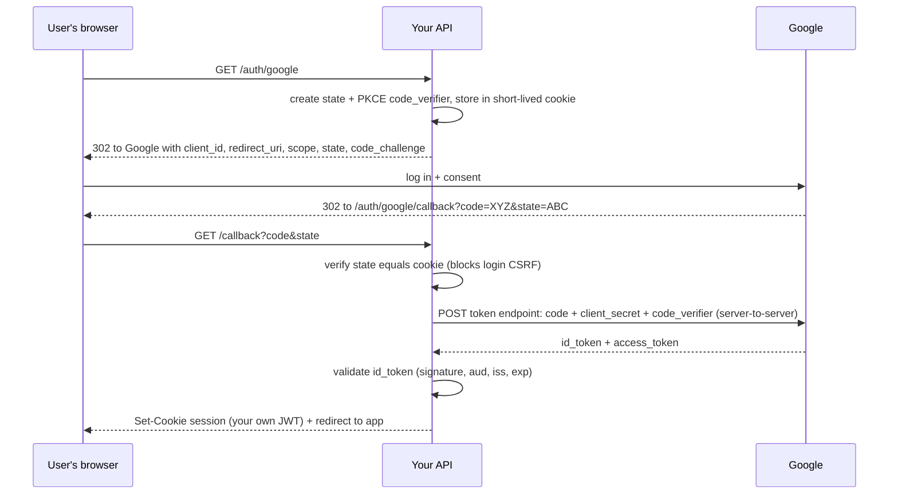
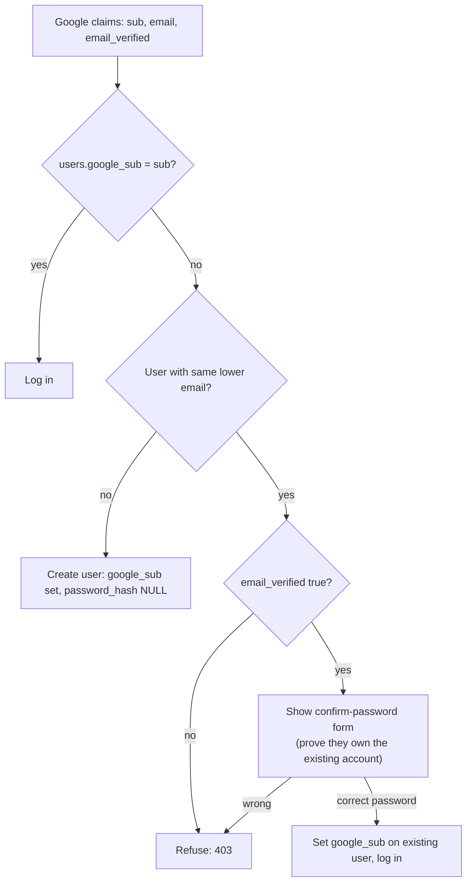

## What

**OAuth 2.0** lets a user grant an app limited access without sharing a password. **OpenID Connect (OIDC)** adds identity on top: an **ID token** saying who the user is (`sub`, `email`, `email_verified`). "Sign in with Google" is OIDC.

Roles: **User** (resource owner), **Your app** (client), **Google** (authorization server / identity provider).

### Authorization Code flow with PKCE



- **`state`**: random value you generate and check on return. Without it, an attacker can trick your browser into completing *their* login (login CSRF).
- **PKCE** (`code_verifier` / `code_challenge`): proves the party redeeming the code is the one that started the flow, protecting against intercepted codes.
- **Client secret** is used only server-side, from `.env`.
- The **code** is single-use and short-lived; the user's Google password never touches your app.

## Why

You don't want to store passwords for everyone, and users prefer Google. But a careless implementation creates **account takeover**: if you link by email without checking it is *verified*, an attacker creates a Google/other IdP account claiming a victim's email and logs in as them.

## How

Use a maintained library (Arctic, or Passport + `passport-google-oauth20`). Pseudocode with Arctic:

```ts
// GET /auth/google
const state = generateState();
const codeVerifier = generateCodeVerifier();
const url = google.createAuthorizationURL(state, codeVerifier, ["openid", "email", "profile"]);
setShortCookie(res, "g_state", state);
setShortCookie(res, "g_verifier", codeVerifier);
res.redirect(url.toString());

// GET /auth/google/callback
if (req.query.state !== req.cookies.g_state) return res.status(400).json(err("Invalid state"));
const tokens = await google.validateAuthorizationCode(req.query.code, req.cookies.g_verifier);
const claims = decodeIdToken(tokens.idToken());           // { sub, email, email_verified }
```

### Account linking decision tree



The **confirm-password step** matters: even with a verified Google email, silently merging can hand an attacker a pre-created account (pre-hijacking). Requiring the existing password proves control of both.

## When

Use "Sign in with X" when your users already have those accounts and you want less friction and fewer passwords to protect. Keep email/password available if you serve customers who don't use Google.

## Where

`/auth/google`, `/auth/google/callback`, `/auth/google/link` in the API; in Week 3 the confirm form moves into Next.js; in Week 4 you add the production domain to Google's authorized redirect URIs.

## Levels of understanding

<Levels>
<Level id="beginner">

Instead of making a password for your site, people click "Sign in with Google". Google confirms who they are and tells your site. Your site then gives them its own login cookie.

</Level>
<Level id="intermediate">

Redirect to Google with `state`; Google redirects back with a `code`; your server exchanges the code (plus secret and PKCE verifier) for tokens; read `email` and `email_verified`; create or link a user; issue your own session cookie. Validate `state` and keep the secret in `.env`.

</Level>
<Level id="advanced">

Validate the ID token fully: signature (JWKS), `iss`, `aud` equals your client id, `exp`, and `nonce` if used. Identify users by `sub`, not email (emails change). Restrict `redirect_uri` to exact registered URLs. Use `SameSite=Lax` for the state cookie so it survives the top-level redirect.

</Level>
<Level id="industry">

Enterprises add SSO (SAML/OIDC) with identity providers like Okta/Entra. Auth libraries are updated frequently, so teams pin and scan them. Account-linking policy is a documented security decision, and OAuth misconfigurations (open redirects, missing state) are standard pentest findings.

</Level>
</Levels>

## Common mistakes

<Callout kind="mistake">

- Skipping the `state` check.
- Linking accounts by email without `email_verified` and password confirmation.
- Exposing the client secret in frontend code or the repo.
- Wildcard or mismatched redirect URIs; forgetting to add the production URI in Week 4 (`redirect_uri_mismatch`).
- Using the email as the user identifier instead of `sub`.
- Trusting an ID token without validating signature and audience.

</Callout>

## Industry usage

<Callout kind="industry">Treat identity providers as untrusted input until validated. Log login events (provider, success/failure, ip) for audit, and have a documented path for users who lose access to their Google account.</Callout>

## Exercises

<Challenge kind="exercise" title="Tamper with state" answer={<p>Change the <code>state</code> query parameter in the callback URL by one character. The API must answer 400 and create no session. Write that as an automated test with a mocked token exchange.</p>}>

Prove login CSRF protection works by sending a callback with a wrong `state`.

</Challenge>

<Challenge kind="debug" title="redirect_uri_mismatch" answer={<p>Google only redirects to URIs registered exactly for the OAuth client. Add the production callback (<code>https://api.yourdomain/auth/google/callback</code>) to the authorized redirect URIs and make the app&apos;s configured callback match, scheme and path included.</p>}>

Google login works locally but on the live server shows `Error 400: redirect_uri_mismatch`. Fix?

</Challenge>

## Interview questions

<Challenge kind="interview" title="Why state?" answer={<p>The state ties the callback to the browser session that started the flow, preventing an attacker from making a victim complete a login the attacker initiated (login CSRF) or replaying a callback.</p>}>

"What is the OAuth state parameter for?"

</Challenge>
