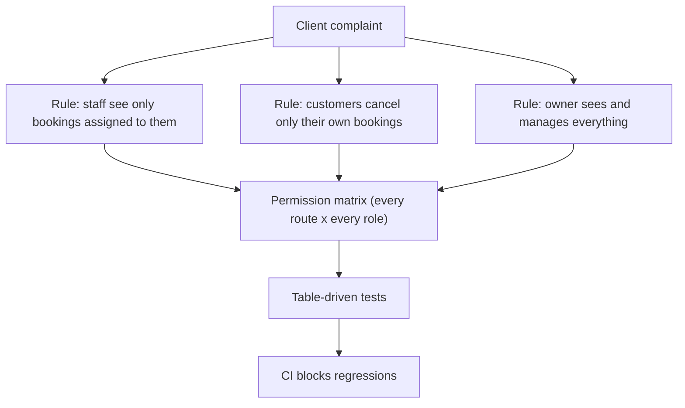

## What

Client message: *"Staff keep seeing each other's customers, and someone cancelled a booking that wasn't theirs."* This is two authorization bugs described in business language. Translate them into rules before coding.



## Why

Security is a product feature the client can feel. A written matrix plus tests is the evidence that the complaint cannot happen again.

## How

### Milestones
1. **Update scope (30 min):** add roles, the matrix, session lifetime, login methods, what is still out of scope (password reset, email verification).
2. **Users + auth (75 min):** migration, signup/login/logout/me, argon2, 1-hour cookie JWT.
3. **Roles + ownership (75 min):** `permit()` on every route; ownership in services/queries; staff schedule scoping.
4. **Google login (60 min):** state + PKCE, verified-email linking with password confirmation.
5. **Hardening (45 min):** Helmet, CORS allowlist, rate limits, Origin check, Zod everywhere.
6. **Tests + CI (75 min):** integration tests, coverage threshold, branch protection.
7. **Attack write-up + README (45 min).**

### README security notes template

```text
## Security notes
Threat model: <who might abuse what>
Controls: hashing, cookie flags, roles/ownership, CORS allowlist, Origin check, rate limits, validation
Tested attacks (curl + automated test name):
| Attack | Command / test | Result |
| SQL injection on login | ... | 401, no bypass |
| Mass assignment role=owner | ... | role = customer |
| IDOR on /bookings/:id | ... | 404 |
| CSRF with evil Origin | ... | 403 |
| Brute force login | ... | 429 after 10 |
Scans: npm audit (<n> findings, fixed/accepted because ...), Semgrep (...), gitleaks (clean)
Known limits: no MFA yet, no password reset
```

### Verification checklist
- [ ] Permission matrix tested for every route and role (401 vs 403 correct)
- [ ] Customer cannot read or cancel another customer's booking
- [ ] Passwords hashed; identical 401 for unknown user / wrong password; token expiry tested
- [ ] Case-insensitive unique email
- [ ] Google linking only with verified email + password confirmation; state checked
- [ ] CORS only allows the frontend origin; evil Origin POST → 403
- [ ] CI green; failing PR blocked; coverage 80%+ on auth and booking logic

## When

Write the matrix before the middleware, and re-run all attacks after every security-relevant change.

## Where

`docs/SCOPE.md` (updated), `src/middleware`, `tests/`, `.github/workflows/ci.yml`, README.

## Levels of understanding

<Levels>
<Level id="beginner">

The owner is worried that people can see or cancel things they shouldn't. List who may do what, build exactly that, and write tests that try to break the rules.

</Level>
<Level id="intermediate">

Convert complaints into rules and a matrix; enforce in middleware plus ownership in services; harden configuration; automate checks in CI; document attacks and results.

</Level>
<Level id="advanced">

Add audit logs for sensitive actions, consider session revocation, MFA for owners (stretch), and secure account recovery; run dependency and secret scanning continuously.

</Level>
<Level id="industry">

Client security questionnaires ask for exactly these artefacts: access-control model, test evidence, dependency management and incident response. Your README answers most of it.

</Level>
</Levels>

## Common mistakes

<Callout kind="mistake">

- Role checks without ownership checks.
- Tests that call services directly and skip HTTP middleware.
- Forgetting new routes in the matrix.
- Security notes that say "secure" without commands or results.

</Callout>

## Industry usage

<Callout kind="industry">Handing a client a short, evidence-based security note converts a vague worry into a closed ticket, and is often the difference between winning and losing a contract.</Callout>

## Exercises

<Challenge kind="exercise" title="Matrix first" answer={<p>Create a table of every route by role (owner, staff, customer, anonymous) with the expected status. Generate the test cases from that table so adding a route without a rule fails the suite.</p>}>

Write the permission matrix and a table-driven test that fails if any route lacks a rule.

</Challenge>

## Interview questions

<Challenge kind="interview" title="From complaint to controls" answer={<p>Restate the complaint as concrete rules, express them as a permission matrix, implement role plus ownership checks server-side, test every cell, automate in CI, and record the evidence.</p>}>

"A client says staff can see each other's customers. What do you do?"

</Challenge>
