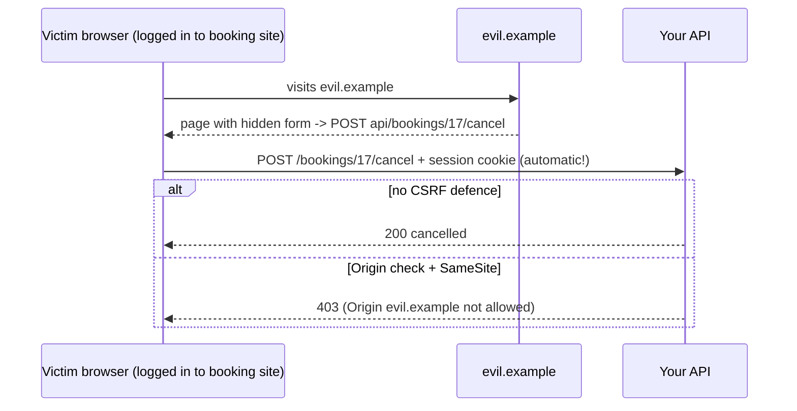

## What

Security is a set of layered controls, each stopping a class of attack. Know the **OWASP Top 10** categories and map them to concrete code:

| Risk | Typical bug | Control you add |
|------|-------------|-----------------|
| Broken access control | IDOR, missing role check | Permission middleware + ownership queries (Day 2) |
| Cryptographic failures | Plain-text passwords, weak secrets | argon2id, strong `JWT_SECRET`, TLS |
| Injection | SQL built by string concatenation | Parameterized queries, Zod validation |
| Insecure design | No rate limits, mass assignment | Threat model, allow-listed fields |
| Security misconfiguration | Verbose errors, open CORS | Helmet, CORS allowlist, no stack traces |
| Vulnerable components | Old dependency with CVE | `npm audit`, Semgrep, Dependabot |
| Authentication failures | Unlimited login tries | Rate limit, lockout, same error message |
| Integrity failures | Unsigned data, leaked CI secrets | Branch protection, gitleaks |
| Logging failures | No audit trail, or secrets in logs | Structured logs without sensitive data |

### CORS vs CSRF, two different things

- **CORS** is a browser rule that blocks a *page on another origin* from **reading** your API's response. It is relaxed by your server's headers.
- **CSRF** is when another site makes the browser **send** a state-changing request with your cookie attached. The attacker doesn't need to read the response.



Defences for cookie auth: `SameSite=Lax/Strict`, an **Origin/Referer allowlist check on state-changing methods** (POST/PUT/PATCH/DELETE), and CORS limited to the frontend origin with `credentials: true`.

## Why

You will be attacked by bots within hours of exposing any server: credential stuffing, scanners probing `.env`, and injection attempts. Hardening is cheap compared to the cost of one breach for a small business.

## How

```ts
import helmet from "helmet";
import cors from "cors";
import rateLimit from "express-rate-limit";

app.use(helmet());                                    // security headers (HSTS, nosniff, frame protections…)

const allowed = new Set([process.env.WEB_ORIGIN!]);   // exact origins only, from env
app.use(cors({
  origin: (origin, cb) => cb(null, !origin || allowed.has(origin)),
  credentials: true,
}));

// CSRF: Origin check for state-changing requests
app.use((req, res, next) => {
  if (["POST", "PUT", "PATCH", "DELETE"].includes(req.method)) {
    const origin = req.get("origin");
    if (origin && !allowed.has(origin)) return res.status(403).json({ error: { code: "BAD_ORIGIN", message: "Origin not allowed." } });
  }
  next();
});

// Brute-force protection on auth routes
const authLimiter = rateLimit({ windowMs: 15 * 60_000, limit: 10, standardHeaders: true, legacyHeaders: false });
app.use(["/login", "/signup"], authLimiter);

app.use(express.json({ limit: "100kb" }));            // cap body size
```

Hide internals: the error handler returns `{ error: { code, message } }` and logs the stack server-side only. Set `app.disable("x-powered-by")` (Helmet does).

### Attack your own API (write each up with its result)

```bash
# 1. SQL injection
curl -i -X POST localhost:4000/login -H 'content-type: application/json' \
  -d '{"email":"x'"'"' OR 1=1 --","password":"x"}'          # expect 400/401, never a login

# 2. Mass assignment
curl -i -X POST localhost:4000/signup -H 'content-type: application/json' \
  -d '{"email":"m@x.com","password":"CorrectHorse9!","role":"owner"}'   # then GET /me -> role must be customer

# 3. IDOR (as customer A, with A's cookie jar)
curl -i -b a.txt localhost:4000/bookings/<B's id>           # expect 404/403

# 4. CSRF
curl -i -b a.txt -X POST localhost:4000/bookings -H 'Origin: https://evil.example' \
  -H 'content-type: application/json' -d '{...}'            # expect 403

# 5. Brute force
for i in $(seq 1 15); do curl -s -o /dev/null -w "%{http_code} " -X POST localhost:4000/login ...; done  # 429 appears
```

### Dependency and secret hygiene
`npm audit` for known vulnerable packages; Semgrep for insecure code patterns; `gitleaks detect` for secrets in history. Fix or *document* each finding (accepted risk, with reason).

## When

Add controls early, then re-test after each feature. Run scans in CI so regressions are blocked.

## Where

Global middleware in the API entry point, auth routes, CI workflow (audit + Semgrep), and the README's "Security notes" section.

## Levels of understanding

<Levels>
<Level id="beginner">

Lock the doors: only let your own website talk to your API, slow down people who guess passwords, don't tell attackers how your server works, and try to break in yourself before someone else does.

</Level>
<Level id="intermediate">

Use Helmet, a CORS allowlist with credentials, rate limiting on login/signup, an Origin check for state-changing requests, input validation with Zod, parameterized SQL, and generic error messages. Run `npm audit` and Semgrep and record what you fixed.

</Level>
<Level id="advanced">

Layer defences: CSP, `SameSite`, double-submit or synchronizer CSRF tokens when cross-site embedding is required, per-account plus per-IP rate limits (behind a proxy configure `trust proxy`), request size limits, timeouts, and structured audit logs. Threat-model with STRIDE; treat every input (headers, files, LLM output) as untrusted.

</Level>
<Level id="industry">

Security reviews, SAST/DAST in CI, dependency bots, secrets scanners, and incident runbooks are normal. Clients ask for a security summary before launch; your README's notes (what was tested and how) are the artifact you hand over.

</Level>
</Levels>

## Common mistakes

<Callout kind="mistake">

- `cors({ origin: "*", credentials: true })` or reflecting any origin.
- Thinking CORS protects the server from requests (it only restricts browser reads).
- Rate limiting by IP behind a proxy without `trust proxy` (everyone looks like one IP).
- Returning stack traces or SQL errors to clients.
- Ignoring `npm audit` output instead of triaging it.
- Believing client-side validation is a security control.
- Committing secrets, then "deleting" them in a later commit.

</Callout>

## Industry usage

<Callout kind="industry">A one-page "what we tested and how" security note, with the exact curl attacks and results, builds client trust and is exactly what the Week 2 rubric asks for.</Callout>

## Exercises

<Challenge kind="exercise" title="Evil origin" answer={<p>With a valid cookie and header <code>Origin: https://evil.example</code>, <code>POST /bookings</code> returns 403 and no booking is created. Add this as an integration test.</p>}>

Reproduce the Day 4 acceptance criterion for the Origin check and automate it.

</Challenge>

<Challenge kind="debug" title="Rate limit does nothing in production" answer={<p>Behind Caddy every request arrives from the proxy IP, so either everyone shares a bucket or the limiter sees the wrong address. Set <code>app.set("trust proxy", 1)</code> so Express uses <code>X-Forwarded-For</code> from the first proxy.</p>}>

Locally login is limited after 10 tries. On the VPS behind a reverse proxy, a single IP is never limited (or all users are limited together). Why?

</Challenge>

## Interview questions

<Challenge kind="interview" title="CORS vs CSRF" answer={<p>CORS controls which origins may read cross-origin responses in the browser; it doesn&apos;t stop requests being sent. CSRF abuses automatically attached cookies to send unwanted state-changing requests. Use SameSite cookies, Origin checks or tokens against CSRF, and a CORS allowlist to limit reads.</p>}>

"What is the difference between CORS and CSRF?"

</Challenge>
