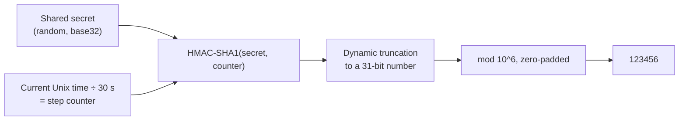
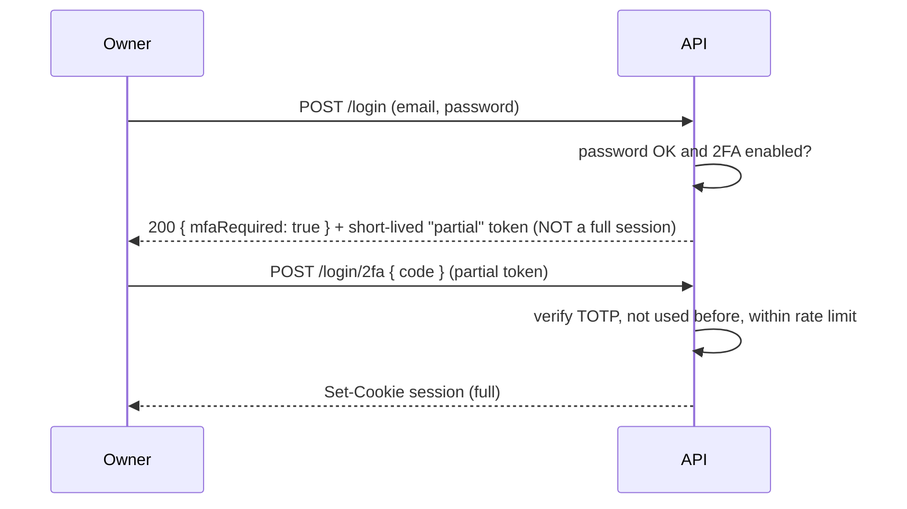

## What

**Two-factor authentication (2FA)** requires something you **know** (password) plus something you **have** (a phone running an authenticator app). **TOTP** (time-based one-time password, RFC 6238) is the standard behind Google Authenticator, Authy, 1Password and others. Server and phone share a **secret** once; after that both compute the same 6-digit code from the secret and the current time, so no network is needed on the phone.



HOTP (RFC 4226) is the counter-based core; TOTP simply uses `floor(unixTime / 30)` as the counter.

## Why

Passwords get phished, reused and leaked. A second factor stops most account takeovers even when the password is known. Owner accounts can see and cancel everything, so they are the first to protect.

## How

### A complete, tested implementation (Node, no dependencies)

This code reproduces the official RFC 4226 and RFC 6238 test vectors:

```js
import crypto from "node:crypto";

const B32 = "ABCDEFGHIJKLMNOPQRSTUVWXYZ234567";
export function base32Encode(buf) {
  let bits = "", out = "";
  for (const b of buf) bits += b.toString(2).padStart(8, "0");
  for (let i = 0; i < bits.length; i += 5) out += B32[parseInt(bits.slice(i, i + 5).padEnd(5, "0"), 2)];
  return out;
}
export function base32Decode(str) {
  let bits = "";
  for (const c of str.replace(/=+$/, "").toUpperCase()) bits += B32.indexOf(c).toString(2).padStart(5, "0");
  const bytes = [];
  for (let i = 0; i + 8 <= bits.length; i += 8) bytes.push(parseInt(bits.slice(i, i + 8), 2));
  return Buffer.from(bytes);
}

export function hotp(secret, counter, digits = 6, algo = "sha1") {
  const msg = Buffer.alloc(8);
  msg.writeBigUInt64BE(BigInt(counter));
  const h = crypto.createHmac(algo, secret).update(msg).digest();
  const off = h[h.length - 1] & 0x0f;                              // dynamic truncation
  const code = ((h[off] & 0x7f) << 24) | (h[off + 1] << 16) | (h[off + 2] << 8) | h[off + 3];
  return String(code % 10 ** digits).padStart(digits, "0");
}
export const totp = (secret, nowMs = Date.now(), step = 30, digits = 6, algo = "sha1") =>
  hotp(secret, Math.floor(nowMs / 1000 / step), digits, algo);

export function verifyTotp(secret, token, nowMs = Date.now()) {
  if (!/^\d{6}$/.test(token)) return false;
  for (const drift of [-1, 0, 1]) {                                // tolerate one step of clock drift either way
    const expected = totp(secret, nowMs + drift * 30_000);
    if (crypto.timingSafeEqual(Buffer.from(expected), Buffer.from(token))) return true;
  }
  return false;
}
```

Test vectors (RFC 4226 Appendix D, secret `"12345678901234567890"`): counters 0 to 9 give `755224, 287082, 359152, 969429, 338314, 254676, 287922, 162583, 399871, 520489`. RFC 6238 Appendix B (SHA-1, 8 digits): time 59 gives `94287082`, time 1111111109 gives `07081804`, time 1234567890 gives `89005924`. A secret of those 20 bytes in base32 is `GEZDGNBVGY3TQOJQGEZDGNBVGY3TQOJQ`.

### Enrolment flow

1. Owner logs in with password, chooses "Enable 2FA".
2. Server generates a random secret (20 bytes from `crypto.randomBytes`), stores it **as pending** (encrypted at rest), and returns an `otpauth://` URI to show as a QR code:
   `otpauth://totp/Salon:owner%40example.com?secret=BASE32SECRET&issuer=Salon&algorithm=SHA1&digits=6&period=30`
3. Owner scans it and submits the current 6-digit code.
4. Server verifies; only then marks 2FA **enabled** and shows **recovery codes** once.

### Login flow



### Details that matter

- **Rate limit** the 2FA endpoint hard (6 digits = 1,000,000 possibilities); lock after repeated failures.
- **Prevent replay:** remember the last accepted step per user and reject a code from the same or an earlier step.
- **Store the secret safely:** encrypt it with a key from the environment/secret store, never log it, never show it again after enrolment.
- **Recovery codes:** generate ~10 random one-time codes, store only their hashes, show them once.
- **Partial session:** after the password step the user is *not* logged in; routes must refuse the partial token.
- **Disabling 2FA** requires the password and a valid code.
- **Phishing resistance:** TOTP can still be phished in real time; WebAuthn/passkeys are stronger.

## When

Require it for owner and any privileged accounts first; offer it to staff and customers if risk justifies the friction. Use a vetted library (such as `otpauth` or `otplib`) in production; the code above is for understanding and testing.

## Where

The Week 2 stretch task: owner accounts of the booking API, an enrolment page in Week 3's Next.js app, and the README security notes.

## Levels of understanding

<Levels>
<Level id="beginner">

Logging in with a password plus a code from your phone is much harder to steal than a password alone. The phone and the server secretly agree on a recipe and both cook the same 6-digit code every 30 seconds.

</Level>
<Level id="intermediate">

TOTP is HMAC of a time counter, truncated to 6 digits. Verify with a small drift window, rate-limit attempts, block reuse of a step, store the secret encrypted, issue recovery codes, and treat the post-password state as a partial session.

</Level>
<Level id="advanced">

Understand dynamic truncation, algorithm and digit parameters (most apps expect SHA-1/6/30), clock skew handling and resynchronisation, secret storage with envelope encryption, account-recovery risks (support social engineering), and moving to WebAuthn.

</Level>
<Level id="industry">

MFA policies are enforced by role and risk; enrolment rates and recovery-flow abuse are monitored; support runbooks define how identity is verified before resetting 2FA.

</Level>
</Levels>

## Common mistakes

<Callout kind="mistake">

- No rate limit on the code endpoint.
- Accepting a code twice, or a wide drift window.
- Marking 2FA enabled before the user proves they can generate a code.
- Storing the secret in plain text or logging it.
- Issuing a full session after the password step.
- No recovery path (users get locked out) or an insecure one (email-only reset that bypasses 2FA).

</Callout>

## Industry usage

<Callout kind="industry">Clients with staff accounts increasingly require MFA for administrators. Being able to say "owners have TOTP, with rate limits and recovery codes, tested against the RFC vectors" is a concrete, defensible answer.</Callout>

## Exercises

<Challenge kind="exercise" title="Reproduce the RFC vectors" answer={<p>Paste the implementation, run HOTP for counters 0 to 9 with the 20-byte ASCII secret and compare with the RFC list; run TOTP with 8 digits at times 59, 1111111109 and 1234567890. All must match exactly. Then add tests for drift (+/-30 s accepted, +90 s rejected) and bad formats.</p>}>

Write a test file that checks the RFC vectors, the drift window and input validation.

</Challenge>

<Challenge kind="debug" title="Codes work on my phone but not on the server" answer={<p>Most likely clock skew on the server, a different algorithm/digits/period in the URI than the verifier assumes, or a base32/secret encoding mismatch. Check NTP, print the server&apos;s expected codes for the adjacent steps, and compare the otpauth parameters with the verifier.</p>}>

Users report that valid codes are rejected intermittently. What do you check?

</Challenge>

## Interview questions

<Challenge kind="interview" title="How TOTP works" answer={<p>A shared secret and the current 30-second time step are fed through HMAC; the result is truncated to a 6-digit code. Server and device compute it independently, and the server accepts a small window of steps to tolerate clock drift.</p>}>

"Explain how an authenticator app produces a code without talking to the server."

</Challenge>
