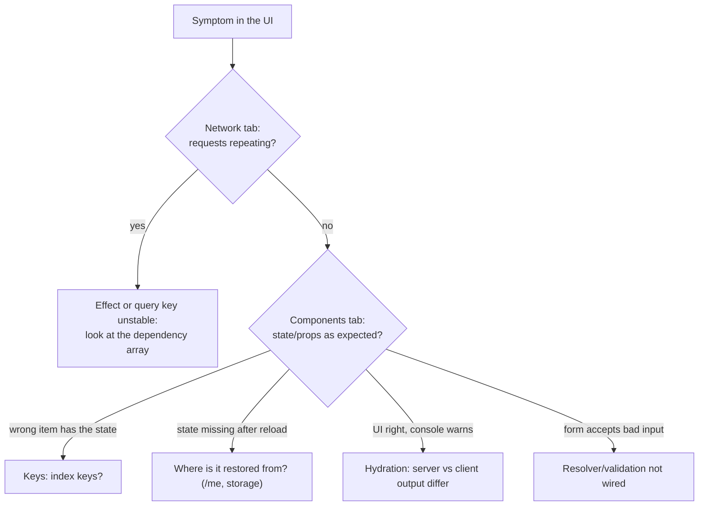

## What

Frontend bugs live in the gap between what you think a render does and what React actually did. Two habits: **look at what actually happened** (Network tab, React DevTools Profiler/Components) and **test in a production build**, because development behaviour (Strict Mode runs effects twice) can look like, or hide, a real bug.



## Why

React hides its work, so bugs look like magic ("it refetches on its own", "the wrong row changed"). DevTools make the work visible.

## How

### The five bugs

1. **Refetch loop (unstable dependency).**
   Signal: Network shows the same request over and over; CPU spikes. Cause: an object or array created during render sits in the dependency array, so the effect re-runs every render, sets state, and renders again.

   ```tsx
   const filters = { status };            // new object every render
   useEffect(() => { load(filters) }, [filters]);   // runs every render
   ```
   Fix: depend on primitives (`[status]`) or use a query library with a stable `queryKey`. **Check with `next build && next start`** (or the lab's production bundle): Strict Mode doubles effects in dev only, so "two requests on load" in dev is normal, while "requests forever" is the bug.

2. **Index keys.**
   Signal: after removing or filtering an item, local state (an input's text, a checkbox) appears on a different item. Cause: React matches components by key; with index keys the component at position 2 is "the same" component even though it now represents another booking. Fix: `key={booking.id}`. Test: type in row 3, remove row 1, row 3 keeps its text.

3. **Auth state lost on refresh.**
   Signal: login works; reload shows logged out though the cookie exists (Application tab). Cause: the user lives only in memory and nothing asks the server who the cookie belongs to. Fix: on startup call `GET /me` with `credentials: "include"` and populate state; show a loading state meanwhile so protected pages don't flash.

4. **A form that doesn't validate.**
   Signal: an empty submit sends a request; the server answers 400 but the UI shows nothing. Cause: no resolver and no error rendering. Fix: wire the shared Zod schema, render messages with `role="alert"`, focus the first invalid field, and also display server-side field errors.

5. **Hydration mismatch.**
   Signal: console error "Hydration failed because the server rendered HTML didn't match the client" (minified in production as React error #418 or similar) and a visible flicker. Cause: output depends on something that differs between server and browser: time zone, locale, `Date.now()`, `Math.random()`, `window`. The server rendered `04:30 AM` (UTC); the browser rendered `10:00 AM` (India). Fix: format with an explicit `timeZone` on both sides, or render time-dependent text only after mount.

   ```tsx
   new Intl.DateTimeFormat("en-US", { timeZone: "Asia/Kolkata", hour: "2-digit", minute: "2-digit" }).format(date)
   ```
   Do **not** hide it with `suppressHydrationWarning` unless the difference is intentional and harmless.

### Tools

- **React DevTools → Components:** inspect props/state; highlight updates. **Profiler:** why did this render?
- **Network:** filter Fetch/XHR; sort by time; right-click → Copy as cURL to replay.
- **Application:** cookies (HttpOnly, SameSite, expiry), localStorage.
- **View Source (not Elements):** the server HTML before hydration, which is what you compare with the client.

## When

Always reproduce in a production build before concluding anything about effects; use the dev build to get readable error messages.

## Where

The runnable lab is `labs/week-3/broken` (a server-rendered React app; `node labs/week-3/check.mjs broken`; Chromium required; see `labs/README.md`). Write each fix as symptom, cause, fix, verified, with a test (React Testing Library for form/keys, Playwright for the session and hydration).

## Levels of understanding

<Levels>
<Level id="beginner">

When the screen misbehaves, look at what the browser is really doing: are requests repeating, does the data look right, is the console complaining? Give list items a real id as their key, ask the server who is logged in when the page opens, and always show the same time zone.

</Level>
<Level id="intermediate">

Use DevTools Components and Network to locate the cause; fix dependency arrays with primitives or stable query keys; use stable keys; restore sessions from the server; wire validation; use explicit time zones; verify in a production build with tests.

</Level>
<Level id="advanced">

Understand reconciliation (type + key), effect timing, batching and Strict Mode's double-invocation; use the Profiler to find wasted renders; design components so server and first client render are identical; use `useSyncExternalStore` or mount-time effects for browser-only values.

</Level>
<Level id="industry">

Teams monitor client errors (Sentry), run E2E tests under multiple time zones and locales in CI, and treat hydration warnings as failing signals.

</Level>
</Levels>

## Common mistakes

<Callout kind="mistake">

- Silencing a dependency warning with an eslint-disable instead of fixing the unstable value.
- Concluding "my code runs twice" is a bug when it is dev-only Strict Mode.
- Index keys on lists that change.
- Storing the session only in React state.
- `suppressHydrationWarning` as a fix.
- Testing only in a browser that happens to share the server's time zone.

</Callout>

## Industry usage

<Callout kind="industry">"Works on my machine" frontend bugs are very often locale, time zone or build-mode differences. A CI job that runs the E2E suite with `timezoneId` set to a faraway zone catches a whole category.</Callout>

## Exercises

<Challenge kind="exercise" title="Prove each with DevTools" answer={<p>Evidence per bug: Network screenshot with the request count (bug 1), Components tab showing the note state on the wrong row (2), Application tab with the cookie present while the UI says logged out (3), Network showing a POST with an empty body (4), console hydration error plus View Source versus rendered text (5).</p>}>

Collect one piece of DevTools evidence for each of the five bugs before fixing any.

</Challenge>

<Challenge kind="debug" title="Requests twice in dev only" answer={<p>Strict Mode intentionally mounts, unmounts and remounts components in development to expose effects without cleanup. Add cleanup (abort the fetch) and confirm there is a single request in a production build.</p>}>

Your page makes two identical requests on load in `npm run dev` but one in `next start`. Is that a bug?

</Challenge>

## Interview questions

<Challenge kind="interview" title="Why do keys matter?" answer={<p>Keys let React match elements across renders. Stable ids keep component state attached to the right item; index keys misattribute state when the list changes, causing wrong-row updates and stale inputs.</p>}>

"Why shouldn't you use the array index as a key?"

</Challenge>
