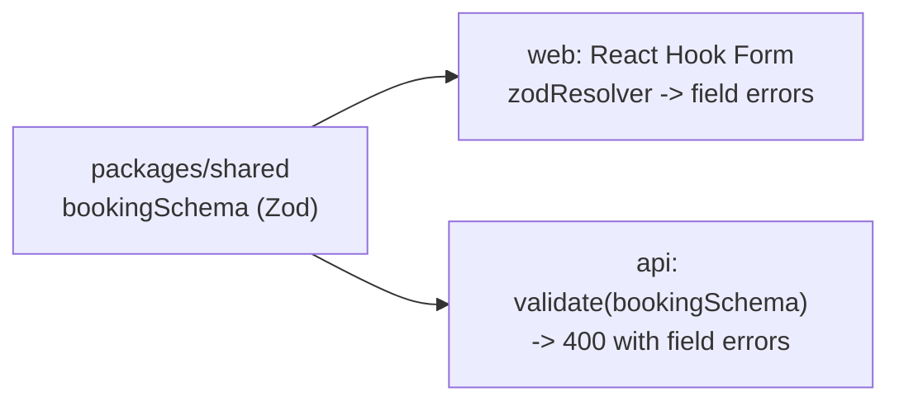

## What

**State** is data a component remembers between renders. Changing state (via the setter) causes React to re-render.

```tsx
"use client";
import { useState } from "react";

export function ServiceManager() {
  const [services, setServices] = useState<{ id: string; name: string }[]>([]);
  const [name, setName] = useState("");

  const add = () => {
    if (!name.trim()) return;
    setServices((prev) => [...prev, { id: crypto.randomUUID(), name: name.trim() }]);   // new array
    setName("");
  };
  const remove = (id: string) => setServices((prev) => prev.filter((s) => s.id !== id)); // new array

  return (
    <section>
      <input value={name} onChange={(e) => setName(e.target.value)} aria-label="Service name" />
      <button type="button" onClick={add}>Add</button>
      <p>{services.length} services</p>
      {services.length === 0 ? <p>No services yet.</p> : (
        <ul>{services.map((s) => <li key={s.id}>{s.name} <button onClick={() => remove(s.id)}>Remove</button></li>)}</ul>
      )}
    </section>
  );
}
```

- **Controlled input:** the input's `value` comes from state and `onChange` updates it, so React is the single source of truth.
- **Immutable updates:** never `push`/`splice` state arrays or assign into state objects. React detects change by *reference*; mutation leaves the reference the same, so nothing re-renders (Week 0's reference lesson, now with consequences).
- Use the **functional form** `setX((prev) => …)` when the new value depends on the old one.

### Validation: one schema, two places

```ts
// packages/shared/src/booking.ts
import { z } from "zod";

export const bookingSchema = z.object({
  serviceId: z.number().int().positive(),
  startsAt: z.string().datetime({ offset: true }),            // ISO with UTC offset
  name: z.string().trim().min(2, "Please enter your name"),
  email: z.string().email("Enter a valid email"),
  phone: z.string().regex(/^\+?[0-9 ()-]{7,15}$/, "Enter a valid phone number").optional(),
});
export type BookingInput = z.infer<typeof bookingSchema>;
```



```tsx
const { register, handleSubmit, formState: { errors, isSubmitting } } =
  useForm<BookingInput>({ resolver: zodResolver(bookingSchema) });

<form onSubmit={handleSubmit(onSubmit)} noValidate>
  <label htmlFor="name">Name</label>
  <input id="name" {...register("name")} aria-invalid={!!errors.name} aria-describedby="name-err" />
  {errors.name && <p id="name-err" role="alert">{errors.name.message}</p>}
  <button type="submit" disabled={isSubmitting}>{isSubmitting ? "Booking…" : "Book"}</button>
</form>
```

## Why

Duplicated validation drifts: the form accepts something the API rejects. A shared schema makes the contract single and typed. Disabling the button while a request is in flight prevents double submission (a double booking at the UI level). Server validation remains mandatory, since clients can be bypassed.

## How

1. Create `packages/shared` and export the schema; import in both workspaces.
2. Build the booking form: service, date, time slot, contact details.
3. Show each error next to its field; link with `aria-describedby`; focus the first invalid field.
4. Submit with a mutation (next lesson); set `isSubmitting`; show server `400` field errors too.
5. Test with keyboard only: Tab order, Enter to submit, visible focus.

## When

Use local `useState` for UI-only state (open/closed, input text). Use React Hook Form when a form has many fields, validation, and submit states. Lift state up to the nearest common parent when two components need it; use context/Zustand (Day 4) for app-wide state; use TanStack Query (Day 3) for server data, not `useState`.

## Where

Booking form, login/signup, owner's service manager, filters and search boxes.

## Levels of understanding

<Levels>
<Level id="beginner">

State is the page's memory. When it changes, the screen updates. Always make a new list instead of editing the old one, then give it to React. A form shows messages next to the box that has a problem.

</Level>
<Level id="intermediate">

Use controlled inputs or React Hook Form's `register`. Update objects and arrays immutably with spread, `map` and `filter`. Share one Zod schema through a workspace package; infer types from it. Disable submit during requests and render loading/empty/error UI.

</Level>
<Level id="advanced">

State updates are batched and asynchronous; use functional updates to avoid stale closures. Derive values instead of storing duplicates. React Hook Form uses uncontrolled inputs and refs for performance. Use `useId` for label/ids, `useTransition` for non-urgent updates, and reducers when transitions are complex.

</Level>
<Level id="industry">

Form UX is tested for error clarity, keyboard use, autofill and mobile keyboards (`inputMode`, `autocomplete`). Teams generate API clients/types from shared schemas or OpenAPI. Analytics track validation failures to find confusing fields.

</Level>
</Levels>

## Common mistakes

<Callout kind="mistake">

- `state.push(x); setState(state)` (same reference, no re-render).
- Index keys with removable items.
- Putting server data in `useState` + `useEffect` (next lesson fixes it).
- Validation only on the client.
- Letting users submit twice.
- Errors only in red color (not announced); use `role="alert"` and text.

</Callout>

## Industry usage

<Callout kind="industry">Code review often rejects mutation of state and unlabeled inputs on sight. Shared schemas between web and API are standard in TypeScript monorepos (tRPC, Zod, OpenAPI codegen).</Callout>

## Exercises

<Challenge kind="exercise" title="Prove immutability" answer={<p>Write a test that renders the manager, adds two services, removes one, and asserts the count and that the previous array was never mutated (compare references in a unit test of the reducer or updater function).</p>}>

Build the service manager and demonstrate with a test that add/remove never mutate the previous array.

</Challenge>

<Challenge kind="debug" title="Nothing happens when I add" answer={<p><code>push</code> mutates the existing array, then <code>setServices(services)</code> passes the same reference, so React sees no change. Use <code>setServices(prev =&gt; [...prev, item])</code>.</p>}>

```tsx
services.push(newService);
setServices(services);
```

The list never updates. Why?

</Challenge>

## Interview questions

<Challenge kind="interview" title="Controlled vs uncontrolled" answer={<p>A controlled input&apos;s value lives in React state and updates on every change; an uncontrolled input keeps its own DOM value and you read it via a ref or on submit. Controlled gives instant validation/formatting; uncontrolled (React Hook Form) is lighter for large forms.</p>}>

"Controlled vs uncontrolled inputs?"

</Challenge>
