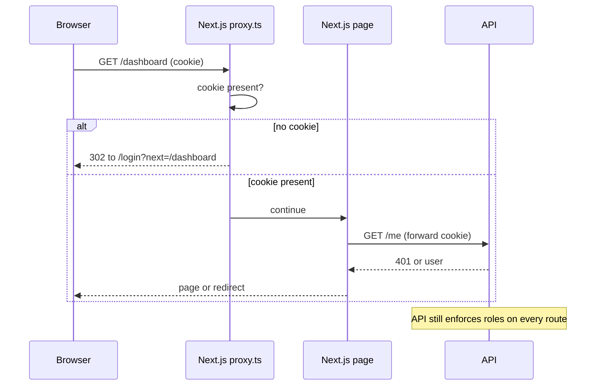

## What

The session lives in an **httpOnly cookie** the browser JavaScript cannot read. So the frontend learns *who* is logged in by asking the API (`GET /me`) and keeps the answer in global state.



### Global user state with Zustand

```ts
import { create } from "zustand";

type User = { id: number; email: string; role: "owner" | "staff" | "customer" };
export const useAuth = create<{ user: User | null; status: "loading" | "ready"; setUser: (u: User | null) => void }>((set) => ({
  user: null, status: "loading", setUser: (user) => set({ user, status: "ready" }),
}));
```

Bootstrap once with TanStack Query (`/me`) and write the result into the store (or just use the query as the source). After login/logout call `setUser` and invalidate cached queries so the next user never sees the previous user's data.

### Route protection

`proxy.ts` (called `middleware.ts` before Next.js 16) runs before a request is handled, so you can redirect cheaply:

```ts
// web/proxy.ts
import { NextResponse, type NextRequest } from "next/server";

export function proxy(req: NextRequest) {
  const hasSession = req.cookies.has("session");
  if (!hasSession) {
    const url = new URL("/login", req.url);
    url.searchParams.set("next", req.nextUrl.pathname);
    return NextResponse.redirect(url);
  }
  return NextResponse.next();
}
export const config = { matcher: ["/dashboard/:path*", "/bookings/:path*"] };
```

<Callout kind="warning" title="Check your Next.js version's docs">

The file name, exported function name and matcher options changed in Next.js 16. Confirm in `node_modules/next/dist/docs/` before relying on an example. The proxy only checks that a cookie *exists*; the real validation is the API call.

</Callout>

### Role-based UI, honest security

```tsx
const user = useAuth((s) => s.user);
{user?.role === "owner" && <ServiceManager />}
```

Hiding a button improves UX. It protects nothing: a user can call the API directly. **The API's role and ownership checks (Week 2) are the security.** Test by calling a forbidden endpoint with curl while logged in as a customer: expect 403.

### The confirm-password form for Google linking
The Day 3 API-rendered form moves into Next.js as `/auth/link` which posts the password to `/auth/google/link` with `credentials: "include"`.

## Why

Without global state, every component re-asks who the user is. Without redirects, logged-out users see flashes of protected pages. Without server enforcement, UI-only checks are trivially bypassed.

## How

1. `useMe()` hook with `staleTime` of a minute; show a loading skeleton, never a flash of wrong content.
2. Login form → `POST /login` (`credentials: "include"`) → set user → redirect to `next` (validate it is a relative path to avoid open redirects).
3. Logout → `POST /logout` → clear store + `queryClient.clear()` → redirect.
4. Dashboard renders per role: owner = paginated, searchable bookings (server-side pagination); staff = own schedule; customer = own history.
5. Refresh the page: user is restored from `/me` (acceptance: auth persists).

## When

Use the proxy for coarse "logged in?" gating and redirects; use API responses for real authorization; use role checks in the UI only for presentation.

## Where

`web/proxy.ts`, `lib/auth.ts`, `components/NavLinks.tsx`, `/login`, `/signup`, `/dashboard`.

## Levels of understanding

<Levels>
<Level id="beginner">

The browser holds a secret stamp (cookie) you can't touch with JavaScript. The app asks the server "who am I?" and remembers the answer. If you're not logged in, you're sent to the login page. Buttons you shouldn't use are hidden, but the server also says "no" if you try anyway.

</Level>
<Level id="intermediate">

Store the user in Zustand/Context, bootstrap from `/me`, redirect with `proxy.ts`, render by role, and always keep the backend as the authority. Clear caches on logout. Show clear error messages for invalid credentials.

</Level>
<Level id="advanced">

Server Components can read cookies (`cookies()`) and call the API with them for SSR of protected pages; avoid leaking one user's cached response to another (no shared caches for personalised data). Validate `next` redirect targets. Consider CSRF (SameSite + Origin check) because cookie auth is ambient.

</Level>
<Level id="industry">

Teams centralise auth in a library or provider, protect routes by layout groups, and write E2E tests for each role. Security reviews check that every protected UI action has a matching server-side rule and test.

</Level>
</Levels>

## Common mistakes

<Callout kind="mistake">

- Treating a hidden button as protection.
- Storing tokens in `localStorage`.
- Not clearing the query cache on logout (next user sees previous data).
- Open redirect through an unvalidated `next` parameter.
- Flash of protected content before the redirect.
- Forgetting `credentials: "include"` on one fetch.

</Callout>

## Industry usage

<Callout kind="industry">"Auth persists across refresh" and "logged-out users are redirected" are baseline E2E tests in every product team. Your Playwright test in Day 5 covers sign up → book → see → cancel on top of this.</Callout>

## Exercises

<Challenge kind="exercise" title="UI is not security" answer={<p>Log in as a customer, open DevTools, copy the owner-only request (for example POST /services) as curl, run it with the customer cookie, and verify the API returns 403. Add that as an API test too.</p>}>

Demonstrate that hiding the owner UI doesn't protect owner endpoints.

</Challenge>

## Interview questions

<Challenge kind="interview" title="Where do you check permissions?" answer={<p>Authoritatively on the server for every request (role + ownership). The frontend checks only improve UX by hiding or disabling actions the user can&apos;t perform.</p>}>

"If you hide the delete button for non-admins, is that enough?"

</Challenge>
