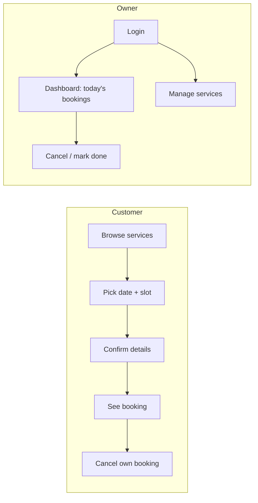

## What

Client message: *"Customers want to book online instead of calling, and I need to see my day at a glance."* Two user journeys, two success measures.

## Why

Customer success = fewer phone calls. Owner success = seeing the day at a glance. Define both in the scope and test them.

## How

### Scope update (30 min)
Customer stories, owner stories, states (loading/error/empty/conflict), time zone (business zone shown everywhere), out of scope (payments, reminders, reschedule).

### Milestones
1. **Shell + auth (60 min):** layout, nav with active link, login/signup/Google, `/me` bootstrap, `proxy.ts`.
2. **Services pages (45 min):** list + detail from the API on the server; 404 for unknown id.
3. **Booking flow (90 min):** form with shared Zod schema; availability query by date; mutation; 409 handling.
4. **My bookings (45 min):** list, cancel, optimistic or invalidate.
5. **Owner dashboard (75 min):** tabs Upcoming / Completed / Cancelled, paginated search, cancel + mark done, service manager.
6. **Polish + a11y (45 min):** keyboard, focus, 360px, Lighthouse 90+.
7. **Tests + README (60 min):** RTL for login and bookings list; one Playwright flow; screenshots.

### Verification checklist
- [ ] Customer flow end to end on a clean database
- [ ] Two tabs book the same slot: one succeeds, one sees the clear message and fresh slots
- [ ] Every fetch has loading, error and empty states
- [ ] Refresh keeps login; logged-out users redirected; customers cannot reach owner UI, and curl proves the API still returns 403
- [ ] 10:00 shows 10:00 with the OS in another time zone
- [ ] Lighthouse accessibility 90+; keyboard-only booking works
- [ ] `npm run build` has zero type errors; E2E green locally

## When

Ship vertical slices (UI + API call + states + test) rather than building all pages first and wiring later.

## Where

Monorepo `web/` (Next.js), `api/`, `packages/shared`; screenshots at 360px and 1440px in README.

## Levels of understanding

<Levels>
<Level id="beginner">

Build the booking journey one screen at a time and check it works before moving on. Make sure every screen says what is happening: loading, nothing found, or something went wrong.

</Level>
<Level id="intermediate">

Slice by user story, share schemas, use TanStack Query for server state, enforce roles on the API, format times in the business zone, and test with RTL plus one Playwright flow.

</Level>
<Level id="advanced">

Optimise perceived performance (server rendering for public pages, prefetching), handle slow networks and retries, add analytics for funnel drop-off, and test accessibility automatically.

</Level>
<Level id="industry">

Product teams measure completion rate of the booking flow and time-to-book; the same metrics become Week 6 success criteria.

</Level>
</Levels>

## Common mistakes

<Callout kind="mistake">

- Building all UI first with fake data, then discovering API mismatches.
- Forgetting empty states ("no slots") and conflict messages.
- Showing times in the browser's zone instead of the business zone.
- Trusting hidden buttons.
- E2E tests that depend on a dirty database.

</Callout>

## Industry usage

<Callout kind="industry">A recorded 60-second walkthrough of the booking flow is often more convincing to a client than any document. Record one for your README.</Callout>

## Exercises

<Challenge kind="exercise" title="Define success" answer={
Customer: median time from landing to confirmed booking under 2 minutes; zero double bookings. Owner: today&apos;s bookings visible in one screen with at most one click to cancel or complete. Measure by timing yourself with a stopwatch on a clean account.
}>

Write two measurable success criteria for this project and time yourself against them.

</Challenge>

## Interview questions

<Challenge kind="interview" title="Vertical slices" answer={
A vertical slice delivers one user-visible capability through all layers (UI, API, database, tests), so each step is demonstrable and integration problems surface early.
}>

"Why build vertical slices instead of layer by layer?"

</Challenge>
