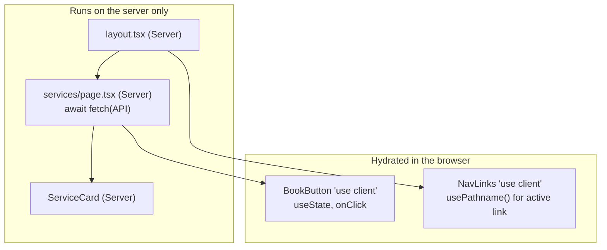

## What

**React** builds UIs from **components**: functions that take **props** (inputs) and return **JSX** (a description of UI). React compares the new description with the previous one and updates only the changed DOM nodes.

```tsx
type ServiceCardProps = { service: { id: number; name: string; priceCents: number } };

export function ServiceCard({ service }: ServiceCardProps) {
  return (
    <article className="rounded-xl border p-4">
      <h3>{service.name}</h3>
      <p>₹{(service.priceCents / 100).toFixed(2)}</p>
    </article>
  );
}
```

- **JSX** is syntax sugar for function calls, not HTML. Use `className`, camelCase props, and `{}` to embed JavaScript.
- **Props** are read-only. Data flows down, events flow up (callbacks).
- **`children`** lets a component wrap arbitrary content (`<Card>…</Card>`).

### Lists and keys

```tsx
<ul>
  {services.map((s) => (
    <li key={s.id}><ServiceCard service={s} /></li>
  ))}
</ul>
```

The `key` tells React which item is which between renders. Use a **stable unique id**. Index keys break when items are reordered, inserted or removed: React reuses the wrong component state (Saturday lab: "the wrong booking updates on cancel").

### Next.js App Router

Next.js adds routing, rendering strategies and a server to React. In `app/`, folders are routes:

```text
app/
  layout.tsx                  shared shell (Header, Footer), wraps all pages
  page.tsx                    /
  services/page.tsx           /services
  services/[id]/page.tsx      /services/42   (dynamic segment)
  services/[id]/not-found.tsx 404 for an unknown id
  book/page.tsx               /book
  bookings/[id]/page.tsx
  login/page.tsx  signup/page.tsx  dashboard/page.tsx
```

<Callout kind="warning" title="This Next.js version differs from older tutorials">

In current Next.js, `params` and `searchParams` passed to pages are **Promises** (`const { id } = await params`), and reading `searchParams` opts that page into dynamic rendering. The route-protection file is `proxy.ts` (it was `middleware.ts` before Next.js 16). Read the version's docs in `node_modules/next/dist/docs/` before copying code from older articles or from an AI that may have been trained on older versions.

</Callout>

### Server Components vs Client Components

By default every component in the App Router is a **Server Component**: it runs on the server, can `await` data directly, and ships **no JavaScript** for itself to the browser. Add `"use client"` at the top of a file to make it a **Client Component**: it is also pre-rendered on the server, then **hydrated** in the browser, where it can use state, effects and event handlers.



| Need | Server Component | Client Component |
|------|:---:|:---:|
| Fetch data with secrets / direct DB or API | ✓ | ✗ |
| `useState`, `useEffect`, event handlers | ✗ | ✓ |
| Browser APIs (`window`, `localStorage`) | ✗ | ✓ |
| Zero JS sent to the user | ✓ | ✗ |

Rule of thumb: keep components on the server; push `"use client"` down to the smallest interactive leaf (a button, a form, a nav link set).

```tsx
// app/services/page.tsx  (Server Component, no "use client")
import { ServiceCard } from "@/components/ServiceCard";
import { listServices } from "@/lib/api";

export default async function ServicesPage() {
  const services = await listServices();       // runs on the server
  if (services.length === 0) return <p>No services yet.</p>;
  return <ul>{services.map((s) => <li key={s.id}><ServiceCard service={s} /></li>)}</ul>;
}
```

```tsx
// app/services/[id]/page.tsx
import { notFound } from "next/navigation";

export default async function ServicePage({ params }: { params: Promise<{ id: string }> }) {
  const { id } = await params;
  const service = await getService(Number(id));
  if (!service) notFound();                    // renders the 404 page
  return <ServiceDetail service={service} />;
}
```

Navigation uses `<Link href="/services">` from `next/link`: client-side transitions without a full reload, with prefetching.

### Monorepo with npm workspaces

```json
{ "name": "booking", "private": true, "workspaces": ["api", "web", "packages/*"] }
```

`packages/shared` exports Zod schemas used by both `api` and `web` (`import { bookingSchema } from "@booking/shared"`). When you move folders, update CI paths (`working-directory`, cache keys) in the same PR so CI stays green.

## Why

Server Components remove JavaScript from the page and keep secrets and data access on the server, giving faster loads and simpler data fetching. Client Components give you interactivity. Understanding the boundary prevents the most common Next.js errors ("useState only works in a Client Component", hydration mismatches, leaking server-only code).

## How

1. Build `Header`, `Footer`, `Button`, `ServiceCard` as small, reusable components.
2. Put `Header` in `layout.tsx`; make only the link list a Client Component (it needs `usePathname()` to highlight the active link).
3. Fetch services in a Server Component page. Handle empty lists and unknown ids.
4. Check the Network tab: navigating between pages should not reload the document.
5. Check the build output: pages that fetch at request time vs prerendered.

## When

- **Vite + React** (SPA): dashboards behind login, tools, prototypes, no SEO need.
- **Next.js**: public pages needing SEO and fast first paint, mixed server and client logic, one deployable app with routing built in.

## Where

All of `web/` in this program. Week 4 containerizes it; note `NEXT_PUBLIC_*` variables are baked in at build time.

## Levels of understanding

<Levels>
<Level id="beginner">

A component is a reusable piece of screen, like a LEGO brick. You give it information (props) and it draws itself. Next.js decides whether each brick is drawn on the server or in your browser. Bricks that need clicks and typing run in the browser; the rest don't need to.

</Level>
<Level id="intermediate">

Components are pure functions of props and state. Lists need stable keys. Server Components render on the server and can be async; Client Components use hooks and events. Folders in `app/` define routes; `layout.tsx` persists across navigation; `notFound()` triggers the 404 UI; `Link` navigates client-side.

</Level>
<Level id="advanced">

React renders to a virtual tree, reconciles by type and key, and commits to the DOM. Server Components stream an RSC payload; Client Components are hydrated, so the server and first client render must match. Props crossing the server→client boundary must be serializable. Use `loading.tsx`/Suspense for streaming, route segment config for caching, and keep secrets in server-only modules (`import "server-only"`).

</Level>
<Level id="industry">

Teams standardise on a design system (Tailwind + component library), colocate components with tests, enforce lint rules for hooks, measure Core Web Vitals, and split bundles by route. Choosing server vs client per component is a regular review topic because it affects performance and security.

</Level>
</Levels>

## Common mistakes

<Callout kind="mistake">

- Using array index as `key` for dynamic lists.
- Adding `"use client"` to a whole page "to make errors go away".
- Using `window`/`localStorage` in a Server Component.
- Mutating props or state directly.
- Using `<a href>` for internal links (full reload) instead of `Link`.
- Reading `params.id` synchronously in this Next.js version (it is a Promise).
- Inline styles and direct DOM manipulation (`document.querySelector`) inside React.

</Callout>

## Industry usage

<Callout kind="industry">A frequent interview prompt is "which of these components should be client components, and why?" Your answer should name data access, interactivity and bundle size.</Callout>

## Exercises

<Challenge kind="exercise" title="Server or browser?" answer={<p>Header: Server (static markup) containing a Client <code>NavLinks</code>. ServiceCard: Server. Booking form: Client (state, handlers). Services page: Server (fetches). Logout button: Client (onClick). A theme toggle: Client (state, localStorage).</p>}>

Classify each as Server or Client and justify: Header, NavLinks with active highlight, ServiceCard, Services page, booking form, Logout button, theme toggle.

</Challenge>

<Challenge kind="debug" title="useState error" answer={<p>The file uses a hook but is a Server Component. Extract the interactive part into its own file with <code>"use client"</code> at the top and import it into the server page.</p>}>

Next.js throws &quot;You're importing a component that needs useState. It only works in a Client Component&quot;. What is the minimal fix?

</Challenge>

## Interview questions

<Challenge kind="interview" title="Hydration" answer={<p>Hydration attaches React&apos;s event handling to server-rendered HTML in the browser. Client Components render once on the server and again on the client; if output differs (dates, random numbers, <code>window</code> checks) you get a hydration mismatch.</p>}>

"What is hydration and what causes a hydration mismatch?"

</Challenge>
