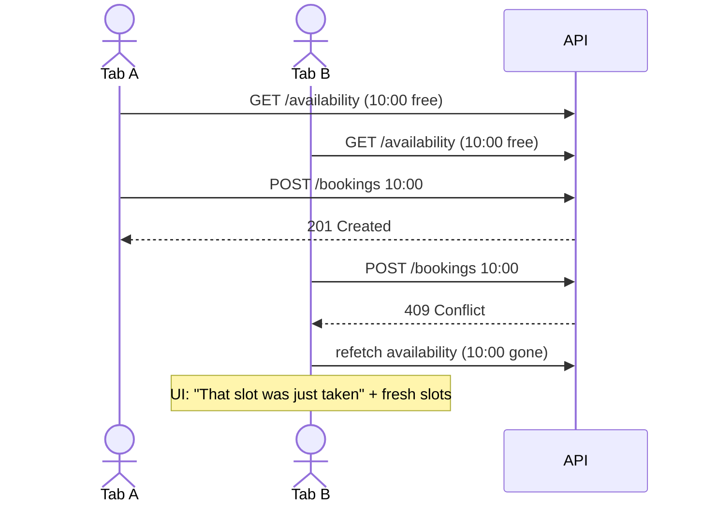

## What

**Server state** is data that lives on the server and is only *cached* in the browser (bookings, availability). It can be stale, can fail, and can be changed by others. It is different from UI state (is the modal open?).

### Cross-origin cookies

The web app (`localhost:3000`) calls the API (`localhost:4000`), a different **origin**. For the cookie to be sent and accepted:

```ts
// web: lib/api.ts (the ONLY place fetch lives)
const BASE = process.env.NEXT_PUBLIC_API_URL!;           // baked in at build time

export class ApiError extends Error {
  constructor(public status: number, message: string, public fields?: Record<string, string>) { super(message); }
}

async function request<T>(path: string, init: RequestInit = {}): Promise<T> {
  const res = await fetch(`${BASE}${path}`, {
    ...init,
    credentials: "include",                              // send/accept cookies cross-origin
    headers: { "content-type": "application/json", ...init.headers },
  });
  if (!res.ok) {
    const body = await res.json().catch(() => null);
    throw new ApiError(res.status, body?.error?.message ?? res.statusText, body?.error?.fields);
  }
  return res.status === 204 ? (undefined as T) : res.json();
}
export const api = {
  availability: (date: string, serviceId: number) => request<{ slots: string[] }>(`/availability?date=${date}&serviceId=${serviceId}`),
  createBooking: (b: BookingInput) => request<Booking>("/bookings", { method: "POST", body: JSON.stringify(b) }),
};
```

```ts
// api: CORS must allow that exact origin AND credentials
app.use(cors({ origin: "http://localhost:3000", credentials: true }));
```

`credentials: "include"` + `Access-Control-Allow-Credentials: true` + an exact (not `*`) `Access-Control-Allow-Origin`: all three are required.

### Why not `useEffect` for fetching?

```tsx
// Fragile
useEffect(() => {
  fetch(`/availability?date=${date}`).then(r => r.json()).then(setSlots);
}, [date]);
```

Problems: no cancellation (a slow older response overwrites a newer one: a **race condition**), no caching, no loading/error handling, no dedupe, double effects in Strict Mode, and an unstable dependency (an object recreated every render) refetches forever (Saturday lab).

### TanStack Query

```tsx
const { data, isPending, isError, error, refetch } = useQuery({
  queryKey: ["availability", date, serviceId],           // identity of the data
  queryFn: () => api.availability(date, serviceId),
  enabled: !!date && !!serviceId,
});
```

- The **query key** is a cache key and dependency list: change `date` → a new entry is fetched; the old one stays cached. Results can't overwrite the wrong key, which eliminates the race.
- **Mutations** change server data and then invalidate related queries:

```tsx
const qc = useQueryClient();
const book = useMutation({
  mutationFn: api.createBooking,
  onSuccess: () => qc.invalidateQueries({ queryKey: ["availability"] }),   // refresh slots
  onError: (e) => {
    if (e instanceof ApiError && e.status === 409) {
      setMessage("Sorry, that slot was just taken. Please pick another.");
      qc.invalidateQueries({ queryKey: ["availability"] });
    }
  },
});
```



The UI can never *guarantee* a slot is free (another user may take it between fetch and click), so the **server's 409 is the source of truth** and the UI must handle it gracefully.

## Why

Most "frontend bugs" are data-synchronisation bugs. A library that models caching, staleness, retries and invalidation removes whole categories of them and the code is shorter than hand-rolled effects.

## How

1. Provide a `QueryClientProvider` in a client `providers.tsx` (as this site does).
2. Centralise all fetch calls in `lib/api.ts`; hooks wrap them (`useAvailability`).
3. Render all states: `isPending` → skeleton; `isError` → message + Retry (`refetch`); empty array → "No free slots on this date"; success → slot buttons.
4. After booking, invalidate; on 409, message + refetch.
5. Verify with two tabs, and with `next build && next start` (Strict Mode doubles effects only in dev).

## When

Use TanStack Query (or SWR) for client-side server state that changes or is shared. For static or per-request data, fetch in a Server Component. Use `useEffect` only to synchronise with non-React systems (subscriptions, timers).

## Where

Availability by date, my bookings, owner dashboard lists, service manager mutations.

## Levels of understanding

<Levels>
<Level id="beginner">

When you pick a date, the app asks the server which times are free and shows them while waiting. If two people click the same time, the server says "taken" to the second person, and the app shows a friendly message and refreshes the list.

</Level>
<Level id="intermediate">

Use `credentials: "include"` and a CORS allowlist with credentials. Use `useQuery` with a key containing every input; use `useMutation` plus `invalidateQueries`. Handle loading, error, and empty states, and map HTTP 409 to a clear message.

</Level>
<Level id="advanced">

Tune `staleTime`, `gcTime`, retry policy (don't retry 4xx), and use optimistic updates with rollback in `onError`. Cancel in-flight queries via the `signal`. Prefetch on the server and hydrate (`HydrationBoundary`) for fast first paint. Idempotency keys make retried POSTs safe.

</Level>
<Level id="industry">

Data layers are typed end to end, with error taxonomies (network, validation, conflict, auth). Teams monitor failed requests in the browser (Sentry), set budgets for request counts per page, and add contract tests so the UI and API cannot drift.

</Level>
</Levels>

## Common mistakes

<Callout kind="mistake">

- Forgetting `credentials: "include"`, then wondering why `/me` is always 401.
- `Access-Control-Allow-Origin: *` with credentials (browsers reject it).
- Object/array literals in `useEffect` dependencies, causing infinite refetch.
- Not invalidating after a mutation (stale UI).
- Retrying a 409 or 400 automatically.
- Treating the UI's "free slot" as a guarantee.
- Scattering `fetch` calls across components.

</Callout>

## Industry usage

<Callout kind="industry">Concurrency conflicts like 409 are a first-class UX case in booking, ticketing and inventory products. Graceful "someone else got it" flows are what separate demo apps from production apps.</Callout>

## Exercises

<Challenge kind="exercise" title="Two tabs" answer={<p>Open the app in two tabs, select the same slot, press Book in A then B. Expect: A succeeds; B shows the conflict message and the slot disappears after refetch. Automate with Playwright using two browser contexts.</p>}>

Reproduce the Day 3 acceptance criterion by hand, then with a Playwright test using two contexts.

</Challenge>

<Challenge kind="debug" title="Old results flash back" answer={<p>Without cancellation, a slow response for the previous date arrives last and overwrites state. Key the query by date (TanStack Query) or abort the previous request with <code>AbortController</code> in the effect cleanup.</p>}>

Quickly switching dates sometimes shows the previous date&apos;s slots. Why, and how do you fix it?

</Challenge>

## Interview questions

<Challenge kind="interview" title="Why a query library?" answer={<p>It manages caching, deduplication, background refetching, retries, cancellation and invalidation, and gives consistent loading/error states, avoiding the race conditions and boilerplate of hand-written effects.</p>}>

"Why use TanStack Query instead of useEffect + useState?"

</Challenge>
