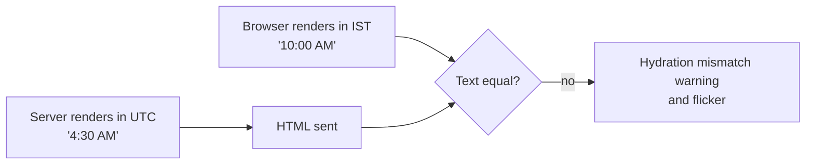

## What

### Accessibility (a11y)

Target Lighthouse accessibility **90+** and full keyboard use.

- Semantic elements (`button`, `nav`, `main`, headings in order).
- Every input has a `label`; errors are associated (`aria-describedby`) and announced (`role="alert"`).
- Visible `:focus-visible` styles; logical tab order; no keyboard traps in dialogs (focus moves in and returns).
- Color contrast ≥ 4.5:1 for text; never color alone (add text/icons).
- Tabs follow the ARIA tab pattern (`role="tablist"`, arrow keys), as Radix does for you.

### Time zones

A booking is an **instant** (`timestamptz`, UTC). People think in **wall-clock time in a place**. The business is in `Asia/Kolkata`; a customer's laptop may be anywhere.

```ts
const BUSINESS_TZ = "Asia/Kolkata";

export function formatSlot(iso: string) {
  return new Intl.DateTimeFormat("en-IN", {
    timeZone: BUSINESS_TZ, weekday: "short", day: "numeric", month: "short", hour: "2-digit", minute: "2-digit",
  }).format(new Date(iso));
}
```

Rules: store and transmit ISO strings **with offset** (`2026-03-02T10:00:00+05:30`); always format with an explicit `timeZone`; compute "today" in the business zone; never use `toLocaleString()` without a zone for business data.

### Hydration mismatch from dates



Fix by formatting with the same explicit `timeZone` on both sides (output becomes identical), not by `suppressHydrationWarning`.

### Testing pyramid for the UI

| Layer | Tool | Example |
|-------|------|---------|
| Unit/component | Vitest + React Testing Library | Login form shows an error on 401 |
| E2E | Playwright | sign up → book → see booking → cancel |

```tsx
// RTL: test what users do, find by role/label
render(<LoginForm />);
await user.type(screen.getByLabelText(/email/i), "a@x.com");
await user.type(screen.getByLabelText(/password/i), "wrong");
await user.click(screen.getByRole("button", { name: /log in/i }));
expect(await screen.findByRole("alert")).toHaveTextContent(/invalid email or password/i);
```

```ts
// Playwright
test("customer can book and cancel", async ({ page }) => {
  await page.goto("/signup");
  await page.getByLabel("Email").fill(`u${Date.now()}@x.com`);
  await page.getByLabel("Password").fill("CorrectHorse9!");
  await page.getByRole("button", { name: "Sign up" }).click();
  await page.goto("/book");
  await page.getByRole("button", { name: "Haircut" }).click();
  await page.getByRole("button", { name: /10:00/ }).click();
  await page.getByRole("button", { name: "Book" }).click();
  await expect(page.getByText("Booking confirmed")).toBeVisible();
  await page.goto("/dashboard");
  await page.getByRole("button", { name: "Cancel" }).click();
  await expect(page.getByText("Cancelled")).toBeVisible();
});
```

Run Playwright with the laptop time zone set differently (`timezoneId: "America/New_York"` in context options) and assert **10:00** still shows.

## Why

Accessibility is a legal and ethical baseline and improves everyone's experience. Time zone bugs silently create wrong bookings, the worst failure for a booking product. Tests are what let you change the UI without fear.

## How

1. Run Lighthouse; fix every a11y item. Tab through the whole flow.
2. Add `PATCH /bookings/:id/status` (owner only) + a migration adding `'completed'`; add dashboard tabs Upcoming / Completed / Cancelled.
3. Render all times through `formatSlot`.
4. Write RTL tests for the login form; ask an AI to draft them, then review: does it query by role? Does it wait properly? Where was it wrong?
5. Write the Playwright flow; run it with a non-business time zone.

## When

Run a11y checks continuously; write the E2E test for the most valuable flow first, then add component tests for logic-heavy components.

## Where

Booking confirmation, dashboard lists, emails/reminders later, AI receptionist replies (Week 5 must also pass offsets).

## Levels of understanding

<Levels>
<Level id="beginner">

Make sure everyone can use the app, including with only a keyboard. Show times for the shop's place, not for wherever the computer is. Write a test that clicks through the app like a customer.

</Level>
<Level id="intermediate">

Use labels, landmarks and focus styles; `Intl.DateTimeFormat` with a fixed `timeZone`; ISO strings with offsets; RTL queries by role/label; one Playwright happy-path flow.

</Level>
<Level id="advanced">

DST transitions break naive arithmetic (use a library such as Temporal polyfill or date-fns-tz for "same time tomorrow"). Combine axe checks in Playwright, test with a screen reader, respect `prefers-reduced-motion`, and keep tests deterministic with data fixtures and API mocking at boundaries.

</Level>
<Level id="industry">

A11y regressions are blocked in CI; time handling follows a written convention ("UTC in storage, business zone in display"). E2E suites run in CI against a docker-compose stack (Week 4) and are kept small and stable.

</Level>
</Levels>

## Common mistakes

<Callout kind="mistake">

- `new Date("2026-03-02T10:00")` (no offset): interpreted in the *local* zone.
- Storing local times without a zone.
- Using `div` buttons and removing focus outlines.
- Tests that depend on CSS classes or fixed timeouts instead of roles and `expect(...).toBeVisible()`.
- Silencing hydration warnings instead of fixing the cause.

</Callout>

## Industry usage

<Callout kind="industry">"Why does my booking show a different hour for my customer in Dubai?" is a real support ticket. A single time-formatting helper plus a test under a different `timezoneId` prevents it.</Callout>

## Exercises

<Challenge kind="exercise" title="Change your laptop's zone" answer={<p>In Playwright create the context with <code>timezoneId: &quot;America/Los_Angeles&quot;</code>, book 10:00 IST, and assert the UI still reads 10:00 (with the zone abbreviation if you show it). Also run the page with the OS zone changed manually.</p>}>

Prove the Day 5 acceptance criterion on time zones.

</Challenge>

<Challenge kind="debug" title="Hydration failed" answer={<p>The component formats a date with the server&apos;s zone and then the browser&apos;s zone, so the text differs. Pass an explicit <code>timeZone</code> in <code>Intl.DateTimeFormat</code> so both render the same string.</p>}>

The console says &quot;Hydration failed because the server rendered text didn&apos;t match the client&quot; on the bookings list. The only dynamic content is a formatted date. Fix?

</Challenge>

## Interview questions

<Challenge kind="interview" title="Storing times" answer={<p>Store instants in UTC (<code>timestamptz</code>/ISO with offset), store the business&apos;s IANA time zone, convert for display with an explicit zone, and do calendar math in the zone (DST aware).</p>}>

"How do you store and display times for a business in one time zone and customers elsewhere?"

</Challenge>
