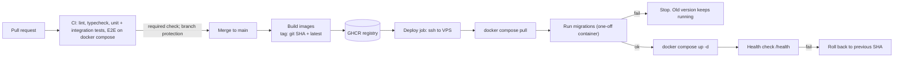

## What

**CI** (continuous integration) runs checks on every change. **CD** (continuous delivery/deployment) ships passing changes to production automatically.



### Deploy workflow (sketch)

```yaml
name: deploy
on:
  push: { branches: [main] }
permissions: { contents: read, packages: write }

jobs:
  test:
    uses: ./.github/workflows/ci.yml            # reuse the same checks

  build-and-push:
    needs: test
    runs-on: ubuntu-latest
    steps:
      - uses: actions/checkout@v4
      - uses: docker/login-action@v3
        with: { registry: ghcr.io, username: ${{ github.actor }}, password: ${{ secrets.GITHUB_TOKEN }} }
      - uses: docker/build-push-action@v6
        with:
          context: .
          file: api/Dockerfile
          push: true
          tags: ghcr.io/${{ github.repository }}/api:${{ github.sha }}

  deploy:
    needs: build-and-push
    runs-on: ubuntu-latest
    steps:
      - uses: appleboy/ssh-action@v1
        with:
          host: ${{ secrets.VPS_HOST }}
          username: deploy
          key: ${{ secrets.VPS_SSH_KEY }}
          script: |
            cd /srv/booking
            export TAG=${{ github.sha }}
            docker compose pull
            docker compose run --rm api node dist/migrate.js || { echo "migration failed"; exit 1; }
            docker compose up -d
            curl -fsS https://api.yourdomain.com/health
```

Pin third-party actions to a version or SHA you trust; action versions shown here are examples, so check current ones. Secrets live in GitHub **Actions secrets**; the VPS pulls private images using a GitHub token with only `read:packages`.

### Migrations on deploy

- Migrations are **versioned files** applied once, in order (Drizzle migrator).
- The deploy runs them **before** swapping containers. If a migration fails the script exits, so containers aren't replaced and the old version keeps serving.
- Make migrations **backwards compatible** (expand/contract): add a column, deploy code that writes both, backfill, then drop the old column in a later release. Otherwise a rollback can run old code against a new schema.

### Production seed and first owner

- Seed production with **real services only**. Never test users or demo bookings.
- Create the first owner with a one-off script that prompts for the password (no echo) and hashes it:

```bash
docker compose run --rm -it api node dist/scripts/create-owner.js
# Email: owner@salon.com
# Password: ******** (prompted, never in env, history or repo)
```

### Rollback

Because images are tagged by SHA, rollback = deploy the previous SHA:

```bash
cd /srv/booking
TAG=<previous-sha> docker compose up -d      # compose uses image: ...:${TAG}
curl -fsS https://api.yourdomain.com/health
```

Write exact steps in `RUNBOOK.md` and time yourself (under 5 minutes is the acceptance bar). If the bad release ran a migration, rolling back code alone may not suffice; that's why migrations must be backward compatible, with a documented restore as the last resort.

### Self-hosted PaaS: Coolify and Dokploy

They run on your VPS and provide Git-connected deploys, a built-in reverse proxy with automatic TLS, env var UI, logs, databases and backups. You trade manual control and transparency for speed and a UI. Good for many small apps and non-ops teammates; less good when you need custom pipelines, strict change control or minimal moving parts. (Convex is a different model, a hosted reactive backend, which may suit future clients but is not part of this app.)

## Why

Manual deploys are slow, error-prone and scary, so people avoid shipping. Automation makes deployment boring, which is what you want, and the rollback plan makes boring safe.

## How

1. Branch protection requires CI green before merge (Week 2).
2. Build/push images on merge, tagged by SHA.
3. Deploy job SSHes in, pulls, migrates, restarts, health-checks.
4. Deliberately merge a broken migration on a branch to prove the deploy stops and the old version stays up.
5. Practise a rollback and time it; write RUNBOOK.md.

## When

Auto-deploy to production on merge when you have strong tests and a fast rollback. Add a staging environment and manual approvals when the blast radius is larger.

## Where

`.github/workflows/`, the VPS deploy directory, GHCR, `RUNBOOK.md`.

## Levels of understanding

<Levels>
<Level id="beginner">

When code is approved, a robot builds it, puts it on the server, updates the database, and checks it's alive. If something goes wrong, you can put the previous version back quickly using a written checklist.

</Level>
<Level id="intermediate">

Build once per commit, tag with the SHA, push to GHCR, deploy with Compose over SSH, migrate before switching, health check, keep the previous tag for rollback. Secrets in Actions/server env, minimal token scopes.

</Level>
<Level id="advanced">

Use concurrency groups to prevent parallel deploys, environments with protection rules, OIDC instead of long-lived tokens where possible, blue/green or rolling updates, and zero-downtime migrations with expand/contract and locks timeouts (`lock_timeout`). Cache layers in CI, sign images (cosign), and scan on build.

</Level>
<Level id="industry">

DORA metrics (deployment frequency, lead time, change failure rate, MTTR) guide improvement. Teams run canaries, feature flags and automatic rollbacks on error-rate spikes; the runbook is exercised in game days.

</Level>
</Levels>

## Common mistakes

<Callout kind="mistake">

- Deploying `latest` with no way to know what's running or go back.
- Migrating after swapping containers.
- A migration that drops/renames a column old code still uses.
- Test users or demo data in production; the owner password in the seed or repo.
- Long-lived broad tokens stored in CI.
- Rollback steps nobody has ever executed.

</Callout>

## Industry usage

<Callout kind="industry">"Can you roll back in under five minutes?" is a launch-readiness question clients and employers ask. Having done it once, on a timer, is your answer.</Callout>

## Exercises

<Challenge kind="exercise" title="Break it safely" answer={<p>Create a branch whose migration has a SQL error. Merge it to a throwaway environment (or run the deploy script by hand). Expected: migrate step exits non-zero, deploy aborts, containers unchanged, <code>/health</code> still returns 200 on the old version. Record the log excerpt.</p>}>

Prove "a failed migration stops the deploy and leaves the old version running".

</Challenge>

## Interview questions

<Challenge kind="interview" title="Safe migrations" answer={<p>Use expand/contract: add nullable columns/new tables first, deploy compatible code, backfill, then remove old structures later. Run migrations before switching traffic, keep them idempotent and tested, and plan rollback.</p>}>

"How do you ship a schema change without downtime or breaking rollback?"

</Challenge>
