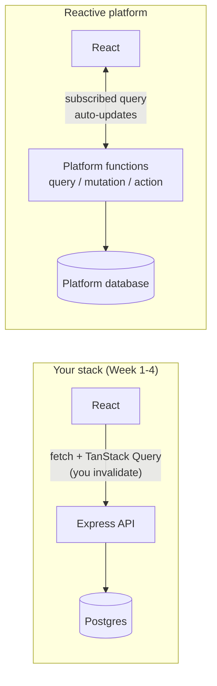

## What

You built a **conventional, self-operated** backend: Express API, Postgres, migrations, auth, deployment, monitoring and backups, all yours. There are other models, and a forward-deployed engineer must be able to say when each fits.

| Model | You write | Platform provides | Examples |
|-------|-----------|-------------------|----------|
| **Self-operated stack** (this program) | API, schema, auth, deploy, ops | Servers (VPS) | Express/Postgres on a VPS |
| **Managed platform for your own code** | Same code | Hosting, TLS, scaling, DB hosting | Render, Railway, Fly, managed Postgres (Neon, Supabase DB) |
| **Backend-as-a-Service (BaaS)** | Mostly client code + rules | Auth, database, storage, functions | Supabase, Firebase |
| **Reactive backend platform** | Server functions in TypeScript | Database, functions, real-time subscriptions, hosting | Convex |

### What is different about a reactive backend (Convex as the example)

In a Convex-style model, your backend is a set of **TypeScript functions** that run on the platform next to a built-in **document database**: **queries** read data, **mutations** write it transactionally, and **actions** call outside services (like an LLM). The distinctive feature is **reactivity**: a client subscribing to a query is updated automatically when the underlying data changes, with no polling, WebSocket code or cache invalidation of your own.

(Names and APIs change; check the current Convex documentation before relying on any detail here. This lesson is about the *model*, not syntax.)

## Why

Neither is "better". The choice moves work between you and the vendor, and moves risk too: lock-in, pricing, data portability, compliance, and who is paged when it breaks.

## How

### Trade-offs

| Question | Self-operated Postgres stack | Reactive / BaaS platform |
|----------|------------------------------|--------------------------|
| Speed to first version | Slower (you build auth, API, deploy) | Faster |
| Real-time features | Extra work (SSE/WebSockets, invalidation) | Often built in |
| SQL power, joins, extensions (pgvector, pg_trgm) | Full | Varies; different query model |
| Portability / lock-in | High: standard Postgres anywhere | Lower: platform-specific APIs |
| Operations burden | You: backups, patching, monitoring | Vendor |
| Cost shape | Flat server cost | Usage-based; check at your scale |
| Data residency / compliance | You choose the region | Depends on vendor options |
| Customisation | Unlimited | Within the platform's limits |
| Skills needed | Broad (ops + backend) | Platform knowledge |

### Decision checklist for a client project

1. **Who operates it after you leave?** If nobody technical, managed beats self-hosted.
2. **Does it need real-time collaboration?** Reactive platforms shine.
3. **Is relational data and SQL central?** (reports, joins, pgvector) Postgres wins.
4. **What are the data-protection rules?** Check regions, DPAs, export and deletion.
5. **What is the exit plan?** Can you export everything in a standard format?
6. **What does it cost at 10x usage?** Model it with the vendor's calculator.
7. **Team skills and hiring.**

### Why this app stayed on Postgres
The booking product needs relational integrity (constraints and transactions for double-booking), SQL reporting, pgvector for RAG in Week 5, and a cheap predictable bill, so a VPS with Postgres is a defensible choice. A live shared whiteboard for a client would reasonably go the other way.

## When

Prefer the stack you can fully explain and operate for small, stable apps. Evaluate a reactive platform or BaaS when speed and real-time matter more than portability, and always prototype the riskiest requirement first.

## Where

Your Week 6 architecture doc's "build vs buy" section; future client conversations; the README comparison for Coolify/Dokploy (a different axis: how you *deploy*, not what the backend *is*).

## Levels of understanding

<Levels>
<Level id="beginner">

You can build and run your own kitchen or rent one that someone else maintains. Your own gives control and low cost; the rented one is faster to start but you follow their rules and pay by usage.

</Level>
<Level id="intermediate">

Compare models on speed, real-time needs, SQL requirements, operations burden, lock-in, compliance and cost shape, then justify the choice in one paragraph in the architecture doc.

</Level>
<Level id="advanced">

Look at consistency guarantees and transaction model, query expressiveness, extension ecosystem (pgvector), migration and export paths, observability, vendor roadmap risk, and total cost including engineering time.

</Level>
<Level id="industry">

Procurement, security review and data-processing agreements often decide the backend, not engineering preference. Document alternatives considered and why they were rejected.

</Level>
</Levels>

## Common mistakes

<Callout kind="mistake">

- Choosing a platform because it is trending, not because of a requirement.
- Ignoring the exit path until the invoice or a policy change arrives.
- Assuming "managed" means no responsibility for backups or access control.
- Re-platforming a working system without a measured problem.
- Comparing only list prices and not engineering time.

</Callout>

## Industry usage

<Callout kind="industry">Forward-deployed engineers are often asked "should we use X instead?". A short decision table with the client's own constraints in it turns an opinion into a recommendation.</Callout>

## Exercises

<Challenge kind="exercise" title="Decide for three clients" answer={
A strong answer picks per client and justifies with constraints: salon with one owner and modest budget (VPS + Postgres or managed Postgres with backups); a live collaborative scheduling tool for a call centre (reactive platform worth prototyping); a clinic with strict data residency (self-operated or a region-pinned managed Postgres, verified in writing). Each answer states the exit plan.
}>

Choose a backend model and justify it in five lines for: (a) a single salon, (b) a live collaborative scheduling tool, (c) a clinic with strict data-residency rules.

</Challenge>

## Interview questions

<Challenge kind="interview" title="Build or buy the backend" answer={
Start from requirements (real-time, relational needs, compliance, who operates it), compare time to market against lock-in and cost at scale, prototype the riskiest requirement, and document the exit plan.
}>

"When would you not self-host your own Postgres?"

</Challenge>
