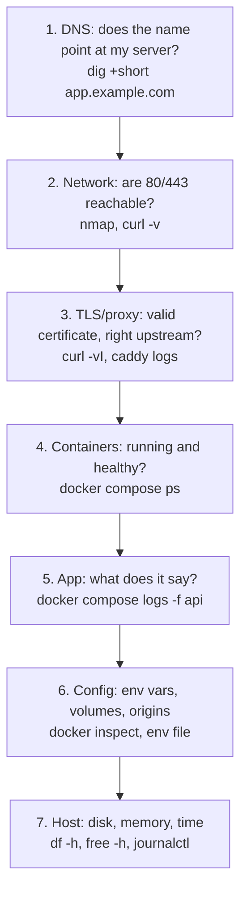

## What

When production breaks you cannot attach a debugger, so you go **layer by layer from the outside in**, asking one question per layer and not moving on until it is answered.



### Command cheat list

```bash
dig +short app.example.com ; dig @1.1.1.1 app.example.com        # what do public resolvers say?
curl -vI https://app.example.com                                  # TLS, redirects, headers
curl -v -H 'Origin: https://app.example.com' https://api.example.com/health   # CORS headers
docker compose ps                                                 # state, restarts, health
docker compose logs --tail 100 -f api                             # app output
docker inspect <container> --format '{{.State.ExitCode}} {{json .Config.Env}}' # exit code, effective env
docker compose config                                             # the fully resolved compose file
docker volume ls ; docker inspect <db-container> --format '{{json .Mounts}}'    # is data on a volume?
df -h ; du -sh /var/lib/docker/containers/* | sort -h | tail    # where did the disk go?
journalctl -u docker --since "1 hour ago"                         # daemon-level problems
```

## Why

Production symptoms ("the site is down") say nothing about the cause. A fixed order stops you from changing things randomly at 2 a.m., and every check you do leaves evidence for the write-up.

## How

### The five failure patterns

1. **Restart loop (missing env var).** `docker compose ps` shows `Restarting`; logs show the crash message (`JWT_SECRET is required`), exit code 1. Fix: add the variable to the server's env file (permissions 600), `up -d`, and make the app **fail fast with a clear message** at startup.
2. **Data lost on every restart (no volume).** Rows vanish after `--force-recreate`. `docker inspect` shows no mount at `/var/lib/postgresql/data`. Fix: named volume; restore from the last backup; never run `down -v` casually.
3. **HTTPS failing (wrong DNS record).** Caddy logs "challenge failed"; `dig` returns an old IP. Fix the A record, wait for the TTL, check with a public resolver, reload Caddy. Use Let's Encrypt's staging CA while experimenting to avoid rate limits.
4. **CORS only in production (wrong origin env).** Browser console shows a CORS error; `curl -v -H 'Origin: ...'` shows no `Access-Control-Allow-Origin` (or the wrong one). The env still has `http://localhost:3000`. Fix: exact `https://app.example.com`, no trailing slash, restart, re-test with the browser.
5. **Full disk from unrotated logs.** Writes fail, Postgres crashes, `df -h` 100%. `du` points at `*-json.log`. Fix: truncate safely, configure `max-size`/`max-file`, alert at 80% disk.

### Write-up format

```text
Symptom:   api container restarting every 5 s after deploy
Cause:     GOOGLE_CLIENT_SECRET missing from /srv/booking/.env.production (logs: "GOOGLE_CLIENT_SECRET is required")
Fix:       added the variable, docker compose up -d; startup now validates all required env vars with one error listing them
Verified:  docker compose ps shows healthy for 10 minutes; Google login works; uptime check green
```

## When

Start from the outside (what the user sees) and move inward. Change **one** thing at a time and record it. Before touching data (volumes, databases) take a backup.

## Where

Real servers and, for practice here, the config-audit lab in `labs/week-4/` (compose, env, Caddy, DNS and logging files with a checker; see `labs/README.md`). The five patterns above are also in the Debug labs tab.

## Levels of understanding

<Levels>
<Level id="beginner">

Work from the outside in: does the address point to the right computer, does the website answer, are the programs running, what do their logs say? Fix one thing at a time and check again.

</Level>
<Level id="intermediate">

Use dig, curl -v, docker compose ps/logs/inspect and df to answer one question per layer; read exit codes and logs; fix configuration at its source (env file, compose, DNS) and verify with the original symptom.

</Level>
<Level id="advanced">

Correlate across layers with request ids and timestamps, use `docker events`, `ss -tlnp`, packet-level checks only when necessary, and compare running config (`docker compose config`) with intended config. Add startup validation, healthchecks, log rotation and alerts so the same failure becomes visible earlier.

</Level>
<Level id="industry">

On-call engineers follow runbooks organised exactly like this; postmortems list contributing factors and add a detection or prevention item for each.

</Level>
</Levels>

## Common mistakes

<Callout kind="mistake">

- Restarting everything before reading a single log line.
- `docker compose down -v` while debugging (deletes the database volume).
- Testing CORS with curl alone and not in the browser.
- Trusting your own machine's DNS cache instead of asking a public resolver.
- Fixing the symptom (deleting log files) without adding rotation.
- Making several changes at once and not knowing which one worked.

</Callout>

## Industry usage

<Callout kind="industry">The best incident write-ups read like this lesson: the layer, the evidence, the single change, the verification, and the guard that makes it visible next time.</Callout>

## Exercises

<Challenge kind="exercise" title="Layered triage" answer={<p>Write the five commands you would run, in order, for &quot;the site is down&quot;: dig for DNS, curl -vI for TLS and HTTP, docker compose ps for container state, docker compose logs for the app, df -h for the host. For each, state what a bad result would look like.</p>}>

Given only &quot;the booking site is down&quot;, list your first five commands in order and what each result would tell you.

</Challenge>

<Challenge kind="debug" title="Postgres keeps crashing" answer={<p>Check the disk first (<code>df -h</code>): a full disk makes Postgres fail writes and crash. Find the biggest files with <code>du</code>; unrotated container logs are common. Free space, set log rotation, and add a disk alert.</p>}>

`docker compose logs db` shows &quot;No space left on device&quot;. What do you check and fix?

</Challenge>

## Interview questions

<Challenge kind="interview" title="Site down" answer={<p>Start at the outside: DNS, reachability, certificate, then proxy, containers, application logs, configuration and host resources. Change one thing at a time, keep evidence, and finish with a postmortem item that adds detection or prevention.</p>}>

"Walk me through how you would debug 'the website is down' on a server you didn't set up."

</Challenge>
