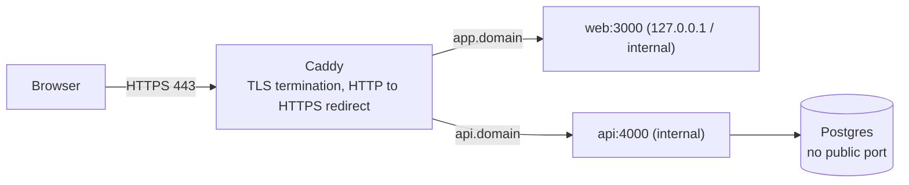

## What

### DNS records you will set

| Type | Name | Value | Purpose |
|------|------|-------|---------|
| A | `app` | `203.0.113.10` | app.yourdomain.com → your VPS |
| A | `api` | `203.0.113.10` | api.yourdomain.com → your VPS |
| CNAME | `www` | `yourdomain.com` | alias |
| TXT | `@` | `google-site-verification=…` | prove ownership |

DNS changes propagate according to **TTL**. Check with `dig +short app.yourdomain.com`; if it returns your IP from a public resolver (`dig @1.1.1.1 …`), Caddy can obtain a certificate.

### Reverse proxy + automatic HTTPS with Caddy

A **reverse proxy** accepts public traffic and forwards it to private services. Caddy also gets and renews **Let's Encrypt** certificates automatically (it proves domain control over ports 80/443).



```text
# Caddyfile
app.yourdomain.com {
    encode zstd gzip
    reverse_proxy web:3000
}
api.yourdomain.com {
    encode zstd gzip
    reverse_proxy api:4000
}
```

Caddy redirects HTTP → HTTPS by default. Put Caddy in the same Compose project so it reaches `web` and `api` by service name; it is the **only** service with `ports: ["80:80", "443:443"]`. Everything else is `127.0.0.1:…` or unpublished.

### Cookies and CORS in production

Frontend `https://app.yourdomain.com`, API `https://api.yourdomain.com`: **same site** (registrable domain `yourdomain.com`), different origins.

```ts
// API: cookie settings come from env, unset in local dev & CI
res.cookie("session", token, {
  httpOnly: true,
  secure: process.env.COOKIE_SECURE === "true",           // true in prod
  sameSite: "lax",
  domain: process.env.COOKIE_DOMAIN || undefined,        // ".yourdomain.com" in prod
  maxAge: 60 * 60 * 1000,
});

// CORS: exact frontend origin, credentials allowed
app.use(cors({ origin: process.env.WEB_ORIGIN, credentials: true }));
```

- `Domain=.yourdomain.com` lets the cookie be sent to both subdomains. That includes Next.js server-rendered protected pages (your proxy/SSR sees the cookie).
- `Secure` requires HTTPS; local `http://localhost` must not set it or the browser drops the cookie.
- `SameSite=Lax` works because both are the **same site**; `None` is only for truly cross-site.
- Browser fetches use `credentials: "include"`; the API returns `Access-Control-Allow-Origin: https://app.yourdomain.com` (exact) and `Allow-Credentials: true`.

### Production database choice (one line each)

- **Postgres in Docker on the VPS:** cheapest, full control, *you* handle backups/upgrades. Good for small clients with tested backups.
- **Hosted Postgres (Neon, Supabase):** managed backups/branching/scaling, more cost and network latency, less control. Good when nobody wants to run a DB.

Pick one and justify it in one line in the README (e.g., "Postgres in Docker: single salon, ~50 bookings/day, nightly tested pg_dump, saves ~€15/month").

### Environment variables

Set them on the **server** (`/srv/booking/.env.production` with `chmod 600`, referenced by Compose `env_file`): `DATABASE_URL`, `JWT_SECRET`, `GOOGLE_CLIENT_ID/SECRET`, `WEB_ORIGIN`, `COOKIE_DOMAIN`, `COOKIE_SECURE`. Never in the repo or the image. Add `https://api.yourdomain.com/auth/google/callback` to Google's authorized redirect URIs.

## Why

Browsers refuse many features on plain HTTP, users distrust it, and credentials in cookies must be protected in transit. Wrong DNS, cookie scope or CORS origin are the top reasons "it works locally but not live".

## How

1. Buy/choose a domain; create A records for `app` and `api`; wait until `dig` shows them.
2. Add the Caddy service and Caddyfile; `docker compose up -d`.
3. Check `curl -vI https://app.yourdomain.com` (certificate, `HTTP/2 200`) and `curl -I http://app...` (301/308 to HTTPS).
4. Log in on the live site; confirm the cookie in DevTools → Application: `HttpOnly`, `Secure`, `SameSite=Lax`, `Domain=.yourdomain.com`.
5. Run `nmap -Pn SERVER_IP` from outside: only 22, 80, 443.

## When

Use Caddy for simplicity and automatic TLS; Nginx + Certbot when your team standardises on it. Use a wildcard/`Domain=` cookie only when subdomains must share a session.

## Where

The production VPS, the Compose file, the API cookie/CORS config, Google Cloud Console redirect URIs.

## Levels of understanding

<Levels>
<Level id="beginner">

A domain name needs a record telling the internet which server to visit. Caddy is a doorman: it handles the secure connection (the padlock) and sends visitors to the right app. The login cookie is set so both the website and the API recognise you.

</Level>
<Level id="intermediate">

Create A records, run Caddy with automatic certificates, redirect HTTP→HTTPS, bind internal ports to localhost, configure `Domain`, `Secure`, `SameSite=Lax` via env, CORS with exact origin plus credentials, keep secrets on the server.

</Level>
<Level id="advanced">

Let's Encrypt uses HTTP-01 (port 80) or DNS-01 (wildcards) challenges and rate-limits failures, so use staging while debugging. HSTS makes HTTPS sticky. Understand site vs origin: `SameSite` compares registrable domains; CORS compares full origins. Behind a proxy set `trust proxy` for correct client IPs and secure-cookie detection.

</Level>
<Level id="industry">

Certificates, DNS and secrets are managed as code and monitored (expiry alerts). Teams use CDNs/WAFs in front, separate staging domains, and automate DNS with APIs. Misrouted DNS and expired certificates are classic outages; uptime checks watch the cert.

</Level>
</Levels>

## Common mistakes

<Callout kind="mistake">

- Starting Caddy before DNS points to the server (certificate failures, rate limits).
- `Secure` cookies in local dev (cookie silently dropped).
- Forgetting `Domain=.yourdomain.com`, so the Next.js server never sees the cookie.
- CORS origin with a trailing slash or wrong scheme.
- Publishing `5432:5432` or app ports on `0.0.0.0`.
- Committing `.env.production`, or baking it into an image.
- Forgetting the Google redirect URI for the production domain.

</Callout>

## Industry usage

<Callout kind="industry">Clients judge your work by the padlock and by "can I log in on my phone". The live checks here (valid cert, redirect, login with SSR pages, nmap) are what a forward-deployed engineer verifies before saying "it's live".</Callout>

## Exercises

<Challenge kind="exercise" title="The five live checks" answer={<p>Run: <code>curl -vI https://app…</code> (valid cert), <code>curl -I http://app…</code> (redirect), login in a browser incl. a protected SSR page, <code>docker history</code>/<code>grep</code> the repo for secrets (none), and external <code>nmap</code> (only 22/80/443). Save the outputs in the README.</p>}>

Produce evidence for each Day 3 acceptance criterion.

</Challenge>

<Challenge kind="debug" title="CORS error only in production" answer={<p>The API&apos;s allowed origin env var still holds the local value (or lacks the scheme/https). Set <code>WEB_ORIGIN=https://app.yourdomain.com</code> exactly, restart the container, and confirm the response header with <code>curl -v -H "Origin: https://app.yourdomain.com"</code>.</p>}>

Login works locally but the live site logs a CORS error on every request. What do you check first?

</Challenge>

## Interview questions

<Challenge kind="interview" title="Site vs origin" answer={<p>An origin is scheme + host + port; a site is the registrable domain (eTLD+1). app.example.com and api.example.com are different origins (CORS applies) but the same site (SameSite=Lax cookies are sent).</p>}>

"Why do SameSite cookies work between app.example.com and api.example.com but CORS still matters?"

</Challenge>
