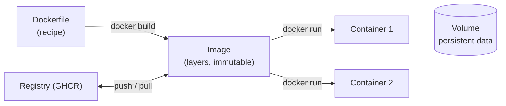
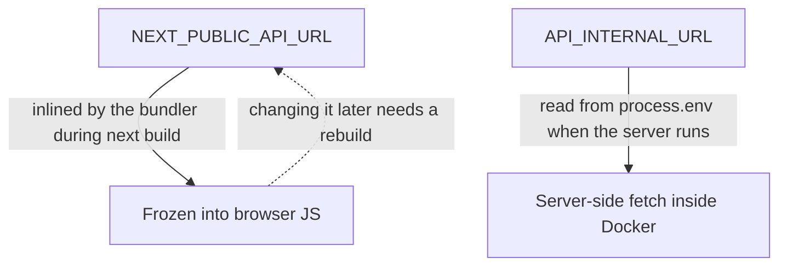

## What

A **container** is an isolated process with its own filesystem, started from an **image**. An image is a read-only, layered snapshot containing your app plus its exact runtime and dependencies. "Works on my machine" becomes "works in this image".



Containers differ from VMs: they share the host kernel, start in seconds, and are far lighter.

### A multi-stage Dockerfile for the API

```dockerfile
# ---- build stage: has dev tools
FROM node:22-alpine AS build
WORKDIR /app
COPY package.json package-lock.json ./
COPY api/package.json api/
COPY packages/shared/package.json packages/shared/
RUN npm ci
COPY . .
RUN npm run build -w api

# ---- runtime stage: small, production only
FROM node:22-alpine AS runtime
ENV NODE_ENV=production
WORKDIR /app
COPY --from=build /app/package.json /app/package-lock.json ./
COPY --from=build /app/api/package.json api/
COPY --from=build /app/packages/shared/package.json packages/shared/
RUN npm ci --omit=dev
COPY --from=build /app/api/dist api/dist
COPY --from=build /app/packages/shared packages/shared
USER node                                   # never run as root
EXPOSE 4000
HEALTHCHECK --interval=15s --timeout=3s --retries=3 CMD wget -qO- http://127.0.0.1:4000/health || exit 1
CMD ["node", "api/dist/index.js"]
```

Why multi-stage: the final image excludes compilers, source and dev dependencies: smaller, faster to pull, smaller attack surface. Order layers so rarely-changing steps (dependency install) come first and cache well.

`.dockerignore` keeps junk out of the build context:

```text
node_modules
.git
.env
.env.*
**/.next
**/dist
```

### Compose: the whole stack in one file

```yaml
services:
  db:
    image: pgvector/pgvector:pg17
    environment:
      POSTGRES_PASSWORD: ${POSTGRES_PASSWORD}
      POSTGRES_DB: booking
    volumes:
      - pgdata:/var/lib/postgresql/data      # survives down/up
    healthcheck:
      test: ["CMD-SHELL", "pg_isready -U postgres -d booking"]
      interval: 5s
      retries: 10

  api:
    build: { context: ., dockerfile: api/Dockerfile }
    env_file: .env
    environment:
      DATABASE_URL: postgres://postgres:${POSTGRES_PASSWORD}@db:5432/booking
    depends_on:
      db: { condition: service_healthy }
    ports: ["127.0.0.1:4000:4000"]

  web:
    build:
      context: .
      dockerfile: web/Dockerfile
      args:
        NEXT_PUBLIC_API_URL: http://localhost:4000      # baked into the JS bundle at BUILD time
    environment:
      API_INTERNAL_URL: http://api:4000                  # used by server code at RUNTIME
    ports: ["127.0.0.1:3000:3000"]

volumes:
  pgdata:
```

### The Next.js trap: build-time vs runtime variables



Two different URLs for the same API:

- **Public** (`https://api.yourdomain.com`): used by the **browser**.
- **Internal** (`http://api:4000`): used by Next.js **server code** inside the Docker network (service names resolve via Docker DNS). `localhost` inside a container means *that container*, a classic bug.

## Why

Reproducibility (same image in CI, staging and production), isolation (each service has its own dependencies), and portability (any server with Docker can run it). It also makes onboarding a one-command affair: `docker compose up`.

## How

1. Write `api/Dockerfile` and `web/Dockerfile` (Next.js `output: "standalone"` shrinks the image).
2. `docker compose up --build`; open the app; run the Playwright test against it in CI.
3. Prove persistence: create a booking, `docker compose down`, `up`, booking remains.
4. Prove non-root: `docker compose exec api id` shows a non-zero uid.
5. Inspect: `docker compose logs -f api`, `docker inspect`, `docker stats`.

Useful commands:

```bash
docker build -t booking-api -f api/Dockerfile .
docker run --rm -p 4000:4000 --env-file .env booking-api
docker ps -a ; docker logs <name> ; docker exec -it <name> sh
docker compose up -d --build ; docker compose down ; docker compose down -v   # -v DELETES volumes!
docker system df ; docker image prune
```

## When

Containerise anything you deploy. Use Compose for single-server multi-service stacks (this program); use Kubernetes/managed container services when you need multi-node scheduling, autoscaling or rolling updates at scale.

## Where

Local dev, CI (service containers and E2E), the production VPS (Day 3), and any PaaS that accepts images.

## Levels of understanding

<Levels>
<Level id="beginner">

A Dockerfile is a recipe that bakes your app and everything it needs into a box (image). Running the box gives a container. Compose starts several boxes (app, website, database) together and connects them. Data you care about goes in a volume so it survives restarts.

</Level>
<Level id="intermediate">

Use multi-stage builds, `.dockerignore`, non-root users, health checks and `depends_on` with `service_healthy`. Services reach each other by name on the Compose network. Keep secrets in env files/secret stores, not in images. Distinguish build args from runtime env; `NEXT_PUBLIC_*` is inlined at build.

</Level>
<Level id="advanced">

Images are layered content-addressed filesystems built with BuildKit and cached per instruction. Pin base image digests, scan with Trivy/Grype, use read-only root filesystems and dropped capabilities, set resource limits, and handle signals (`tini`, graceful shutdown) so `docker stop` doesn't kill requests mid-flight. Published ports bypass ufw by editing iptables, so bind to `127.0.0.1` and publish only the reverse proxy.

</Level>
<Level id="industry">

Teams build once in CI, tag images with the git SHA, push to a registry, scan them, and deploy the same artifact everywhere. Healthchecks feed orchestrators; logs go to stdout for collection; images are rebuilt regularly to pick up base-image patches.

</Level>
</Levels>

## Common mistakes

<Callout kind="mistake">

- Using `localhost` between containers.
- Baking secrets into the image or build args.
- Running as root; huge single-stage images with dev dependencies.
- `docker compose down -v` in production (deletes the database volume).
- No volume for Postgres: data lost on every recreate (Saturday lab).
- Expecting a changed `NEXT_PUBLIC_*` to take effect without rebuilding.
- Starting the API before Postgres is ready.
- Publishing Postgres to `0.0.0.0:5432`.

</Callout>

## Industry usage

<Callout kind="industry">Image + Compose files are code-reviewed like application code. A secrets leak through a Docker layer (an `ENV` with a key, or a copied `.env`) is a classic incident: use `docker history` and scanners to check.</Callout>

## Exercises

<Challenge kind="exercise" title="Four acceptance checks" answer={<p>(1) Fresh clone, <code>cp .env.example .env</code>, <code>docker compose up --build</code> works. (2) <code>docker compose exec api id</code> shows uid 1000 (node). (3) Create data, <code>down</code>, <code>up</code>, data remains. (4) CI job brings up the stack and runs Playwright green.</p>}>

Demonstrate each Day 1 acceptance criterion.

</Challenge>

<Challenge kind="debug" title="ECONNREFUSED 127.0.0.1:4000 in the web container" answer={<p>Server code in the web container calls <code>localhost:4000</code>, which is the web container itself. Use the Compose service name (<code>http://api:4000</code>) via a runtime variable such as <code>API_INTERNAL_URL</code>.</p>}>

Next.js server-side `fetch` works on your laptop but fails in Docker. Why?

</Challenge>

## Interview questions

<Challenge kind="interview" title="Image vs container" answer={<p>An image is an immutable, layered template; a container is a running (or stopped) instance with a writable layer on top. Many containers can run from one image.</p>}>

"What's the difference between an image and a container?"

</Challenge>
