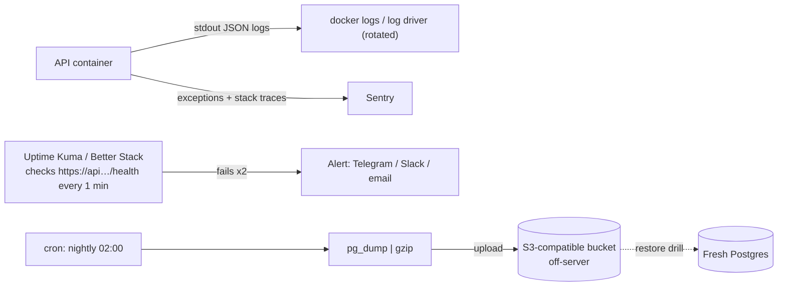

## What

Three questions for any production system: **What happened?** (logs), **Is it broken right now?** (uptime/metrics/alerts), **Can we get the data back?** (backups).



### Structured logs

```ts
logger.info({ msg: "request", method: req.method, path: req.path, status: res.statusCode, ms: Date.now() - start, requestId, userId: req.user?.id });
```

JSON logs can be searched and aggregated. Include a **request id**, never include passwords, tokens, full bodies or personal data. Log to stdout and let Docker handle files, with **rotation** configured:

```yaml
services:
  api:
    logging:
      driver: json-file
      options: { max-size: "10m", max-file: "5" }     # prevents the "full disk from logs" outage
```

### Error tracking

```ts
import * as Sentry from "@sentry/node";
Sentry.init({ dsn: process.env.SENTRY_DSN, environment: "production", release: process.env.GIT_SHA });
// in the Express error handler:
Sentry.captureException(err);
```

Sentry groups errors, shows stack traces, release and user impact. Tag with release (git SHA) so you know which deploy broke things. Scrub PII.

### Uptime and server metrics
Check `/health` from **outside** the server (Uptime Kuma on another host, or Better Stack). Alert after 2 consecutive failures to avoid noise. Watch CPU, memory, **disk** (the silent killer) with `df -h`, `docker stats`, or a node exporter.

### Backups with pg_dump

```bash
#!/usr/bin/env bash
set -euo pipefail
STAMP=$(date -u +%Y%m%dT%H%M%SZ)
docker compose exec -T db pg_dump -U postgres -Fc booking > "/tmp/booking-$STAMP.dump"   # custom format
aws s3 cp "/tmp/booking-$STAMP.dump" "s3://my-backups/booking/" --endpoint-url "$S3_ENDPOINT"
rm "/tmp/booking-$STAMP.dump"
```

Schedule with cron (`0 2 * * * /srv/booking/backup.sh >> /var/log/backup.log 2>&1`). Keep a retention policy (e.g., 7 daily, 4 weekly). Store off the server (a dead VPS takes local backups with it), encrypt at rest, and alert if a backup *didn't* run.

### The restore drill (the only real backup test)

```bash
createdb booking_restore
pg_restore -U postgres -d booking_restore --no-owner /path/booking-2026….dump
psql -d booking_restore -c "SELECT count(*) FROM bookings;"     # compare with production
```

Time it, write the steps in RUNBOOK.md, and repeat periodically. An untested backup is a hope, not a backup.

## Why

Without monitoring, the client is your alarm system ("it can't go down on a Saturday"). Without a tested restore, one bad `DELETE` or dead disk can end the business's history.

## How

1. Add request logging with request ids; check logs contain no secrets.
2. Add Sentry; throw a test error in production and confirm the stack trace appears.
3. Create an uptime monitor; stop the API container; confirm an alert within 5 minutes; restart.
4. Write the backup script, run it by hand, then restore the dump into a fresh DB and compare counts.
5. Schedule nightly; add the restore steps to RUNBOOK.md.

## When

From the first production deploy, not "later". Backups before real customer data exists.

## Where

API middleware, Compose logging config, an external monitor, cron on the VPS, an S3-compatible bucket (Backblaze B2, Cloudflare R2, Hetzner Storage Box with S3, AWS S3).

## Levels of understanding

<Levels>
<Level id="beginner">

Logs are the diary of what happened. Error tracking is an alarm that shows exactly what broke. An uptime check pings the site every minute and messages you if it stops answering. Backups are copies of your data stored elsewhere, and you must practise using them.

</Level>
<Level id="intermediate">

Emit JSON logs with request ids to stdout and rotate; send exceptions to Sentry with release tags; monitor `/health` externally and alert; run nightly `pg_dump -Fc` uploads to object storage; document and rehearse restore.

</Level>
<Level id="advanced">

Define SLOs and alert on symptoms (error rate, latency percentiles), not just resources. Use WAL archiving / point-in-time recovery (pgBackRest, Barman) for low RPO. Protect backups with immutability/versioning and separate credentials; measure RTO/RPO from drills.

</Level>
<Level id="industry">

Teams have on-call rotations, dashboards (Grafana), tracing (OpenTelemetry), incident postmortems, and compliance requirements for retention and encryption. Backup restores are scheduled drills with recorded timings.

</Level>
</Levels>

## Common mistakes

<Callout kind="mistake">

- Backups stored only on the same server or never restored.
- No log rotation; disk fills; Postgres crashes.
- Monitoring from the same machine that might be down.
- Logging request bodies with passwords/PII.
- Alert fatigue from one-off blips, or alerts nobody receives.
- `pg_dump` in plain format for large DBs without compression; wrong credentials in cron.

</Callout>

## Industry usage

<Callout kind="industry">Clients rarely ask for monitoring; they ask for "no downtime". Showing the alert firing and a timed restore turns that promise into evidence.</Callout>

## Exercises

<Challenge kind="exercise" title="Kill it" answer={<p>Stop the API (<code>docker compose stop api</code>). Within the check interval plus retries the monitor should alert; note the time-to-alert. Start the API and confirm a recovery notification. Add the observed timing to the README.</p>}>

Prove "stopping the API triggers an alert within 5 minutes".

</Challenge>

<Challenge kind="debug" title="Postgres died overnight" answer={<p>Unrotated container logs filled the disk, so Postgres could not write. Free space (<code>docker system df</code>, truncate the oversized log), add <code>max-size</code>/<code>max-file</code> log options, and alert on disk &gt; 80%.</p>}>

`df -h` shows 100% on `/`, and `du` points to `/var/lib/docker/containers/*/*-json.log`. Cause and prevention?

</Challenge>

## Interview questions

<Challenge kind="interview" title="RPO and RTO" answer={<p>RPO is how much data you can afford to lose (time since last good backup); RTO is how long recovery may take. Nightly dumps give up to 24h RPO; WAL archiving reduces it to minutes. RTO is measured by restore drills.</p>}>

"What are RPO and RTO and how do they shape your backup plan?"

</Challenge>
