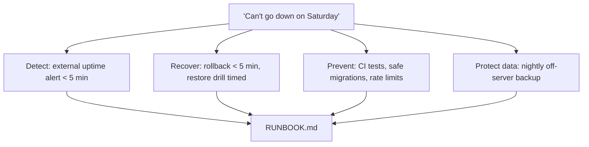

## What

Client message: *"I want to share the booking link with customers this week. It can't go down on a Saturday."* Translate the second sentence into engineering: uptime monitoring, tested backups, a rehearsed rollback, and no manual deploy steps.



## Why

Reliability is a set of rehearsed procedures, not a promise. The runbook is the artefact that lets someone else keep the system alive.

## How

### Milestones
1. **Scope update (30 min):** availability expectation (state it honestly, e.g. best effort single-server), maintenance windows, who gets alerts.
2. **Production stack (90 min):** Compose + Caddy on the VPS, DNS, HTTPS, env on the server, first owner script, safe seed.
3. **CI/CD (75 min):** build → GHCR → deploy → migrate → health check; failed-migration drill.
4. **Monitoring + backups (75 min):** Sentry, uptime alert, nightly dump to S3-compatible storage, restore drill.
5. **Second deployment (90 min):** Coolify or Dokploy on another VPS (at least 2 vCPU and 2 GB RAM); same app.
6. **Runbook + README (60 min).**

### Coolify/Dokploy README section (write from your experience and their docs)
- What it automated for you (proxy, TLS, Git deploys, env UI, logs) and what you gave up or had to learn.
- **Pick it when:** several small apps, non-ops teammates need to deploy, Git-push workflow is wanted, you accept running the platform itself.
- **Don't pick it when:** strict change control, minimal moving parts, custom pipelines, tiny servers (the platform uses RAM), or the client needs a vendor SLA.
- A short comparison with the one you did not use, based on its docs (cite them).

### RUNBOOK.md outline

```text
# Runbook
Contacts / access: where alerts go, who has SSH, where secrets live (not the values)
Deploy: normal path (merge to main) and manual path
Rollback: exact commands, previous-tag lookup, verification, expected time
Database: migrate, restore from backup (steps + last drill date and duration)
Logs: where and how to read them (docker logs, Caddy, journalctl)
Incidents: API down / DB down / disk full / cert expired / DNS wrong - symptom, check, fix
Rotate secrets: JWT secret, DB password, OAuth secret
Cost and renewals: domain, server, storage
```

### Drills to perform and time (record in the runbook)
- Stop the API → alert within 5 minutes → restore
- Merge a bad migration → deploy stops, old version stays up
- Roll back to the previous image (< 5 minutes)
- Restore last night's backup into a fresh database; compare row counts
- External `nmap`: only 22/80/443

### Verification checklist
- [ ] HTTPS valid; HTTP redirects; login works on live pages including SSR
- [ ] Merge to main deploys with no manual steps; migrations run first
- [ ] Alerts delivered to a channel you actually watch
- [ ] Backups are off-server; restore verified and timed
- [ ] No secrets in repo/images; non-root containers; only Caddy exposed

## When

Do the drills on a calm day before launch, not during an incident. Repeat the restore drill periodically.

## Where

VPS(s), GitHub Actions, uptime tool, S3-compatible bucket, `RUNBOOK.md` in the repo.

## Levels of understanding

<Levels>
<Level id="beginner">

Put the app on a real server, make it restart safely, tell yourself when it breaks, keep copies of the data, and write instructions so someone else could fix it.

</Level>
<Level id="intermediate">

Automate deploys, migrations and health checks; monitor from outside; back up off-server and rehearse restores; document everything in a runbook with timings.

</Level>
<Level id="advanced">

Define SLOs, plan zero-downtime migrations, add staging, reduce single points of failure (managed DB, second node) where the budget justifies, and run game days.

</Level>
<Level id="industry">

Clients receive an operations handover: access, monitoring, backup policy, support hours and escalation path.

</Level>
</Levels>

## Common mistakes

<Callout kind="mistake">

- Alerts that go to an email nobody reads.
- A backup that has never been restored.
- Runbook steps that rely on knowledge in your head.
- Promising "100% uptime" on a single server.
- Deploying on Friday evening without a rollback rehearsal.

</Callout>

## Industry usage

<Callout kind="industry">An honest line in the contract such as "single server, alerts within 5 minutes, restore within 1 hour, up to 24 hours of data at risk" builds more trust than an impossible uptime promise.</Callout>

## Exercises

<Challenge kind="exercise" title="Time your drills" answer={<p>Record start/end times for rollback, restore and alert-to-recovery. Targets: rollback under 5 minutes; alert within 5 minutes; restore time as measured. If you miss a target, fix the procedure and repeat.</p>}>

Perform the five drills above and write the measured times into RUNBOOK.md.

</Challenge>

## Interview questions

<Challenge kind="interview" title="Promising availability" answer={<p>State measurable targets and the architecture behind them (detection time, recovery time, data-loss window, single points of failure), not a bare percentage, and document what you did to verify them.</p>}>

"The client wants 'no downtime'. How do you respond?"

</Challenge>
