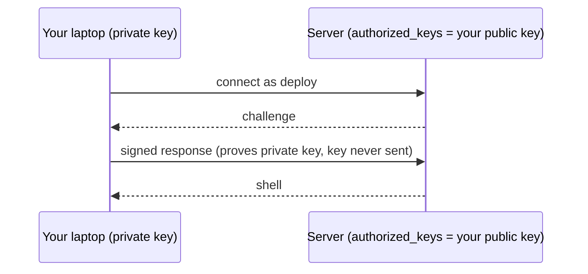
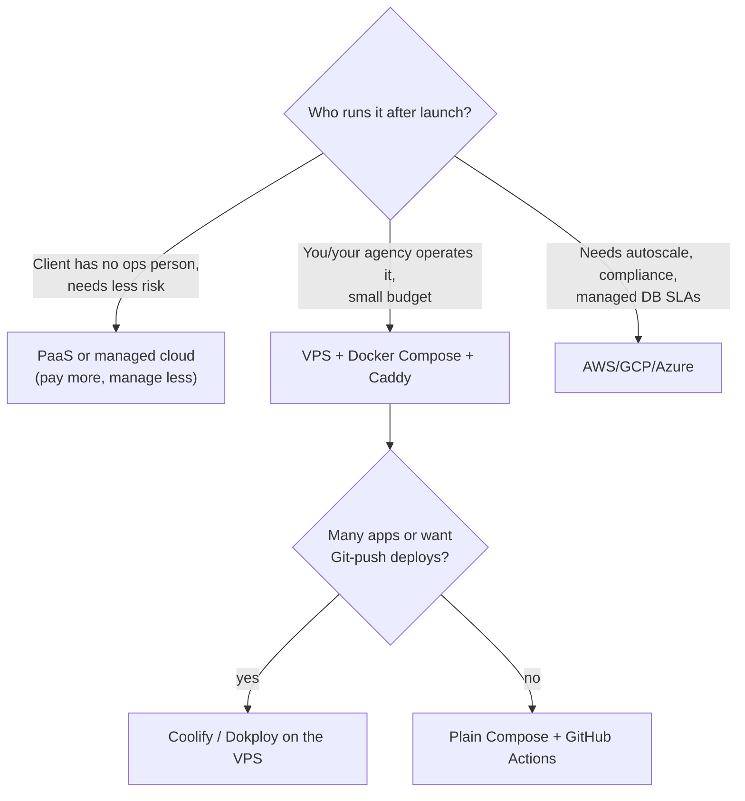

## What

A **VPS** (virtual private server) is a slice of a physical machine rented by the month, giving you root on a Linux box with a public IP. Everything the cloud abstracts away (users, packages, firewalls, updates) becomes your job, and that is what you learn here.

### Linux essentials

```bash
whoami ; id                         # who am I, my groups
sudo apt update && sudo apt upgrade -y
ls -l file                          # permissions: -rwxr-x--- owner group others
chmod 600 ~/.ssh/authorized_keys    # r=4 w=2 x=1 -> owner read/write only
chown deploy:deploy /srv/app -R
systemctl status docker ; sudo systemctl restart docker
journalctl -u docker --since "1 hour ago"       # logs from systemd units
df -h ; free -h ; top ; du -sh /var/log/*       # disk, memory, CPU, what is big
```

### SSH keys instead of passwords



```bash
ssh-keygen -t ed25519 -C "you@laptop"                 # on your laptop
ssh-copy-id deploy@SERVER_IP                          # install public key
# On the server: create a non-root user, then lock down SSH
sudo adduser deploy && sudo usermod -aG sudo deploy
sudo nano /etc/ssh/sshd_config.d/99-hardening.conf
#   PasswordAuthentication no
#   PermitRootLogin no
#   PubkeyAuthentication yes
sudo sshd -t && sudo systemctl reload ssh           # test config BEFORE reloading
```

**Keep your current SSH session open** and test a second login in another terminal before closing it, or you may lock yourself out.

### Firewall and fail2ban

```bash
sudo ufw default deny incoming
sudo ufw default allow outgoing
sudo ufw allow 22/tcp ; sudo ufw allow 80/tcp ; sudo ufw allow 443/tcp
sudo ufw enable ; sudo ufw status verbose
sudo apt install fail2ban -y                        # bans IPs with repeated failed logins
# verify from OUTSIDE:  nmap -Pn SERVER_IP          (expect only 22, 80, 443)
```

<Callout kind="warning" title="Docker can bypass ufw">

Docker edits iptables directly, so `ports: ["5432:5432"]` can expose Postgres to the internet **even with ufw denying it**. The fix (Day 3): publish only Caddy's 80/443 and bind everything else to `127.0.0.1`. Always verify with nmap from another machine.

</Callout>

### Hosting options

| Option | You manage | Typical for | Rough monthly cost for this app* |
|--------|-----------|-------------|-----------------------------------|
| **VPS** (Hetzner, Contabo, OVH, DigitalOcean) | OS, Docker, backups, security | Small clients, cost-sensitive | ≈ €4-12 (2 vCPU / 4 GB class) |
| **VDS / dedicated CPU** | Same, but guaranteed CPU | Steady performance needs | ≈ €10-30 |
| **PaaS** (Vercel, Render, Railway) | Your code only | Fast start, small teams | ≈ $20-60 (web + API + DB add up) |
| **Self-hosted PaaS** (Coolify, Dokploy) on a VPS | The VPS + the tool | Many small apps, Git deploys | VPS cost + your time |
| **Cloud** (AWS EC2/RDS, GCP Cloud Run, Azure) | Cloud services & IAM | Scale, compliance, enterprise | ≈ $40-150+ for managed DB + compute + egress |

*Illustrative ranges. **Task: look up current prices yourself** on the Hetzner, Contabo and OVH pricing pages, price one month for each option, and record the date and links. Prices and plans change, so numbers in a lesson go stale; your dated table in the README is the real deliverable.



## Why

Choosing hosting is a business decision: the cheapest server costs more in your time if the client needs 99.9% uptime and you're the on-call engineer. Hardening matters because a new server is scanned within minutes of getting an IP.

## How

1. Create a VPS (Ubuntu LTS). Log in once as root with the provider key.
2. Create `deploy`, add your key, disable password and root login, test a second session.
3. Enable ufw (22/80/443) and fail2ban; install Docker from Docker's official apt repo.
4. Enable unattended security upgrades.
5. From your laptop run `nmap` and save the output as evidence.
6. Write the cost comparison and justify one pick for a small salon client, in numbers (cost, downtime risk, effort, backup responsibility).

## When

VPS + Compose is right when a technical operator exists and the budget is small. Choose PaaS or managed services when the client's risk tolerance is low and nobody can be on call. Choose cloud when scale or compliance requires it.

## Where

The Week 4 production server, the Coolify/Dokploy second deployment, and every future client engagement where you must recommend hosting.

## Levels of understanding

<Levels>
<Level id="beginner">

A VPS is a computer you rent that is always on. You log in with a special key instead of a password, close every door you don't need (firewall), and install Docker so your app can run there.

</Level>
<Level id="intermediate">

Create a non-root sudo user, SSH key auth only, ufw allowing 22/80/443, fail2ban, unattended upgrades, Docker. Verify externally with nmap. Know the trade-offs of VPS, VDS, PaaS, self-hosted PaaS and cloud, with real numbers.

</Level>
<Level id="advanced">

Harden further: change SSH port optionally (not a real defence), restrict SSH to your IP/VPN, use `AllowUsers`, disable unused services, set up auditd/log rotation, separate data volumes, snapshots, and Docker daemon options (`userns-remap`, `no-new-privileges`). Understand shared-CPU noisy neighbours (VPS) vs dedicated cores (VDS).

</Level>
<Level id="industry">

Production setups are defined as code (Terraform, Ansible, cloud-init) so servers are reproducible; access is via SSO/VPN bastions; patching is scheduled; cost is tracked monthly; and the hosting decision is documented in the architecture doc with its risks.

</Level>
</Levels>

## Common mistakes

<Callout kind="mistake">

- Disabling password auth before confirming key login works.
- Leaving root login enabled; weak or reused passwords.
- Assuming ufw protects Docker-published ports.
- No backups ("the provider has snapshots" is not a tested restore).
- Choosing on price alone; ignoring egress, backup storage and your own time.
- Forgetting security updates.

</Callout>

## Industry usage

<Callout kind="industry">Forward-deployed engineers are often asked "where should this run and what will it cost?" in the first week. A defensible, numbers-based recommendation (with a dated pricing table) is part of the Week 6 architecture doc.</Callout>

## Exercises

<Challenge kind="exercise" title="Prove the lock-down" answer={<p>Evidence: <code>ssh root@IP</code> refused; <code>ssh -o PubkeyAuthentication=no deploy@IP</code> refused; <code>nmap -Pn IP</code> from another network shows only 22, 80, 443 (80/443 may be closed until Caddy runs); <code>sudo ufw status</code> and <code>sudo fail2ban-client status sshd</code> screenshots.</p>}>

Collect the evidence for the three Day 2 acceptance criteria.

</Challenge>

## Interview questions

<Challenge kind="interview" title="VPS vs PaaS" answer={<p>VPS: cheaper, full control, you own ops/security/backups. PaaS: more expensive per unit, but handles deploys, TLS, scaling and patching. Choose by who operates it, budget, uptime needs and lock-in tolerance, backed with a cost table.</p>}>

"A small clinic wants this app online. VPS or PaaS?"

</Challenge>
