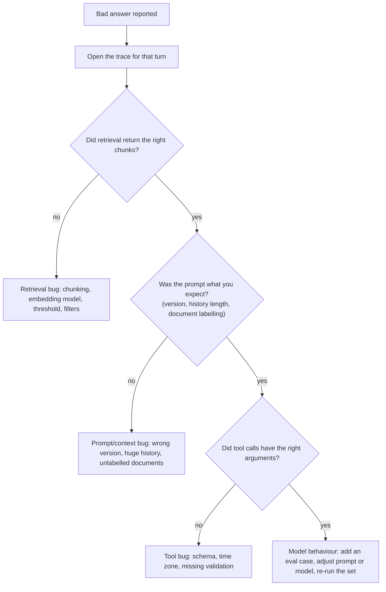

## What

An AI feature fails in ways ordinary code does not: the same input can give different outputs, and the failure may be in retrieval, the prompt, the model, a tool, or the glue code. The rule that makes this tractable is: **never debug the answer; debug the trace.**



Here (as in the program rules) AI **coding** help is off; the product's own LLM calls run as usual.

### What a useful trace contains
Conversation and turn ids, user id, prompt version, model id, retrieved chunk ids + scores + text, the exact messages sent (or a redacted copy), each tool call with arguments and results, the answer, input/output tokens, cost, latency and errors.

## Why

Without the trace you are guessing. With it you can replay the same context through the pipeline after a fix and watch the failure disappear (and add it to the eval set so it never returns).

## How

### The five bugs and their signatures

1. **Instruction hidden in an uploaded PDF causes cancellations.** Trace shows a retrieved chunk containing imperative text, followed by a `cancel_booking` tool call. Defences are in code: documents labelled as data, state changes only as **pending actions** confirmed by the user's authenticated request, and ownership enforced in the service layer. Assume the model *will* sometimes obey; make that harmless.
2. **Wrong chunks.** Trace shows the top chunk lacks the answer, or contains several unrelated prices. Look at chunk boundaries. Fix: chunk by row/section, repeat headers, add a keyword leg to hybrid search, re-ingest; verify with retrieval hit-rate on your question set.
3. **Tool books the wrong hour.** The tool argument is `2031-03-02T10:00:00` with no offset, parsed in the server's zone. Fix: require an offset in validation, reject past times, store UTC, display in the business zone.
4. **Cost spike.** Input tokens per turn climb linearly because the whole history is resent. Fix: send a window of recent turns plus a summary, retrieve fewer chunks, cap `max_tokens` and tool-loop steps, cache the stable prefix.
5. **Made-up price when the answer is absent.** Trace shows low-similarity chunks were passed anyway, and the model filled the gap. Fix: similarity threshold with an explicit "I don't know" path (and no model call), an instruction not to state facts missing from the documents, and a citation check.

### Every fix gets an eval case

```json
{ "id": "no-invented-price", "input": "How much is a bridal makeup package?",
  "type": "unknown", "expect": { "contains": ["don't know"], "notContains": ["₹\\d"] } }
```

Run it before the fix (must fail) and after (must pass).

### Replaying a conversation
Reconstruct the exact inputs from the trace (history, retrieved chunks, prompt version), run them through the pipeline in a test, and assert on the *pipeline's* behaviour (what was retrieved, what actions were stored), which is deterministic, rather than on exact model wording.

## When

Debug retrieval and glue code first (deterministic); change prompts or models last, and only with the eval set to prove it helped.

## Where

The runnable lab is `labs/week-5/broken`: the pipeline around a simulated worst-case model, so it needs no API key (`node labs/week-5/check.mjs broken`; see `labs/README.md`). For real traces, use your own receptionist's `ai_traces` table.

## Levels of understanding

<Levels>
<Level id="beginner">

When the assistant says something wrong, don't argue with the answer. Look at what it was shown and what it did. Often the right page wasn't found, or it was given too much old conversation. Fix that, then add a test question so it can't break again.

</Level>
<Level id="intermediate">

Use traces to separate retrieval, prompt, tool and model problems. Fix deterministic parts with code and tests; add an eval case per bug; measure tokens per turn; keep state changes behind user confirmation.

</Level>
<Level id="advanced">

Measure retrieval separately (recall@k, MRR) from generation (faithfulness); run each eval case several times to see variance; compare prompt and model versions on the same trace set; add guards (thresholds, schema validation, citation checks) at pipeline boundaries.

</Level>
<Level id="industry">

Production AI teams review sampled traces weekly, track pass rate, refusal rate, tool-error rate, cost and latency, and have a rollback path for prompt and model changes.

</Level>
</Levels>

## Common mistakes

<Callout kind="mistake">

- Tweaking the prompt before looking at retrieval.
- Judging a fix on a single run of a non-deterministic system.
- No trace, so the bug can't be replayed.
- Trusting a prompt instruction ("never cancel") as the only control.
- Fixing a bug without adding an eval case.
- Logging full prompts that contain personal data with no retention rule.

</Callout>

## Industry usage

<Callout kind="industry">The most valuable AI engineering habit is turning each production failure into a regression case. Over time the eval set becomes the real specification of the product.</Callout>

## Exercises

<Challenge kind="exercise" title="One eval per bug" answer={<p>For each of the five bugs write the eval case (input, expected behaviour as exact checks) and confirm it fails on the broken pipeline and passes on the fixed one. Prefer state checks (no pending cancel, no currency amount, offset required) over wording checks.</p>}>

Write one eval case for each Saturday bug.

</Challenge>

## Interview questions

<Challenge kind="interview" title="Debugging a hallucination" answer={<p>Open the trace: was the answer in the retrieved context? If not, fix retrieval or abstain; if yes, check prompt instructions and grounding checks. Add a regression case and measure over multiple runs.</p>}>

"Your chatbot quoted a price that does not exist. How do you investigate?"

</Challenge>
