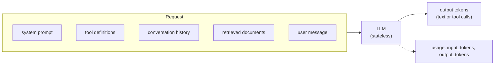

## What

A **large language model (LLM)** predicts the next **token** given all previous tokens. A token is a chunk of text (roughly 3-4 characters of English; fewer characters per token for other scripts and code). Everything the model sees in one request is the **context window**: system prompt + tools + conversation + retrieved documents + the answer being generated. You pay for **input tokens** and **output tokens** (output costs more per token).



Key facts for engineers:

- **Stateless:** the API remembers nothing. Your server resends whatever context is needed on every call (this is why chat cost grows with history length).
- **Non-deterministic:** the same input can produce different outputs. Some current models fix sampling parameters, so treat output as variable and *validate* it.
- **Context window** is large but finite and priced; more context is also noisier.
- **Latency** is dominated by output length; streaming improves *perceived* latency.
- **Providers:** this program uses Anthropic's Claude via its official SDK. Local models (Ollama) are for experiments only: a small VPS cannot serve a model that does reliable tool calling.

## Why

You must call the model **from the backend**: the API key is a secret (never in browser code), you control what data leaves your system, you can validate output, rate limit users, and log cost.

## How

### 1. A basic server-side call

```ts
import Anthropic from "@anthropic-ai/sdk";

const client = new Anthropic();                       // reads ANTHROPIC_API_KEY from the server environment
const MODEL = process.env.AI_MODEL ?? "claude-opus-5-5";   // model id lives in config, not scattered in code

const response = await client.messages.create({
  model: MODEL,
  max_tokens: 1024,
  system: "You summarise a salon owner's day. Be concise and factual.",
  messages: [{ role: "user", content: `Today's bookings:\n${bookingsText}` }],
});
for (const block of response.content) if (block.type === "text") console.log(block.text);
console.log(response.usage.input_tokens, response.usage.output_tokens);
```

Always check `response.stop_reason`: `max_tokens` means the answer was cut off; `refusal` means safety systems declined (see `stop_details`).

### 2. Send only what is needed (privacy)

The summary needs service names, times and statuses, **not** phone numbers or emails. Build the prompt from an allow-listed projection:

```ts
const rows = bookings.map((b) => ({ time: formatSlot(b.startsAt), service: b.serviceName, status: b.status }));
```

Only send data to a provider the client has approved, and never paste secrets or client data into AI *coding* assistants either.

### 3. Structured output validated with Zod

```ts
import { z } from "zod";
import { zodOutputFormat } from "@anthropic-ai/sdk/helpers/zod";

const SummarySchema = z.object({
  headline: z.string(),
  busiest_hour: z.string(),
  notes: z.array(z.string()).max(3),
});

const r = await client.messages.parse({
  model: MODEL,
  max_tokens: 1024,
  messages: [{ role: "user", content: `Summarise in 3 lines:\n${JSON.stringify(rows)}` }],
  output_config: { format: zodOutputFormat(SummarySchema) },
});
if (!r.parsed_output) throw new AiOutputError("Model output did not match the schema");   // never pass invalid output on
```

Even with schema-constrained output, **validate again at your boundary** (`SummarySchema.safeParse`) and handle failure (retry once, then return a clean 502 or fallback). Model output is untrusted input.

### 4. Streaming plain text

```ts
app.get("/ai/summary/stream", requireAuth, permit("owner"), async (req, res) => {
  res.setHeader("content-type", "text/plain; charset=utf-8");
  const stream = client.messages.stream({ model: MODEL, max_tokens: 1024, messages });
  stream.on("text", (delta) => res.write(delta));
  const final = await stream.finalMessage();            // complete message + usage
  logUsage(req.user.id, final.usage);
  res.end();
});
```

Abort the upstream request when the client disconnects (`req.on("close", () => stream.abort())`) so you stop paying for tokens nobody reads.

### 5. Cost per request in rupees

```ts
const PRICE_USD_PER_MTOK = { input: 4, output: 20 };   // check the provider's pricing page; this value changes
const USD_TO_INR = Number(process.env.USD_TO_INR ?? 85);  // configurable, not hard-coded truth

export function costInr(u: { input_tokens: number; output_tokens: number }) {
  const usd = (u.input_tokens * PRICE_USD_PER_MTOK.input + u.output_tokens * PRICE_USD_PER_MTOK.output) / 1_000_000;
  return usd * USD_TO_INR;
}
```

Worked example (illustrative numbers): 1,500 input + 200 output tokens at $4/$20 per million = $0.006 + $0.004 = $0.010 ≈ ₹0.85. Prompt caching, a cheaper model for simple routes, and shorter context change this a lot, so measure real usage and write the number in the README.

Log per request: user id, route, model, prompt version, input/output tokens, cost, latency, outcome. Never log the full prompt if it contains personal data.

## When

Use an LLM when the task is fuzzy language work (summarise, extract, classify, answer from text). Don't use one when a SQL query, regex or a rule does the job exactly (for example "how many bookings today" is a `COUNT(*)`).

## Where

`POST /ai/summary` (owner dashboard), `/ai/summary/stream`, and in Day 2 the chat route. All behind your auth and rate limits.

## Levels of understanding

<Levels>
<Level id="beginner">

An AI model is a very advanced autocomplete. You send it text, it sends text back, and you pay by the amount of text. Your server talks to it, so the secret key stays hidden. You ask for the answer in a fixed shape and check it before using it.

</Level>
<Level id="intermediate">

Requests are stateless; you resend context. Tokens drive cost and latency. Use the official SDK on the server, config-driven model ids, allow-listed prompt data, structured output validated by Zod, streaming for UX, `stop_reason` checks, and a usage log with cost.

</Level>
<Level id="advanced">

Prompt caching reduces repeated prefix cost (keep stable content first). Use timeouts, retries with backoff for 429/5xx, abort on disconnect, and idempotent logging. Choose effort/thinking settings per route and measure quality vs. cost. Handle `refusal` and consider provider-side fallbacks. Pin model ids and re-run evals when changing them.

</Level>
<Level id="industry">

AI spend is budgeted and monitored per feature and tenant, with alerts on cost spikes. Data-processing agreements and regional controls decide which provider may see which fields. Teams keep a model-routing table (cheap for easy tasks, strong for hard ones) justified by evals.

</Level>
</Levels>

## Common mistakes

<Callout kind="mistake">

- Calling the model from the browser or exposing the key via `NEXT_PUBLIC_*`.
- Sending whole database rows (phones, emails) when three fields would do.
- Trusting model output as valid JSON without validation.
- Not setting `max_tokens`; ignoring `stop_reason`.
- Resending the entire chat history forever (cost spike, the Saturday lab).
- Hard-coding prices and model ids in many places.
- Using an LLM for something a query answers exactly.

</Callout>

## Industry usage

<Callout kind="industry">Clients ask two questions about any AI feature: "what does it cost per month?" and "what data does it see?". Per-request cost logging and an allow-listed prompt projection let you answer both with evidence.</Callout>

## Exercises

<Challenge kind="exercise" title="State the cost in rupees" answer={<p>Take one real log row (input and output tokens), apply the current per-million prices from the provider&apos;s pricing page, multiply by your configured exchange rate, and write the formula and result in the README with the date. Then estimate monthly cost for N summaries per day.</p>}>

Make one `/ai/summary` call, read `usage`, and compute its cost in rupees with the formula above. Record the date and price source.

</Challenge>

<Challenge kind="debug" title="Garbage JSON broke the dashboard" answer={<p>The code does <code>JSON.parse(text)</code> and returns it directly. Validate with Zod <code>safeParse</code>, treat failure as an error path (one retry, then 502 with a friendly message), and never forward unvalidated model output.</p>}>

Occasionally `/ai/summary` returns a field with the wrong type and the React page crashes. What is the fix?

</Challenge>

## Interview questions

<Challenge kind="interview" title="Why server-side?" answer={<p>Keys must stay secret; the server enforces auth, rate limits and data minimisation, validates output and records cost. A browser call would expose the key and bypass all controls.</p>}>

"Why must LLM calls go through your backend?"

</Challenge>
