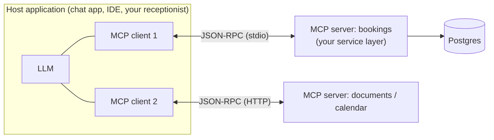

## What

**MCP (Model Context Protocol)** is an open protocol that lets AI applications connect to external **tools and data** through a standard interface, so each integration is written once as a **server** and works with any compatible **client**. It uses **JSON-RPC 2.0** messages over a transport: a local process over **stdio**, or HTTP for remote servers (check the current spec for the transport names and versions, because the protocol evolves).

### What a server can expose (primitives)

| Primitive | Controlled by | Meaning | Booking example |
|-----------|---------------|---------|-----------------|
| **Tools** | The model decides to call | Functions with typed inputs and outputs | `check_availability`, `create_booking_proposal` |
| **Resources** | The application/user picks | Read-only data addressed by URI | `docs://policies/cancellation` |
| **Prompts** | The user chooses | Reusable prompt templates | "Summarise today's bookings" |

Clients can also offer features back to servers (for example asking the host's model to generate text or asking the user for input); these capabilities are negotiated at connection time.

### Relationship to what you built in Week 5

Your `check_availability` / `create_booking` tools were defined **inside** your app. With MCP you would move them into a server that any MCP-capable assistant can use. The *engineering rules do not change*: the server must authenticate the caller, authorise as that user, validate inputs, log calls, and never perform irreversible actions without confirmation. MCP standardises the **wiring**, not the **safety**.

## Why

Without a standard, every assistant × every system needs custom glue (N × M integrations). With MCP it is N + M. For a forward-deployed engineer it means a client's systems can be wrapped once and reused across tools.

## How

### Wrapping your booking service (design)

1. List the capabilities as **tools** with narrow, typed inputs (the same Zod schemas as the API).
2. Run the server with the **end user's identity** (an access token passed through), not a god-mode service account.
3. State-changing tools create **pending actions**; execution happens only through the confirm step (as in the lesson on tool calling).
4. Return **minimal, structured output** (no personal data the model doesn't need).
5. Log every call with user, tool, inputs, outputs and latency.
6. Test the server like an API: unit tests for each tool plus a protocol-level test using an MCP client library or inspector tool.

### Security model (this is the important part)

- **Treat tool descriptions and tool outputs as untrusted.** A malicious or compromised server can put instructions in its descriptions or results (tool poisoning, indirect prompt injection).
- **Only connect servers you trust**; review what each one can do; pin versions.
- **Least privilege per server**: separate read-only and write tools; scope credentials narrowly.
- **Beware the "lethal trifecta":** private data + untrusted content + a way to exfiltrate (for example a tool that can send email or fetch arbitrary URLs). Remove one leg.
- **Human approval** for sensitive tool calls; show the user the exact arguments.
- **Remote servers need real auth** (OAuth-style flows per the spec), TLS, and rate limits.
- **Don't expose a local stdio server's powers (filesystem, shell) to untrusted prompts.**

## When

Use MCP when you want the same integration available to several AI clients, or when you consume existing servers (files, GitHub, databases). For a single app with a handful of tools, direct tool calling is simpler, and what you built is perfectly appropriate.

## Where

Week 5 Day 4 (concepts), the stretch/future work for the receptionist, and client engagements where assistants like Claude or IDE agents must reach internal systems.

## Levels of understanding

<Levels>
<Level id="beginner">

MCP is like a universal plug for AI assistants. Instead of building a different connector for every assistant, you build one plug for your system and any assistant that understands the plug can use it.

</Level>
<Level id="intermediate">

A host runs MCP clients that talk JSON-RPC to MCP servers exposing tools, resources and prompts. Your existing service layer can sit behind a server. Apply the same auth, validation, logging and confirmation as for any API.

</Level>
<Level id="advanced">

Understand capability negotiation, transports and session handling, tool schemas and annotations (read-only or destructive hints are advisory, not security), authorisation flows for remote servers, and threat models for composed servers (cross-server injection, confused deputy).

</Level>
<Level id="industry">

Organisations keep an allow-list of approved servers, run them in sandboxes, review their code and updates like dependencies, and audit tool calls centrally.

</Level>
</Levels>

## Common mistakes

<Callout kind="mistake">

- Giving a server an admin credential "to keep it simple".
- Trusting a server's self-description or `readOnly` hint as a security guarantee.
- Auto-approving every tool call.
- Installing community servers without review.
- Returning whole database rows from tools.
- Assuming MCP makes a prompt-injected model safe.

</Callout>

## Industry usage

<Callout kind="industry">Expect clients to ask "can our assistant use our systems through MCP, and who approves what it can do?". Your answer is the permissions model, the confirmation step and the audit log, not the protocol itself.</Callout>

## Exercises

<Challenge kind="exercise" title="Design the tool list" answer={
List 4-6 tools with typed inputs, mark each read-only or state-changing, and for each state-changing tool describe the pending-action and confirmation step. Add the authentication method for the server and one logging line example. Identify which two of private data, untrusted content, and exfiltration are present, and which you removed.
}>

Design an MCP server for the booking service on paper: tools, inputs, auth, confirmation and logging.

</Challenge>

## Interview questions

<Challenge kind="interview" title="MCP vs function calling" answer={
Function calling is how a model requests a tool within one application&apos;s API; MCP is a protocol for exposing tools and data from separate servers to any compatible client. MCP standardises integration, not safety, so authorisation, validation and confirmation remain your responsibility.
}>

"How is MCP different from ordinary tool calling, and what security issues does it add?"

</Challenge>
