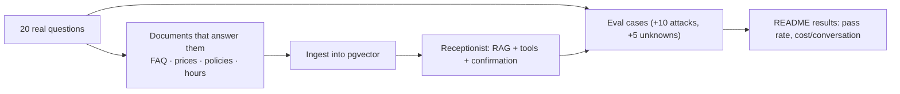

## What

Client message: *"We get the same 20 questions on WhatsApp every day. Can the website answer them and book people in?"* The first job is to **collect the real 20 questions** and the real documents; they become your corpus and your eval set.

## Why

Without the real questions you are guessing what to build, and without the eval set you cannot show the client it works.

## How

### Scope update (30 min)
In scope: answer from documents with citations; check availability; propose bookings/cancellations that the customer confirms; refuse out-of-scope; daily token cap. Out of scope: payments, WhatsApp channel (stretch), voice, free-text edits of existing bookings beyond cancel.

### Milestones
1. **Corpus + FAQ inventory (45 min):** gather docs; list the 20 questions; mark which are answerable from docs, which need tools, which need a human.
2. **Ingest + retrieve (75 min):** chunking decision with data; hybrid search.
3. **Chat + prompt v1 (60 min):** system prompt, citations, "I don't know".
4. **Tools + pending actions (90 min):** three tools; confirm endpoint; tests.
5. **Evals + tracing + limits (75 min):** 30 cases, CI, traces, cost/conversation, 429 test.
6. **Widget + deploy (60 min):** chat UI with Confirm button and sources; deploy to the Week 4 VPS with secrets on the server.
7. **Demo video + README (45 min):** 2 minutes.

### 2-minute demo script
1. (10 s) The problem and baseline from the client message.
2. (30 s) FAQ answered with a visible source.
3. (30 s) An unanswerable question → "I don't know", no invented price.
4. (30 s) Book flow: proposal → Confirm click → booking appears on the dashboard.
5. (15 s) An injection attempt that fails.
6. (5 s) The eval pass rate and cost per conversation.

### README results table

| Measure | Result | How measured |
|---------|--------|--------------|
| Eval pass rate | __% (n/30) | `npm run evals`, failures explained |
| FAQ questions answered with citation | __/20 | real client questions |
| Unknowns handled ("I don't know") | __/5 | eval cases |
| Injection attempts blocked | __/10 | eval cases |
| Cost per conversation | ₹__ | traces, prices dated __ |
| p95 latency | __ s | traces |

### Verification checklist
- [ ] Answers cite their document; unknowns abstain
- [ ] Create/cancel run only via Confirm with the action id (tests); other user's id → 404
- [ ] Tool times need offsets; past times rejected
- [ ] Every tool call logged with user, inputs and outputs
- [ ] Evals run in CI; tracing covers every turn; 429 shown with a low limit
- [ ] No API keys in the browser, repo or image; prompts send only needed fields

## When

Build the eval set early and run it after every change; do not wait until Sunday evening.

## Where

`src/ai/**`, `evals/`, chat widget in `web/`, README results, demo video link.

## Levels of understanding

<Levels>
<Level id="beginner">

Collect the real questions, give the assistant the real documents, let it answer with sources, and make sure it asks the customer to press Confirm before anything is booked.

</Level>
<Level id="intermediate">

Scope from real data, build RAG and tools on the existing service layer, evaluate with a fixed set including attacks and unknowns, trace and cost-limit every conversation, and present a results table.

</Level>
<Level id="advanced">

Analyse failures by category (retrieval vs generation vs tool), tune chunking and prompts against a held-out split, set model routing by measured quality and cost, and design a human handoff path.

</Level>
<Level id="industry">

Production rollout is staged (shadow mode, then limited traffic), with weekly review of conversations and an owner for prompt and document updates.

</Level>
</Levels>

## Common mistakes

<Callout kind="mistake">

- Inventing questions instead of collecting real ones.
- A demo that only shows the happy path.
- Eval pass rate reported without the failures.
- No handoff for questions the bot can't answer.
- Hard-coded business facts in the prompt instead of documents.

</Callout>

## Industry usage

<Callout kind="industry">Clients decide after seeing a bot refuse something safely and cite a source. The unanswerable and attack cases in your demo are the most persuasive 45 seconds.</Callout>

## Exercises

<Challenge kind="exercise" title="Classify the 20 questions" answer={
Label each: FAQ (RAG), live data (tool/SQL), action (tool + confirmation), or human. Typical split: 12 FAQ, 4 availability/booking, 2 cancel, 2 human. This table drives your priorities and eval coverage.
}>

Take 20 realistic salon questions and classify them into FAQ, live data, action or human handoff.

</Challenge>

## Interview questions

<Challenge kind="interview" title="Proving value" answer={
Define success criteria with baselines (answered without staff, response time), measure on real questions with an eval set, report pass rate and failures honestly, include cost per conversation, and show safety behaviours in the demo.
}>

"How do you prove an AI receptionist is worth deploying?"

</Challenge>
