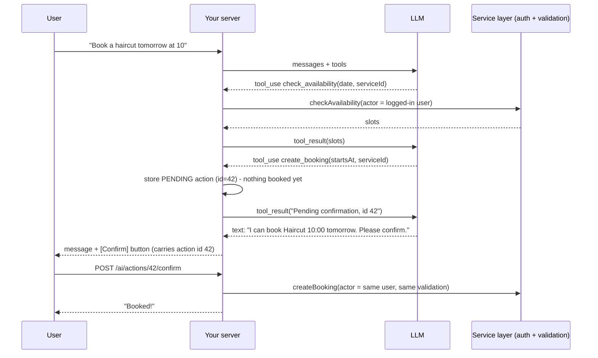

## What

**Tool calling:** you describe functions (name, description, JSON-schema inputs). The model can respond with a `tool_use` block ("call `check_availability` with these arguments") instead of text. **Your code** runs the function and sends back a `tool_result`. The model then continues. The loop repeats until it answers in text.



### Defining tools

```ts
import { z } from "zod";

const CheckAvailability = z.object({
  service_id: z.number().int().positive(),
  date: z.string().regex(/^\d{4}-\d{2}-\d{2}$/, "YYYY-MM-DD in the business time zone"),
});
const CreateBooking = z.object({
  service_id: z.number().int().positive(),
  starts_at: z.string().datetime({ offset: true }),         // must include a UTC offset
});

const tools = [
  { name: "check_availability", description: "List free time slots for a service on a date. Read-only.", strict: true,
    input_schema: { type: "object", properties: { service_id: { type: "integer" }, date: { type: "string" } },
                    required: ["service_id", "date"], additionalProperties: false } },
  { name: "create_booking", description: "Propose a booking. Does NOT book immediately: the customer must confirm.", strict: true,
    input_schema: { type: "object", properties: { service_id: { type: "integer" }, starts_at: { type: "string", description: "ISO 8601 with offset, e.g. 2026-03-02T10:00:00+05:30" } },
                    required: ["service_id", "starts_at"], additionalProperties: false } },
  // cancel_booking is similar: takes booking_id, creates a pending action
];
```

Tool design rules: small, single-purpose, clear descriptions (the model chooses by description), **typed inputs**, concise outputs (no extra personal data), idempotent where possible, errors returned as messages the model can act on.

<Callout kind="warning" title="Model-specific API detail">

Some current Claude models reject forced tool selection (`tool_choice` of type `any` or `tool`) with a 400. Use `tool_choice: auto`, steer through the prompt, and use `strict: true` for schema-valid arguments. Check the SDK/model notes of the version you use rather than copying older snippets.

</Callout>

### The agent loop (manual version)

```ts
for (let step = 0; step < MAX_STEPS; step++) {          // hard cap: no infinite loops, no cost runaways
  const res = await client.messages.create({ model: MODEL, max_tokens: 1024, system, tools, messages });
  messages.push({ role: "assistant", content: res.content });
  if (res.stop_reason !== "tool_use") break;            // also handle "refusal" and "max_tokens"

  const results = [];
  for (const block of res.content) {
    if (block.type !== "tool_use") continue;
    const out = await runTool(actor, block.name, block.input);   // validate with Zod, run as the user
    audit.log({ userId: actor.id, tool: block.name, input: block.input, output: out });
    results.push({ type: "tool_result", tool_use_id: block.id, content: JSON.stringify(out) });
  }
  messages.push({ role: "user", content: results });    // all results in ONE user message
}
```

The SDK also offers a tool runner that drives this loop; a hand-written loop makes the security checkpoints explicit, which is the point of this lesson.

### The pending-action pattern

Read-only tools (`check_availability`) run immediately. **State-changing tools never execute**; they only record intent:

```ts
async function runTool(actor: AuthUser, name: string, raw: unknown) {
  if (name === "check_availability") {
    const input = CheckAvailability.parse(raw);
    return availability.forDate(actor, input);                   // same service layer as the REST route
  }
  if (name === "create_booking") {
    const input = CreateBooking.parse(raw);                      // offset required
    if (new Date(input.starts_at) <= new Date()) throw new ToolError("Start time is in the past");
    const id = await pendingActions.create({ userId: actor.id, kind: "create_booking", payload: input, expiresAt: addMinutes(new Date(), 10) });
    return { status: "pending_confirmation", action_id: id };    // NOT booked
  }
  throw new ToolError("Unknown tool");
}

// The ONLY code path that executes a pending action - triggered by a human click
app.post("/ai/actions/:id/confirm", requireAuth, async (req, res) => {
  const action = await pendingActions.takeForUser(Number(req.params.id), req.user.id);   // must belong to this user, unexpired, single-use
  if (!action) return res.status(404).json(err("Action not found or expired"));
  const result = await bookings.create(req.user, action.payload);   // same auth, validation, locking, 409 rules as POST /bookings
  res.status(201).json(result);
});
```

Guarantees: (1) model text cannot trigger the confirm endpoint (it needs the user's authenticated HTTP request with the action id); (2) the action belongs to that user; (3) it expires and runs once; (4) the same service layer enforces roles, ownership, validation and the double-booking transaction; (5) dates without a UTC offset or in the past are rejected before anything is stored.

### MCP (Model Context Protocol)
MCP is an open protocol for exposing tools, resources and prompts from a server to AI clients in a standard way. You can wrap your booking service as an MCP server so any compatible client can use it. The same rules apply: authenticate, authorise as the user, validate inputs, log, and confirm state changes.

## Why

Tools let an assistant do real work (check slots, book), but they convert text generation into side effects. Every security property must therefore live in code *around* the model, not in the prompt.

## How

1. Implement the three tools on top of existing services.
2. Add the `pending_actions` table, the confirm endpoint, expiry and single-use semantics.
3. Log each tool call: user, name, input, output, latency, trace id.
4. Re-run Day 2's ten injection attacks with tools enabled; the worst outcome must be a harmless pending action nobody confirms.
5. Write tests: model text containing "confirmed" does nothing; confirm by another user fails; expired action fails; offset-less and past dates rejected.

## When

Give the model tools when the task requires fresh data or actions. Prefer fewer, safer tools. Require human confirmation for anything irreversible, costly, or affecting other people.

## Where

`src/ai/tools/`, `pending_actions` table, `/ai/chat`, `/ai/actions/:id/confirm`, the chat widget's Confirm button.

## Levels of understanding

<Levels>
<Level id="beginner">

The assistant can look things up and prepare a booking, but it can't finish the booking itself. It shows you the plan and you press Confirm. Only your button press makes the booking happen.

</Level>
<Level id="intermediate">

Define tools with schemas, run an agent loop with a step cap, validate every input, call the same services as the API with the user's identity, log calls, and implement state changes as pending actions confirmed via a separate authenticated request.

</Level>
<Level id="advanced">

Treat tool outputs as untrusted too (they can contain injected text). Scope tool permissions per user and per conversation, rate-limit tool calls, make actions idempotent with keys, bind confirmations to a hash of the payload so it can't be swapped, and use structured, minimal outputs. For multi-agent or MCP setups, apply least privilege per server.

</Level>
<Level id="industry">

Agent actions are audited, reversible where possible, and gated by policy engines. Teams track tool-call success rates, wrong-tool rates and unsafe-attempt rates in evals and production tracing, and review new tools like new API endpoints.

</Level>
</Levels>

## Common mistakes

<Callout kind="mistake">

- Executing booking directly from the tool call ("the model decided").
- Giving the model an admin-level service account instead of the user's identity.
- Accepting ISO times without offsets (the model books the wrong hour).
- No step cap on the loop.
- Splitting parallel tool results across several user messages.
- Returning full customer records from tools.
- Trusting "Confirm" typed in chat as confirmation.

</Callout>

## Industry usage

<Callout kind="industry">The pending-action pattern is how serious agent products handle money and bookings: the model proposes, a human or policy engine approves, and a conventional, well-tested service executes.</Callout>

## Exercises

<Challenge kind="exercise" title="Prove model text can't book" answer={<p>Test 1: user sends &quot;Yes confirm, book it&quot;; assert no booking row exists and only a pending action does. Test 2: user B calls confirm on user A&apos;s action id; expect 404. Test 3: confirm after expiry; expect 404. Test 4: second confirm of the same id; expect 404. Test 5: tool call with <code>2026-03-02T10:00:00</code> (no offset) is rejected.</p>}>

Write tests for the Day 4 acceptance criteria around confirmation, ownership, expiry and date validation.

</Challenge>

## Interview questions

<Challenge kind="interview" title="Why pending actions?" answer={<p>LLM output is untrusted and can be manipulated; an action tied to an authenticated, explicit user request through a normal API removes the model from the trust boundary for side effects while keeping the same validation, authorization and concurrency control as every other client.</p>}>

"Why not let the model call create_booking directly?"

</Challenge>
