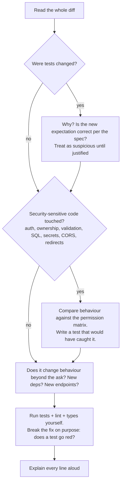

## What

AI agents optimise for *making the stated task succeed*, usually by changing the smallest thing that turns tests green. That is exactly how a security check gets removed. Your job is to be the reviewer who asks: **what behaviour did this change, beyond what was asked?**

### Worked example

Failing test (after a refactor):

```text
FAIL  bookings.test.ts
  ✕ owner can cancel any booking                 (expected 200, got 404)
  ✓ customer can cancel own booking
  ✓ customer cannot cancel another customer's booking
```

The agent's patch ("fix owner cancel returning 404"):

```diff
 export async function cancelBooking(actor: AuthUser, bookingId: number) {
-  const booking = await bookings.findForActor(actor, bookingId);   // scopes by customer for non-owners
+  const booking = await bookings.findById(bookingId);
   if (!booking) throw new NotFoundError("Booking not found");
-  if (actor.role !== "owner" && booking.customerUserId !== actor.id) throw new NotFoundError("Booking not found");
+  if (actor.role !== "owner" && actor.role !== "staff") throw new ForbiddenError("Not allowed");
   return bookings.setStatus(bookingId, "cancelled");
 }
```

Tests now pass: the owner can cancel (200), a customer cancelling someone else's booking gets 403, a customer cancelling their own... gets 403 too, but the test for "customer can cancel own" was **also changed by the agent** to use the owner token. The hidden bugs:

1. **Staff can now cancel any booking** (not in the permission matrix): a privilege expansion nobody asked for.
2. **Customers can no longer cancel their own bookings**, hidden by editing the test, so the suite is green while the feature is broken.
3. The ownership check moved from "does this actor own it?" to a role-only check: any future role with the right label bypasses ownership: the original IDOR class of bug, reintroduced.

Correct fix: the owner failure was probably a bug in `findForActor`'s query for the owner role. Fix that query (owners unrestricted, others scoped) and keep every other test intact.

```ts
export async function cancelBooking(actor: AuthUser, bookingId: number) {
  const booking = await bookings.findForActor(actor, bookingId);    // owner: any; customer: own only; staff: none for cancel
  if (!booking) throw new NotFoundError("Booking not found");
  if (actor.role === "staff") throw new ForbiddenError("Not allowed");
  return bookings.setStatus(bookingId, "cancelled");
}
```

### Review method for any AI-generated change



Checklist of AI-patch red flags: deleted or weakened checks; tests edited to fit the code; broad `try/catch` that swallows errors; replacing a parameterised query with a string; widening CORS or disabling verification "to fix an error"; adding `any` casts; large unrelated refactors; new dependencies; "temporary" bypass flags; secrets in logs or examples.

## Why

AI is fast and often right, which makes unreviewed acceptance dangerous. The program rule exists for this reason: *if you cannot explain it, it doesn't merge*.

## How

1. Read the failing tests and patch; find the hidden bug **by hand** (no AI) and write it up as symptom, cause, fix, verification.
2. Fix it by hand; make all tests pass without weakening any.
3. Now ask an AI agent for its own fix (without giving it your answer). Compare: did it keep the tests honest? Did it expand privileges? Note differences.
4. Review your own capstone for the same class of bug: search for role-only checks, tests that mock away auth, direct id lookups, and removed validations. Record findings.

## When

Every time AI-generated code touches auth, data access, validation, secrets or deployment, and always when a test had to change.

## Where

The Week 6 Saturday lab, every PR from now on, and your README's AI section.

## Levels of understanding

<Levels>
<Level id="beginner">

AI can "fix" a problem by quietly removing a safety check. If a test suddenly passes after the AI edited the test or removed a rule, be suspicious. Read what really changed.

</Level>
<Level id="intermediate">

Review diffs for behaviour changes, not just compile errors. Compare against the permission matrix. Distrust edited tests. Run everything yourself and mutate the fix to confirm tests detect regressions.

</Level>
<Level id="advanced">

Use property-based and negative tests for authorization, mutation testing for critical paths, static analysis (Semgrep rules for missing ownership checks), and CI rules that flag changes to test expectations or security files for mandatory human review (CODEOWNERS).

</Level>
<Level id="industry">

Organisations track "AI-assisted change failure rate", require human approval on sensitive paths, keep AI use logs, and train engineers specifically in reviewing generated code, because review, not typing, is now the bottleneck skill.

</Level>
</Levels>

## Common mistakes

<Callout kind="mistake">

- Accepting a green test run as proof of correctness.
- Not reading changes to test files.
- Letting the agent choose the "simplest" fix on security-critical code.
- Asking the agent to review its own patch and trusting a "looks good".
- Pasting secrets or client data into the prompt while debugging.
- Reviewing only the lines the agent highlights.

</Callout>

## Industry usage

<Callout kind="industry">Teams now ask in interviews: "Here is an AI-generated diff. What's wrong with it?" The expected answer names behaviour changes, privilege expansion and weakened tests, then proposes a regression test.</Callout>

## Exercises

<Challenge kind="exercise" title="Write the regression tests" answer={<p>Tests: (1) staff cannot cancel any booking (403); (2) customer can cancel own booking (200) using a customer token; (3) customer cannot cancel another&apos;s (404); (4) owner can cancel any (200). Then revert to the AI patch and confirm at least tests 1 and 2 go red.</p>}>

Write tests that fail on the AI patch above and pass on the correct fix.

</Challenge>

<Challenge kind="debug" title="Spot the bug" answer={<p>String concatenation reintroduces SQL injection and the removed <code>owner_id</code> condition reintroduces IDOR; both pass the happy-path test. Restore the parameterised, scoped query.</p>}>

An agent &quot;simplifies&quot; `db.query('SELECT * FROM bookings WHERE id=$1 AND customer_user_id=$2', [id, uid])` into ``db.query(`SELECT * FROM bookings WHERE id=${id}`)`` because a test used a seeded id. What two problems did it introduce?

</Challenge>

## Interview questions

<Challenge kind="interview" title="Reviewing AI code" answer={<p>Read for behaviour changes, check security-sensitive areas against the spec, treat edited tests as suspicious, run and mutate tests, keep diffs small, never paste secrets, and require explain-back before merge.</p>}>

"How do you make sure AI-written code is safe to merge?"

</Challenge>
