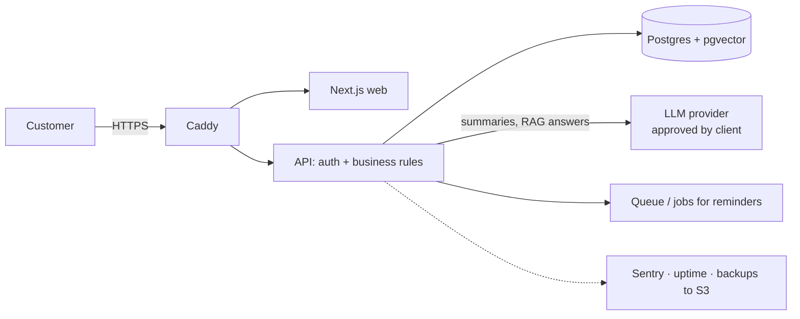

## What

An **architecture document** is a short, reviewable description of how the system will work and why. It lets the mentor (and later the client) approve the plan **before any code is written**, which is the cheapest time to change it.

### Required sections

1. **Context and goals** (from the problem statement; link success criteria).
2. **Diagram** (components and data flow).
3. **Data model** (tables, key relationships).
4. **API surface** (endpoints/events).
5. **AI components** (models, prompts, RAG sources, tools, guardrails, evals).
6. **Hosting and deployment** (where, how, CI/CD, backups, monitoring).
7. **Monthly cost estimate** (hosting + AI tokens + other services).
8. **Risks and mitigations**, including **single points of failure (SPOF)**.
9. **Out of scope / v2**.
10. **Task plan**.



Each box needs a **one-line justification**: "Postgres + pgvector: one database for bookings and document search, no extra service to run." "Caddy: automatic HTTPS with a four-line config."

### Production-grade basics to reason about

| Concern | Question | Typical answer |
|---------|----------|----------------|
| Stateless servers | Can I run two API instances? | Keep sessions in cookies/DB; no local files for state |
| Horizontal scaling | What breaks at 10x load? | DB first; add indexes, caching, read replicas later |
| Caching | What is expensive and repeatable? | Static assets via CDN; cached embeddings/answers carefully |
| Background jobs | What shouldn't block a request? | Emails, reminders, ingestion, long AI work |
| Single points of failure | If this dies, what happens? | One VPS, one DB, one LLM provider, one DNS provider |
| Build vs buy | Is it our differentiator? | Buy auth/email/payments; build the workflow |

### Single points of failure table

| SPOF | Impact | Mitigation | Residual risk |
|------|--------|-----------|---------------|
| One VPS | Site down | Uptime alert, provider snapshots, tested rebuild runbook (under 1h) | Hours of downtime possible |
| Postgres on same VPS | Data loss | Nightly encrypted off-server dump + restore drill | Up to 24h data loss |
| LLM provider outage | AI answers fail | Graceful message, staff fallback, queue | Degraded service |
| DNS/registrar | Site unreachable | 2FA on registrar, documented records | Low |

### Monthly cost estimate

```text
Hosting (VPS 2 vCPU / 4 GB)        €__   (source + date)
Domain                              €__/12
Backups storage (S3-compatible)     €__
Error tracking / uptime (free tier) €0
AI: conversations/month × cost per conversation (measured in evals) + embeddings
Total / month                       ≈ ₹__   vs client budget ₹__
```

Use **measured** numbers (tokens per conversation from your eval runs) and show the formula, not just the total. If it exceeds the budget, change the design (smaller model for easy turns, fewer retrieved chunks, caching) and say so.

### Task plan an AI agent can follow

Break the build into small tasks, each with an **objective, files likely touched, constraints, and a done condition that can be checked**:

```text
T1  Scaffold repo from booking template; CI green
    Done: `npm test` passes in CI; README has local setup
T2  Add table `invoices` + migration + Zod schema
    Done: migration applies on empty DB; schema test passes; no route changes
T3  POST /invoices/upload (PDF) -> extract text -> store
    Done: 3 sample PDFs ingest; failure cases return 400; tests added
...
```

Rules for plans: each task is one small PR; tasks are ordered to keep `main` deployable; every task names its tests; risky unknowns (e.g. unreadable PDFs) get a **spike** task early.

## Why

Mistakes found in a diagram cost minutes; mistakes found after a week of coding cost days. The cost estimate and SPOF list are what separate engineering from hacking, and clients ask for both.

## How

1. Re-read the problem statement and success criteria; list the 3-5 key design decisions.
2. Draw the diagram; justify each component in one line; prefer what you already built in Weeks 1-5.
3. Write the data model, API and AI sections briefly but concretely.
4. List SPOFs and risks; add mitigations.
5. Compute the monthly cost with measured inputs.
6. Write 12-20 tasks with done conditions.
7. Review with the mentor; revise; get approval.

## When

Always before building. Revisit when a change request alters scope, hosting or cost.

## Where

`docs/ARCHITECTURE.md` in the capstone repo; also part of the handover pack.

## Levels of understanding

<Levels>
<Level id="beginner">

An architecture doc is a map drawn before the trip. It shows the pieces, why each is there, what could break, what it costs per month, and the small steps to build it.

</Level>
<Level id="intermediate">

Choose the simplest stack that meets the constraints, reuse proven parts, document data model/API/AI parts, list SPOFs with mitigations, estimate costs from measurements, and write small tasks with testable done conditions.

</Level>
<Level id="advanced">

Use decision records (ADRs) with alternatives and trade-offs, define SLOs (availability, latency, answer quality), plan capacity and failure modes (what degrades gracefully), include security and privacy design (data flow, retention, provider DPAs), and plan migrations/rollbacks.

</Level>
<Level id="industry">

Design reviews are a normal gate; docs live in the repo and are updated with the code; cost and risk registers are shared with the client; plans are structured so humans and AI agents can execute them in small, verifiable increments.

</Level>
</Levels>

## Common mistakes

<Callout kind="mistake">

- Over-engineering (Kubernetes for 50 users) or under-specifying (no backup plan).
- Components with no stated reason.
- Cost estimates with no source or formula.
- Ignoring the client's privacy constraints on AI providers.
- Tasks like "build the backend" with no done condition.
- Starting to code before approval.

</Callout>

## Industry usage

<Callout kind="industry">Engineering managers read the SPOF table and the cost section first. A candidate who volunteers "the single VPS is our biggest risk, here's how we mitigate it and what it costs to remove" sounds senior.</Callout>

## Exercises

<Challenge kind="exercise" title="Justify every box" answer={<p>For each component write: what it does, why this over the alternative, and what happens if it fails. Delete any box you cannot justify. Check the doc names each SPOF and its mitigation, and that the monthly estimate is below the client&apos;s budget.</p>}>

Draft the architecture doc for your capstone and run the Day 2 acceptance checklist on it.

</Challenge>

## Interview questions

<Challenge kind="interview" title="Scaling story" answer={<p>Make servers stateless, put sessions in cookies/DB, scale the API horizontally behind a proxy, optimise queries and indexes first, add caching/CDN for static and repeatable reads, move slow work to queues, and watch the database as the usual bottleneck. Add replicas/partitioning only when measurements demand it.</p>}>

"How would this architecture handle 100x traffic?"

</Challenge>
