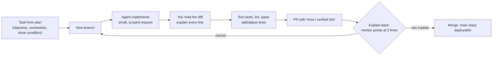
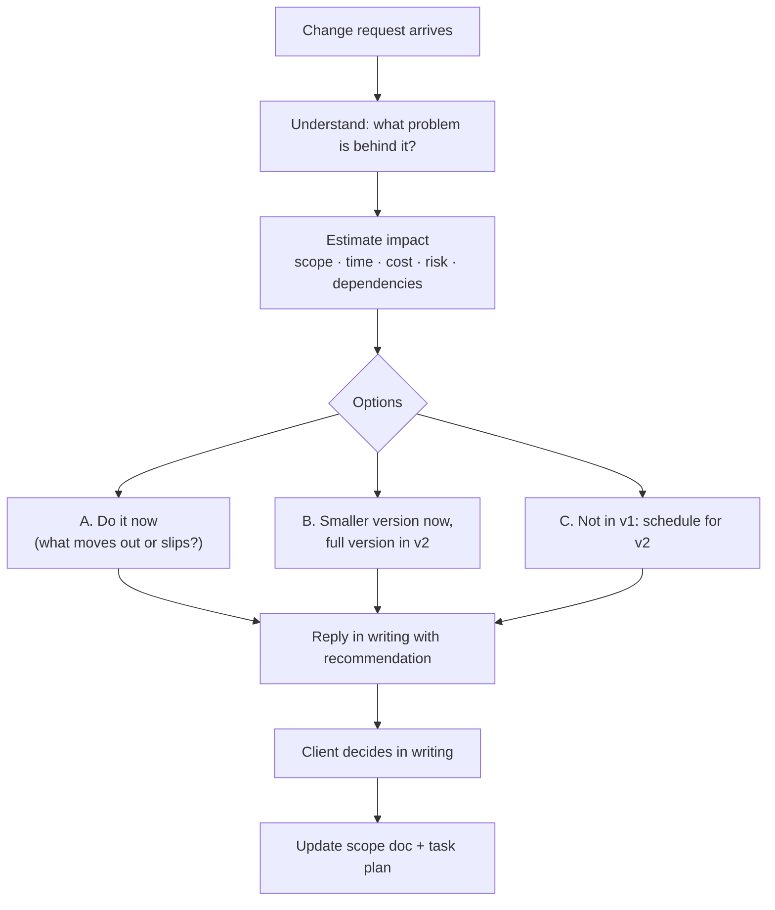

## What

### Building with an AI agent without losing control



Rules: one small PR per task; give the agent the task, the relevant files, the rules file (`AGENTS.md`/`CLAUDE.md`) and the done condition; never paste secrets or client data; run tests yourself; reject sprawling diffs; keep `main` deployable at all times (feature flags or incomplete code behind unused routes if needed).

PR description template:

```text
## What and why
<task id, one paragraph>

## How I verified this
- [ ] npm test (X passed) - added tests: <names>
- [ ] Manual check: <steps and result>
- [ ] Migrations apply on a clean DB
- [ ] Security: auth/ownership/validation considered: <notes>

## AI use
Agent: <tool>. Parts changed by me after review: <list>. Where the agent was wrong: <notes>
```

### Change requests

At midday the "client" sends a change request. The skill is neither "yes to everything" nor "no". It is **making the trade-off visible and getting the decision in writing**.



A good reply (template):

```text
Thanks, I understand the goal: <restate the underlying need>.

Impact if we include it in v1:
- Scope: adds <items>
- Time: about <hours/days>, which would push <task> to <date> / remove <task>
- Cost/risk: <AI cost, new dependency, new risk>

Options:
A. Include now: <consequences>
B. Minimal version now (<what>), full version in v2
C. Keep v1 as agreed and add it to the v2 list

My recommendation: <B> because <reason tied to their success criteria>.
Please confirm which option you prefer so I can update the scope document.
```

Saying "not in v1" politely means: acknowledge value, explain the cost of adding it now in terms the client cares about, and offer a path.

### Pre-launch checklist

| Area | Check | Evidence to record |
|------|-------|--------------------|
| Security | Auth + ownership on every route; Helmet/CORS allowlist/rate limits; Origin check; no secrets in repo/images; `npm audit` + Semgrep + gitleaks reviewed | Test names, scan output, notes |
| AI safety | Injection eval cases pass; model text can't trigger actions; PII minimised in prompts | Eval results table |
| Quality | Tests green in CI; E2E for the core flow; evals pass-rate threshold met or failures explained | CI link, pass rate |
| Performance | Key queries indexed (EXPLAIN); p95 latency of core endpoints measured; AI cost per conversation measured | Numbers |
| Deploy | HTTPS, redirects, cookies/CORS correct, migrations on deploy, health check | curl outputs |
| Operations | Error tracking receives a test error; uptime alert fired in a drill | Screenshots |
| Data | Nightly off-server backup; restore drill timed | Runbook entry |
| Rollback | Previous image tag known; rollback under 5 minutes rehearsed | Runbook entry |
| Legal/privacy | Provider approved by client; retention of traces/logs decided | Notes |

Fix everything that fails, or document it explicitly as a known limit the client accepts.

## Why

Small, verified PRs keep AI-generated code understandable and reversible. Written trade-offs prevent "you promised me that" disputes. A launch checklist converts "I think it's ready" into evidence.

## How

- Day 3: implement the core flow task by task; each PR has tests and a verification section.
- Day 4: when the change request arrives, spend 20-30 minutes on impact analysis, reply in writing, update the plan, and either merge the change or log it for v2, then keep building.
- Day 5: deploy with HTTPS, CI/CD, monitoring and backups; run evals and security checks; fix failures; record results in the README.

## When

Change-request handling applies whenever scope moves after sign-off, which is always. The launch checklist is run before every production release at least in light form, and in full for the first launch.

## Where

Pull requests, the scope document, a shared decisions log (email or issue thread), the README "Results" section.

## Levels of understanding

<Levels>
<Level id="beginner">

Build in small steps and check each one. If the client asks for something new, explain what it would cost in time and what would have to wait, and let them choose in writing. Before going live, tick every box on the safety checklist.

</Level>
<Level id="intermediate">

One task per PR with tests and a verification note. Evaluate change requests by scope, time, cost and risk; offer options with a recommendation; update the scope and plan. Run a full pre-launch checklist and store evidence in the README.

</Level>
<Level id="advanced">

Use feature flags to merge incomplete work safely, trunk-based development with fast CI, risk-based test selection, and canary or staged rollouts. Track decisions in an ADR/decision log and re-baseline estimates after change requests.

</Level>
<Level id="industry">

Launch readiness reviews, change advisory practices, SLAs and on-call handover are standard. FDEs are measured by client outcomes and trust, so written scope control and honest status reports matter as much as code.

</Level>
</Levels>

## Common mistakes

<Callout kind="mistake">

- Agent-generated mega-PRs nobody can explain.
- Saying yes to everything and silently slipping the deadline.
- Saying no without an alternative.
- Agreeing verbally and never updating the scope document.
- Launching without a rehearsed rollback or restore.
- Treating a failed eval or scan as "probably fine".

</Callout>

## Industry usage

<Callout kind="industry">A concise change-request reply with options and a recommendation is one of the most-praised artefacts in client engagements. Keep a copy: it often becomes the template for the next one.</Callout>

## Exercises

<Challenge kind="exercise" title="Reply to the change request" answer={<p>Your reply should restate the need, quantify impact on scope/time/cost/risk, give 2-3 options, make a recommendation, and ask for a written decision. Afterwards the scope doc and task plan must reflect the decision, and the change is either merged or listed under v2.</p>}>

When your mentor sends the Thursday change request, write the reply using the template and update the plan.

</Challenge>

## Interview questions

<Challenge kind="interview" title="Scope creep" answer={<p>Acknowledge the need, make the impact visible, offer options (now, smaller now, later), recommend one tied to the client&apos;s success criteria, get the decision in writing, and update scope and plan.</p>}>

"A client asks for a big feature the day before the deadline. What do you do?"

</Challenge>
